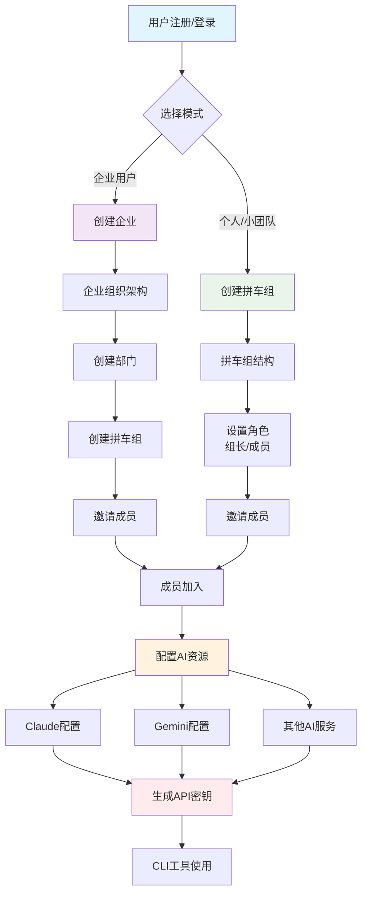
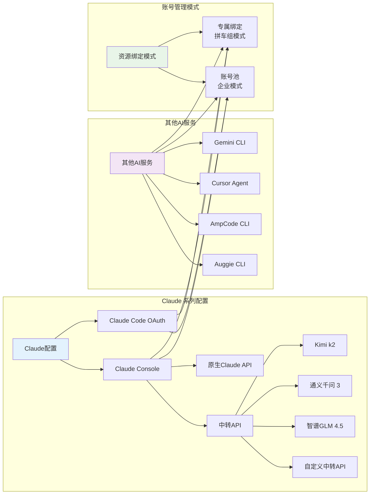
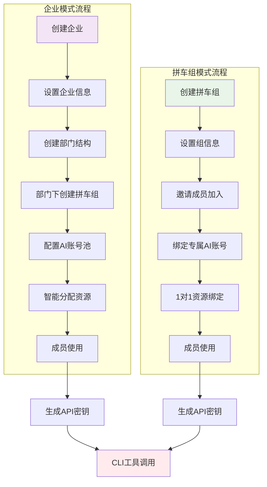
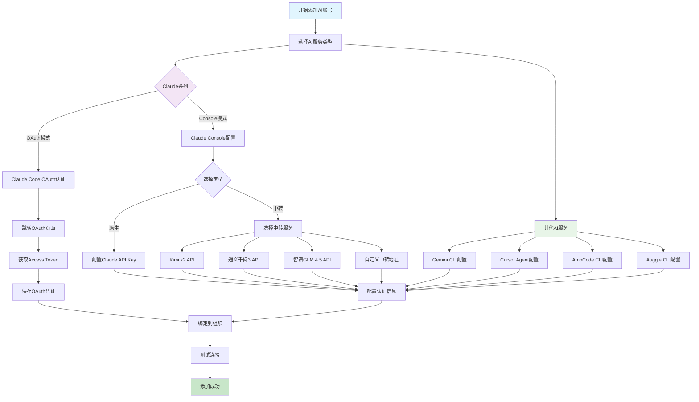
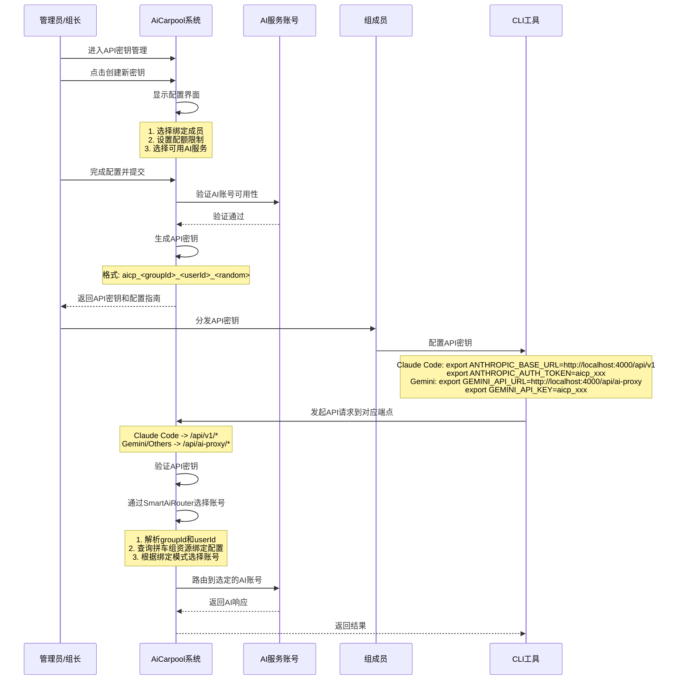
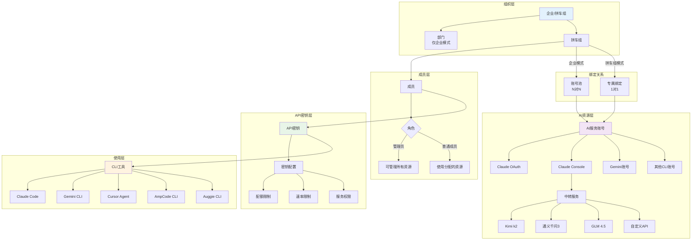
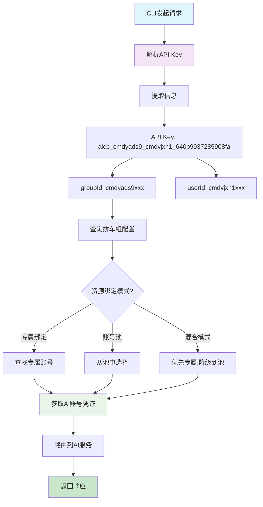
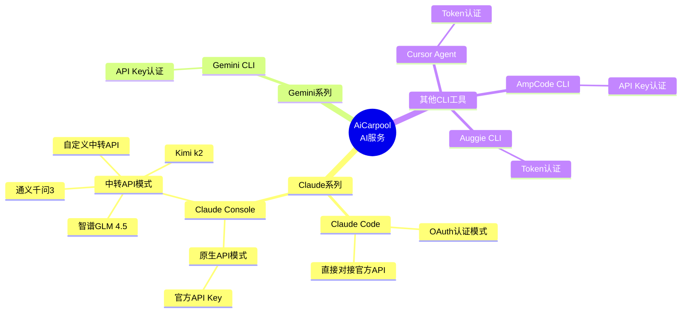

# AiCarpool 核心业务流程架构图

## 文档信息
- **创建时间**: 2025-08-08
- **文档目的**: 展示AiCarpool从组织创建到AI资源配置的核心业务流程
- **重点内容**: 企业/拼车组创建 → 组织架构 → 成员邀请 → AI资源配置 → API密钥管理

---

## 1. 核心业务流程总览

---

## 2. AI资源配置详细流程

---

## 3. 组织模式对比流程

---

## 4. AI账号添加流程

---

## 5. API密钥生成与使用流程

---

## 6. 完整业务数据流

---

## 7. API Key路由验证详解

### 7.1 客户端配置与路由映射

| CLI工具 | 环境变量配置 | 请求端点 | 路由处理 |
|---------|------------|---------|---------|
| **Claude Code** | `ANTHROPIC_BASE_URL=http://localhost:4000/api/v1` `ANTHROPIC_AUTH_TOKEN=aicp_xxx` | `/api/v1/*` | 需要实现v1兼容接口 |
| **Gemini CLI** | `GEMINI_API_URL=http://localhost:4000/api/ai-proxy` `GEMINI_API_KEY=aicp_xxx` | `/api/ai-proxy/chat` | 已实现，通过SmartAiRouter路由 |
| **Cursor Agent** | `CURSOR_API_URL=http://localhost:4000/api/ai-proxy` `CURSOR_API_KEY=aicp_xxx` | `/api/ai-proxy/chat` | 同Gemini处理逻辑 |
| **AmpCode CLI** | `AMPCODE_BASE_URL=http://localhost:4000/api/ai-proxy` `AMPCODE_API_KEY=aicp_xxx` | `/api/ai-proxy/chat` | 同Gemini处理逻辑 |

### 7.2 API Key解析与路由流程

### 7.3 实际路由验证

基于代码分析，当前系统的路由机制：

1. **API Key验证**（`/api/ai-proxy/chat/route.ts`）:
   - 从请求头提取Bearer Token
   - 查询ApiKey表验证有效性
   - 检查用户和组的状态

2. **资源选择**（`SmartAiRouter`）:
   - 根据groupId查询GroupResourceBinding
   - 根据绑定模式（dedicated/shared/hybrid）选择账号
   - 专属模式：使用绑定的专属账号
   - 共享模式：从账号池中智能选择
   - 混合模式：优先专属，不可用时降级到共享池

3. **当前问题**:
   - `/api/v1/*` 端点未实现（Claude Code需要）
   - 路由器部分功能在维护中
   - 需要完善OAuth模式的支持

## 8. 支持的AI服务类型汇总

---

## 总结

AiCarpool的核心业务流程遵循以下主线：

1. **组织创建** → 用户选择企业模式或拼车组模式创建组织
2. **组织架构** → 企业可创建部门和多个拼车组，拼车组直接设置角色
3. **成员邀请** → 通过邀请链接或邮件邀请成员加入
4. **AI资源配置** → 支持多种AI服务：
   - Claude系列（OAuth和Console两种模式）
   - Console模式支持原生API和多种中转服务
   - 其他CLI工具（Gemini、Cursor、AmpCode、Auggie等）
5. **资源绑定** → 企业模式使用账号池，拼车组模式使用专属绑定
6. **API密钥生成** → 为成员生成统一格式的API密钥，支持多种CLI工具

### API Key路由验证结果

✅ **可以正确路由**：系统通过API Key中包含的groupId和userId信息，能够：
- 识别所属拼车组和用户
- 查询对应的资源绑定配置
- 根据绑定模式（专属/共享/混合）选择正确的AI账号
- 将请求路由到对应的AI服务

⚠️ **需要完善的部分**：
- Claude Code需要的`/api/v1/*`端点尚未实现
- 部分路由功能处于维护状态
- OAuth认证模式需要进一步开发

整个流程设计既支持企业级的灵活管理，也满足小团队的简单需求，通过统一的API密钥实现多种AI服务的无缝接入。