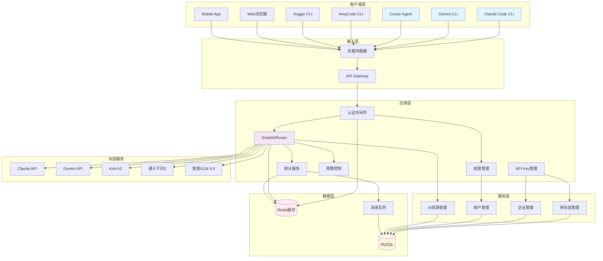
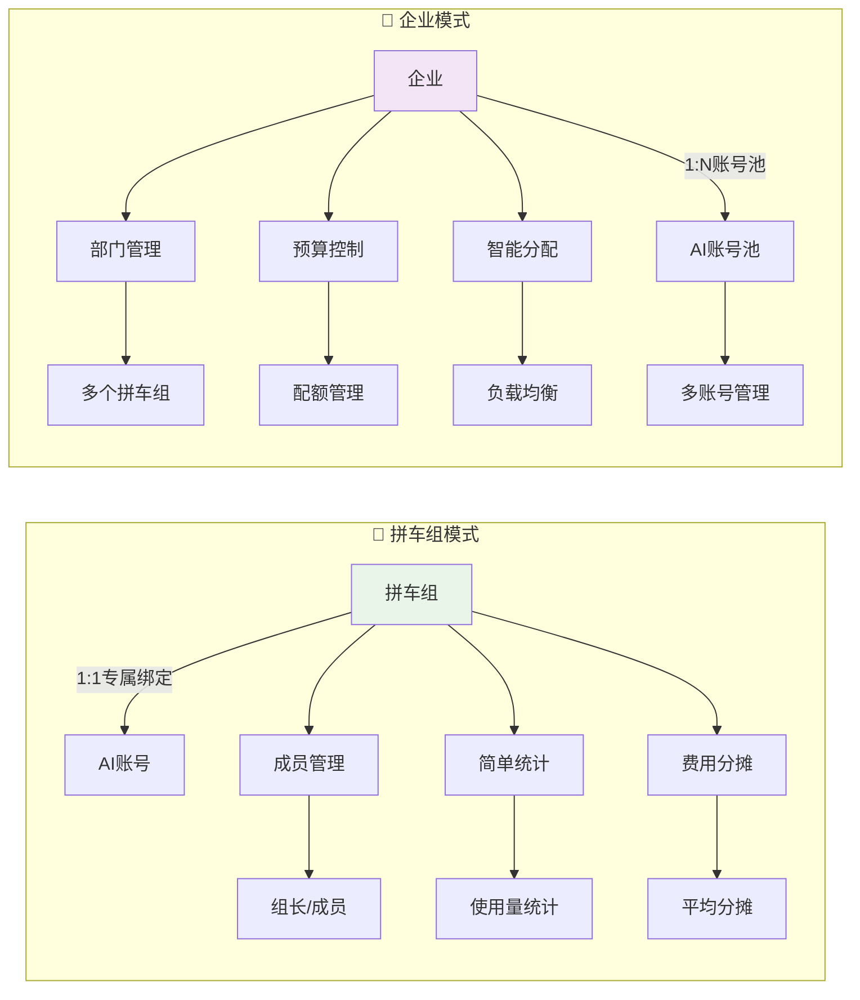
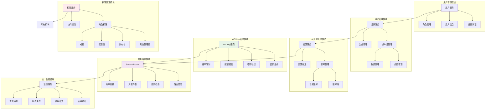
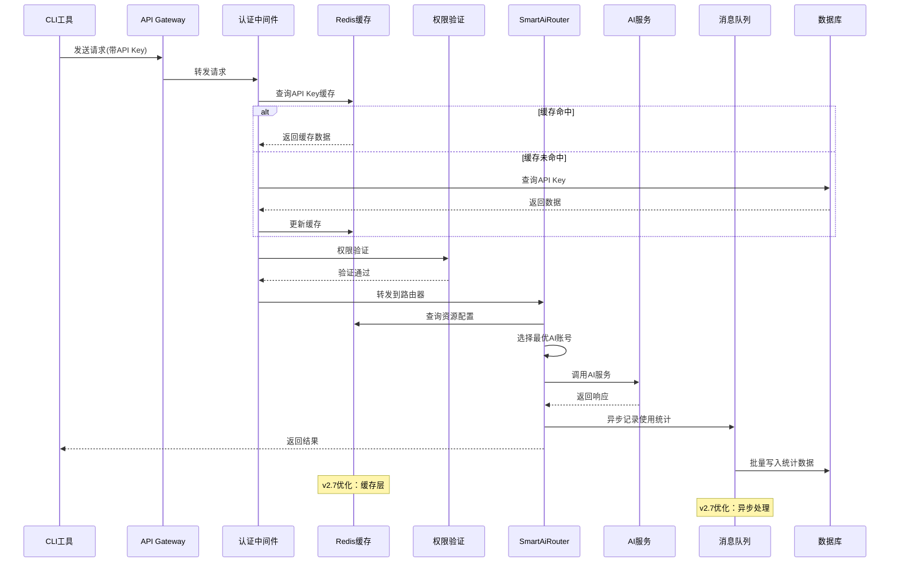
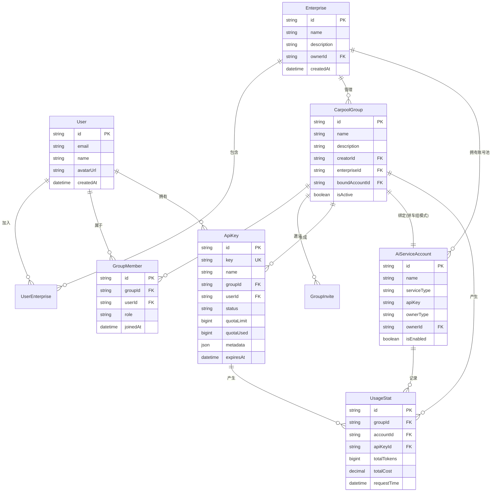
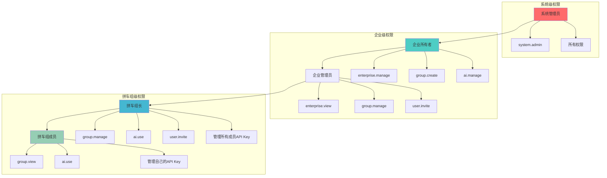
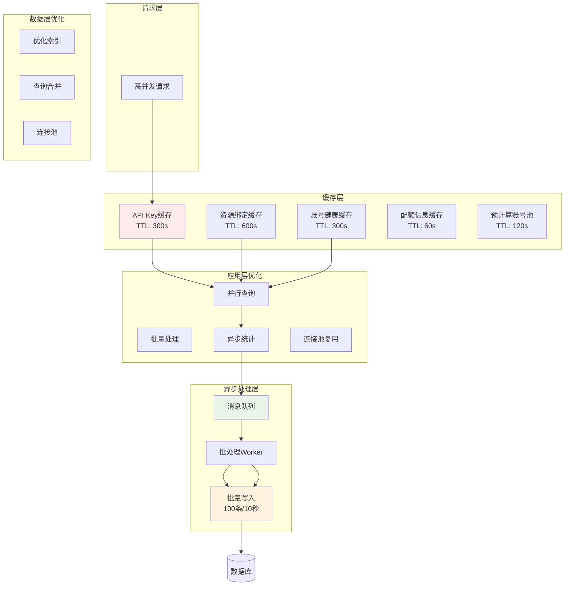
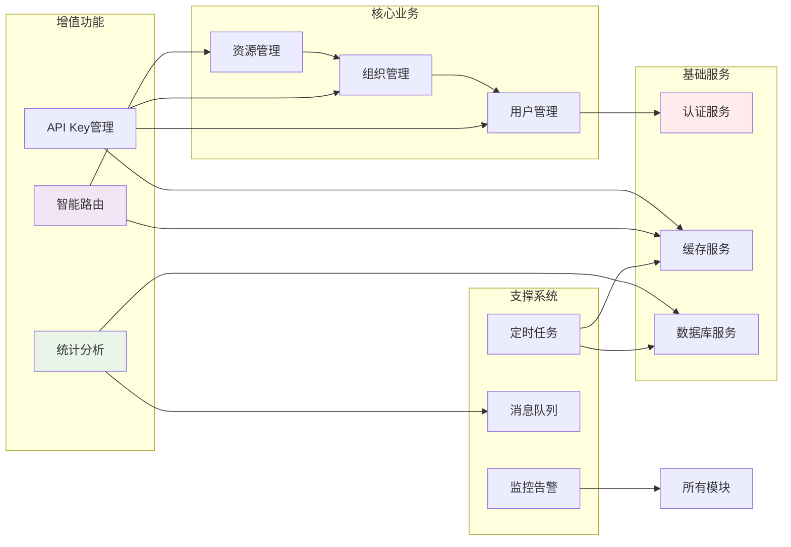

# AiCarpool 当前系统架构关系图

## 文档信息
- **创建时间**: 2025-08-08
- **文档目的**: 梳理AiCarpool当前系统的模块关系和架构设计
- **适用版本**: v2.7（包含高并发优化）

---

## 1. 系统整体架构图

---

## 2. 双模式架构对比图

---

## 3. 核心功能模块关系图

---

## 4. API请求处理流程图

---

## 5. 数据模型关系图

---

## 6. 权限体系层级关系图

---

## 7. 高并发优化架构图（v2.7）

---

## 8. 模块依赖关系总览

---

## 总结

AiCarpool当前架构采用了**双模式设计**（拼车组模式和企业模式），通过以下核心模块实现了完整的AI资源管理平台：

### 核心特点

1. **灵活的资源管理**
   - 拼车组模式：1对1专属绑定，确保公平性
   - 企业模式：账号池智能分配，提高资源利用率

2. **完善的权限体系**
   - 多级权限控制（系统、企业、拼车组、成员）
   - 基于角色的访问控制（RBAC）
   - API Key级别的细粒度权限

3. **智能路由系统**
   - SmartAiRouter实现智能选择最优AI账号
   - 支持负载均衡和故障转移
   - 健康检查和自动恢复

4. **高性能优化**
   - Redis缓存层减少数据库查询
   - 异步消息队列处理统计数据
   - 批量操作和查询优化

5. **统一管理界面**
   - Web端完整管理功能
   - 支持多种CLI工具接入
   - 实时监控和统计分析

### 技术栈

- **前端**: Next.js + React + TypeScript
- **后端**: Node.js + Prisma ORM
- **数据库**: MySQL
- **缓存**: Redis
- **消息队列**: Redis Queue
- **AI服务**: Claude（原生/中转）、Gemini、Kimi k2、通义千问、智谱GLM等

这个架构设计既保证了系统的灵活性和可扩展性，又通过优化确保了高并发场景下的性能表现。