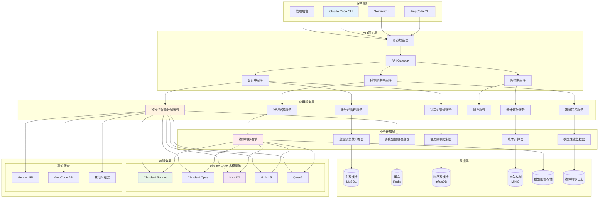
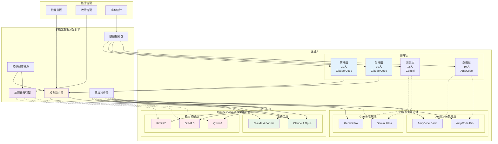
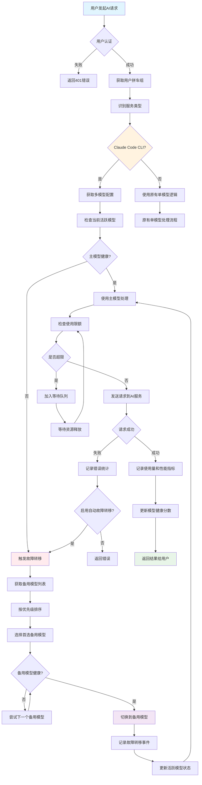
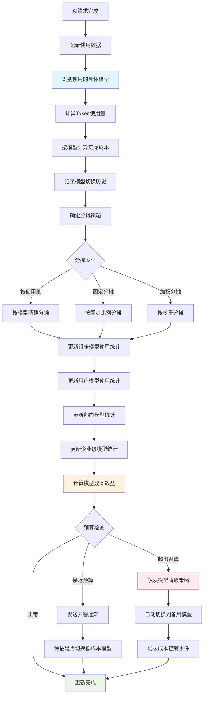
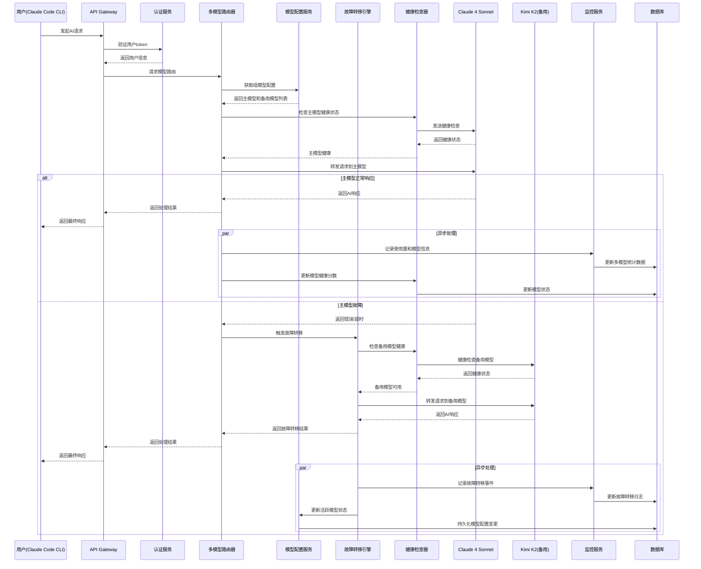
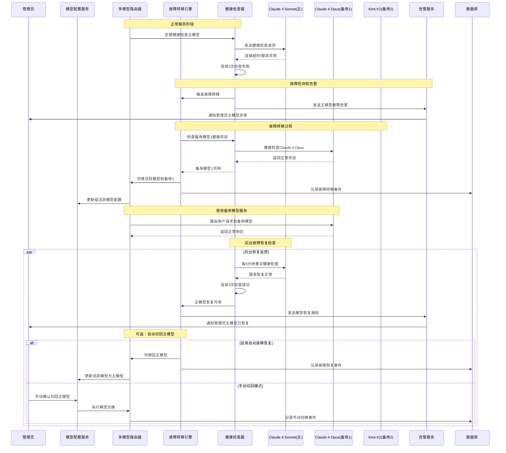
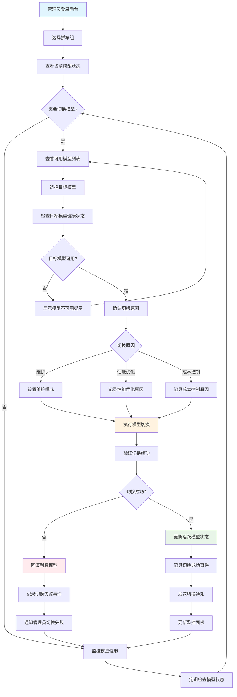
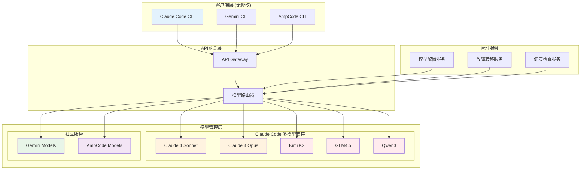

# AiCarpool 企业级产品需求文档 (PRD)

## 📋 文档信息

| 项目 | 内容 |
|------|------|
| **产品名称** | AiCarpool - AI编程工具拼车服务平台 |
| **版本** | v2.0 (企业级) |
| **文档版本** | 1.0 |
| **创建时间** | 2025-08-01 |
| **负责人** | coso |
| **状态** | 需求分析 |

---

## 🎯 产品概述

### 产品定位
AiCarpool 是一个**通用化的AI资源管理平台**，通过创新的"账号池+拼车组"双体系设计，实现从小团队到企业级的AI编程工具资源统一管理、智能分配和成本优化。

### 核心价值主张
- **通用性**：同时满足小团队物理隔离和企业级资源共享需求
- **灵活性**：支持多种账号绑定和分配策略
- **经济性**：最大化AI账号利用率，降低企业AI使用成本
- **可控性**：精细化的权限管理和使用限额控制

### 目标市场
1. **小型团队** (3-10人)：需要账号物理隔离的开发团队
2. **中型企业** (50-200人)：需要部门级资源管理的公司
3. **大型企业** (200+人)：需要企业级AI资源统一管理的组织

---

## 👥 用户角色与场景

### 核心用户角色

#### 1. 企业管理员
- **职责**：企业级AI资源统筹管理
- **权限**：账号池管理、组织架构配置、全局监控
- **关注点**：成本控制、资源利用率、安全合规

#### 2. 部门管理员  
- **职责**：部门内AI资源分配和管理
- **权限**：拼车组管理、成员权限控制、部门统计
- **关注点**：团队效率、预算控制、使用统计

#### 3. 普通用户
- **职责**：日常AI编程工具使用
- **权限**：基础使用功能、个人统计查看
- **关注点**：使用便捷性、响应速度、功能稳定性

### 典型使用场景

#### 场景1：老甘的小团队场景
**背景**：老甘运营一个10人的开发团队，需要为每个项目组提供独立的AI账号。

**需求**：
- 物理隔离：每个拼车组绑定专属账号
- 成本分摊：按使用量精确计费
- 简单管理：易于配置和维护

**解决方案**：
```
拼车组A ←→ 专属账号1 (Claude Pro)
拼车组B ←→ 专属账号2 (Gemini Advanced)  
拼车组C ←→ 专属账号3 (Claude Pro)
```

#### 场景2：无趣的企业场景
**背景**：100人的软件公司，希望最大化AI账号利用率，同时满足行政管理需求。

**需求**：
- 资源共享：多个部门共用账号池
- 负载均衡：智能分配避免账号过载
- 成本分摊：按部门统计和分摊费用
- 预算控制：为各部门设置使用上限

**解决方案**：
```
共享账号池 [账号1, 账号2, 账号3, 账号4, 账号5]
    ↓ 智能分配
前端组 (20人) ←→ 共享池 + 专属账号A
后端组 (30人) ←→ 共享池 + 专属账号B  
测试组 (15人) ←→ 共享池
产品组 (10人) ←→ 共享池
```

#### 场景3：混合场景
**背景**：某科技公司，大部分团队共享资源，核心业务团队需要专属账号。

**需求**：
- 分层管理：核心团队专属，普通团队共享
- 弹性扩展：根据业务需要灵活调整
- 成本优化：在保证核心业务的前提下最大化利用率

**解决方案**：
```
核心业务组 ←→ 专属高级账号池
研发部门 ←→ 共享标准账号池  
支持部门 ←→ 共享基础账号池
```

---

## 🔧 核心功能设计

### 1. 账号池管理系统

#### 1.1 账号池概念
**账号池**是AI服务账号的逻辑集合，支持以下属性：

```json
{
  "poolId": "pool_001",
  "name": "企业共享池",
  "type": "shared|dedicated", 
  "accounts": ["account_1", "account_2", "account_3"],
  "loadBalanceStrategy": "round_robin|least_connections|weighted",
  "maxLoadPerAccount": 80, // 单账号最大负载百分比
  "priority": 1, // 池优先级
  "isActive": true
}
```

#### 1.2 账号标签系统
- **共享标签**：`shared` - 可被多个拼车组使用
- **专属标签**：`dedicated` - 仅服务特定拼车组
- **优先级标签**：`high|medium|low` - 影响分配优先级
- **服务类型标签**：`claude|gemini|copilot` - 按AI服务分类

#### 1.3 负载均衡策略
1. **轮询分配** (Round Robin)：依次分配请求
2. **最少连接** (Least Connections)：分配给当前负载最低的账号
3. **加权分配** (Weighted)：根据账号性能设置权重
4. **健康检查**：自动剔除不可用账号

### 2. 拼车组绑定机制

#### 2.1 灵活绑定关系
支持一对多和多对多的绑定关系：

```sql
-- 拼车组可以绑定多个账号池
group_pool_bindings (
  group_id, 
  pool_id, 
  binding_type, -- 'primary' | 'fallback' | 'shared'
  usage_limit,  -- 该组在此池的使用上限
  priority      -- 使用优先级
)

-- 拼车组也可以直接绑定特定账号
group_account_bindings (
  group_id,
  account_id,
  binding_type, -- 'exclusive' | 'shared'
  usage_limit
)
```

#### 2.2 使用限额控制
- **池级别限额**：拼车组在账号池中的使用上限
- **账号级别限额**：拼车组对特定账号的使用上限  
- **时间段限额**：按小时/日/月设置使用限制
- **动态调整**：根据负载情况动态调整限额

#### 2.3 智能分配算法
```typescript
interface AccountAllocationRequest {
  groupId: string;
  serviceType: 'claude' | 'gemini' | 'copilot';
  estimatedTokens?: number;
  priority?: 'high' | 'normal' | 'low';
}

interface AccountPool {
  id: string;
  name: string;
  type: 'shared' | 'dedicated';
  loadBalanceStrategy: 'round_robin' | 'least_connections' | 'weighted';
  accounts: AiServiceAccount[];
  maxLoadPerAccount: number;
  priority: number;
}

class EnterpriseAccountAllocator {
  constructor(private prisma: PrismaClient, private cache: CacheManager) {}

  async allocateAccount(request: AccountAllocationRequest): Promise<AiServiceAccount | null> {
    // 1. 获取拼车组绑定的账号池
    const pools = await this.getGroupPools(request.groupId);
    
    // 2. 按优先级排序池
    const sortedPools = pools.sort((a, b) => a.priority - b.priority);
    
    // 3. 遍历池，寻找可用账号
    for (const pool of sortedPools) {
      // 检查使用限额
      if (await this.checkUsageLimit(request.groupId, pool.id)) {
        // 根据负载均衡策略选择账号
        const account = await this.selectAccount(pool, request);
        if (account && await this.isAccountHealthy(account.id)) {
          return account;
        }
      }
    }
    
    // 4. 如果没有可用账号，返回null或加入等待队列
    return await this.handleNoAvailableAccount(request);
  }

  private async getGroupPools(groupId: string): Promise<AccountPool[]> {
    return await this.cache.getOrSet(
      `group:pools:${groupId}`,
      async () => {
        return await this.prisma.groupPoolBinding.findMany({
          where: { groupId, isActive: true },
          include: {
            pool: {
              include: {
                accounts: {
                  where: { isActive: true },
                  include: { account: true }
                }
              }
            }
          },
          orderBy: { priority: 'asc' }
        });
      },
      { ttl: 300 } // 5分钟缓存
    );
  }

  private async selectAccount(
    pool: AccountPool, 
    request: AccountAllocationRequest
  ): Promise<AiServiceAccount | null> {
    const availableAccounts = pool.accounts.filter(account => 
      account.serviceType === request.serviceType &&
      account.isActive &&
      this.getCurrentLoad(account.id) < pool.maxLoadPerAccount
    );

    if (availableAccounts.length === 0) return null;

    switch (pool.loadBalanceStrategy) {
      case 'round_robin':
        return this.roundRobinSelection(pool.id, availableAccounts);
      case 'least_connections':
        return this.leastConnectionsSelection(availableAccounts);
      case 'weighted':
        return this.weightedSelection(availableAccounts);
      default:
        return availableAccounts[0];
    }
  }
}
```

### 3. 企业级管理功能

#### 3.1 组织架构管理
```json
{
  "enterprise": {
    "id": "ent_001",
    "name": "某科技公司",
    "departments": [
      {
        "id": "dept_001", 
        "name": "研发部",
        "parent_id": null,
        "budget_limit": 10000,
        "groups": ["group_001", "group_002"]
      },
      {
        "id": "dept_002",
        "name": "前端组", 
        "parent_id": "dept_001",
        "budget_limit": 3000,
        "groups": ["group_003"]
      }
    ]
  }
}
```

#### 3.2 成本分摊系统
- **使用量统计**：精确记录每个请求的token使用量和成本
- **分摊规则**：支持按使用量、固定分摊、加权分摊等多种模式
- **预算控制**：实时监控预算使用情况，支持预警和限制
- **报表生成**：自动生成部门级、项目级成本报表

#### 3.3 权限管理系统
```yaml
角色权限矩阵:
  企业管理员:
    - 账号池：创建、编辑、删除、查看
    - 拼车组：全部权限
    - 用户：全部权限  
    - 统计：全企业数据
    - 设置：系统配置
    
  部门管理员:
    - 账号池：查看
    - 拼车组：部门内管理
    - 用户：部门内管理
    - 统计：部门数据
    - 设置：部门配置
    
  拼车组长:
    - 拼车组：本组管理
    - 用户：本组成员管理
    - 统计：本组数据
    
  普通用户:
    - 使用：AI服务调用
    - 查看：个人统计
```

---

## 🏗️ 技术架构设计

### 1. 系统架构图

#### 1.1 企业级多模型整体架构图


#### 1.2 企业级多模型账号池架构图


### 2. 核心流程图

#### 2.1 多模型智能分配流程图


#### 2.2 多模型成本分摊流程图


### 3. 时序图

#### 3.1 多模型用户请求处理时序图


#### 3.2 多模型故障转移和恢复时序图


#### 3.3 手动模型切换管理流程图


### 4. 数据库结构设计

#### 4.1 基于现有Prisma Schema的扩展设计

**现有核心模型**：
- `Group` - 拼车组
- `AiServiceAccount` - AI服务账号  
- `GroupAiService` - 拼车组与AI服务绑定
- `UsageStat` - 使用统计
- `QuotaConfig` / `QuotaUsage` - 配额管理

#### 4.2 企业级扩展模型

```prisma
// 企业组织表
model Enterprise {
  id          String   @id @default(cuid())
  name        String
  planType    String   @default("basic") // "basic", "enterprise", "custom"
  settings    Json?
  createdAt   DateTime @default(now())
  updatedAt   DateTime @updatedAt
  
  // 关联关系
  accountPools AccountPool[]
  departments  Department[]
  
  @@map("enterprises")
}

// 部门表 (支持层级结构)
model Department {
  id           String   @id @default(cuid())
  enterpriseId String
  parentId     String?  // 支持层级结构
  name         String
  description  String?
  budgetLimit  Decimal? @db.Decimal(10, 2)
  createdAt    DateTime @default(now())
  updatedAt    DateTime @updatedAt
  
  // 关联关系
  enterprise   Enterprise   @relation(fields: [enterpriseId], references: [id], onDelete: Cascade)
  parent       Department?  @relation("DepartmentHierarchy", fields: [parentId], references: [id])
  children     Department[] @relation("DepartmentHierarchy") 
  groups       Group[]      @relation("DepartmentGroups")
  
  @@index([enterpriseId])
  @@map("departments")
}

// 账号池表
model AccountPool {
  id                  String   @id @default(cuid())
  enterpriseId        String
  name                String
  description         String?
  poolType            String   @default("shared") // "shared", "dedicated"
  loadBalanceStrategy String   @default("round_robin") // "round_robin", "least_connections", "weighted"
  maxLoadPerAccount   Int      @default(80)
  priority            Int      @default(1)
  isActive            Boolean  @default(true)
  createdAt           DateTime @default(now())
  updatedAt           DateTime @updatedAt
  
  // 关联关系
  enterprise       Enterprise           @relation(fields: [enterpriseId], references: [id], onDelete: Cascade)
  accountBindings  AccountPoolBinding[]
  groupBindings    GroupPoolBinding[]
  
  @@index([enterpriseId])
  @@map("account_pools")
}

// 账号池与AI账号绑定表
model AccountPoolBinding {
  id                String   @id @default(cuid())
  poolId            String
  accountId         String
  weight            Int      @default(1)
  maxLoadPercentage Int      @default(80)
  isActive          Boolean  @default(true)
  createdAt         DateTime @default(now())
  
  // 关联关系
  pool    AccountPool      @relation(fields: [poolId], references: [id], onDelete: Cascade)
  account AiServiceAccount @relation(fields: [accountId], references: [id], onDelete: Cascade)
  
  @@unique([poolId, accountId])
  @@index([accountId])
  @@map("account_pool_bindings")
}

// 拼车组与账号池绑定表
model GroupPoolBinding {
  id                String   @id @default(cuid())
  groupId           String
  poolId            String
  bindingType       String   @default("shared") // "primary", "fallback", "shared"
  usageLimitHourly  Int      @default(0) // 0表示无限制
  usageLimitDaily   Int      @default(0)
  usageLimitMonthly Int      @default(0)
  priority          Int      @default(1)
  isActive          Boolean  @default(true)
  createdAt         DateTime @default(now())
  updatedAt         DateTime @updatedAt
  
  // 关联关系
  group Group       @relation(fields: [groupId], references: [id], onDelete: Cascade)
  pool  AccountPool @relation(fields: [poolId], references: [id], onDelete: Cascade)
  
  @@unique([groupId, poolId])
  @@index([poolId])
  @@map("group_pool_bindings")
}

// 扩展现有Group模型以支持部门关联
model Group {
  // ... 现有字段保持不变
  departmentId String?
  
  // 新增关联关系
  department     Department?        @relation("DepartmentGroups", fields: [departmentId], references: [id])
  poolBindings   GroupPoolBinding[]
  
  @@index([departmentId])
}

// 扩展现有AiServiceAccount模型以支持账号池
model AiServiceAccount {
  // ... 现有字段保持不变
  
  // 新增关联关系
  poolBindings AccountPoolBinding[]
}

// 增强使用记录表以支持账号池统计
model EnhancedUsageStat {
  id            String    @id @default(cuid())
  userId        String
  groupId       String
  accountId     String?   // 实际使用的账号ID
  poolId        String?   // 账号所属池ID
  aiServiceId   String    // 服务类型
  requestType   String
  requestTokens Int       @default(0)
  responseTokens Int      @default(0)
  totalTokens   BigInt
  cost          Decimal   @db.Decimal(10, 6)
  requestTime   DateTime
  responseTime  Int?
  status        String
  errorCode     String?
  metadata      Json?
  
  // 关联关系
  user    User             @relation(fields: [userId], references: [id], onDelete: Cascade)
  group   Group            @relation(fields: [groupId], references: [id], onDelete: Cascade)
  account AiServiceAccount? @relation(fields: [accountId], references: [id], onDelete: SetNull)
  pool    AccountPool?     @relation(fields: [poolId], references: [id], onDelete: SetNull)
  
  @@index([userId, requestTime])
  @@index([groupId, requestTime])
  @@index([accountId, requestTime])
  @@index([poolId, requestTime])
  @@map("enhanced_usage_stats")
}

// 预算分配表
model BudgetAllocation {
  id           String   @id @default(cuid())
  entityType   String   // "enterprise", "department", "group"
  entityId     String   // 对应的实体ID
  budgetPeriod String   @default("monthly") // "monthly", "quarterly", "yearly"
  budgetAmount Decimal  @db.Decimal(10, 2)
  usedAmount   Decimal  @default(0) @db.Decimal(10, 2)
  periodStart  DateTime
  periodEnd    DateTime
  isActive     Boolean  @default(true)
  createdAt    DateTime @default(now())
  updatedAt    DateTime @updatedAt
  
  @@unique([entityType, entityId, budgetPeriod, periodStart])
  @@index([entityType, entityId])
  @@map("budget_allocations")
}
```

#### 1.2 缓存策略
```yaml
缓存层设计:
  L1 - 应用缓存 (内存):
    - 账号池配置: 5分钟
    - 负载状态: 30秒
    - 用户权限: 10分钟
    
  L2 - Redis缓存:  
    - 账号可用性: 1分钟
    - 使用限额计数器: 实时
    - 统计数据: 5分钟
    - 分配算法结果: 30秒
    
  L3 - 数据库:
    - 持久化存储
    - 历史数据
    - 配置信息
```

### 5. API接口设计

#### 5.1 基于Next.js App Router的API设计

**API路由结构**：
```
/api/
├── enterprises/
│   ├── [enterpriseId]/
│   │   ├── route.ts                    # 企业CRUD
│   │   ├── departments/
│   │   │   └── route.ts                # 部门管理
│   │   └── account-pools/
│   │       ├── route.ts                # 账号池列表
│   │       └── [poolId]/
│   │           └── route.ts            # 账号池详情
├── groups/
│   └── [groupId]/
│       ├── account-pools/
│       │   ├── route.ts                # 组绑定的账号池
│       │   └── bindings/
│       │       └── route.ts            # 池绑定管理
│       └── ai-allocation/
│           └── route.ts                # 智能分配接口
└── admin/
    ├── account-pools/
    │   └── route.ts                    # 全局账号池管理
    └── load-balancer/
        └── route.ts                    # 负载均衡状态
```

#### 5.2 核心API接口实现

**企业级账号池管理API**：
```typescript
// /api/enterprises/[enterpriseId]/account-pools/route.ts
import { NextRequest } from 'next/server';
import { prisma } from '@/lib/prisma';
import { withAuth, createApiResponse } from '@/lib/middleware';

// 获取企业账号池列表
export async function GET(
  request: NextRequest,
  { params }: { params: Promise<{ enterpriseId: string }> }
) {
  const { enterpriseId } = await params;
  
  try {
    const pools = await prisma.accountPool.findMany({
      where: { enterpriseId },
      include: {
        accountBindings: {
          include: {
            account: {
              select: {
                id: true,
                name: true,
                serviceType: true,
                status: true
              }
            }
          }
        },
        groupBindings: {
          include: {
            group: {
              select: {
                id: true,
                name: true
              }
            }
          }
        },
        _count: {
          select: {
            accountBindings: true,
            groupBindings: true
          }
        }
      },
      orderBy: { priority: 'asc' }
    });

    return createApiResponse(pools, true, 200);
  } catch (error) {
    console.error('Get account pools error:', error);
    return createApiResponse(false, null, '获取账号池列表失败', 500);
  }
}

// 创建账号池
export async function POST(
  request: NextRequest,
  { params }: { params: Promise<{ enterpriseId: string }> }
) {
  const { enterpriseId } = await params;
  
  try {
    const body = await request.json();
    const {
      name,
      description,
      poolType,
      loadBalanceStrategy,
      maxLoadPerAccount,
      priority,
      accountIds
    } = body;

    // 创建账号池
    const pool = await prisma.accountPool.create({
      data: {
        enterpriseId,
        name,
        description,
        poolType,
        loadBalanceStrategy,
        maxLoadPerAccount,
        priority,
        accountBindings: {
          create: accountIds.map((accountId: string) => ({
            accountId,
            weight: 1,
            maxLoadPercentage: maxLoadPerAccount
          }))
        }
      },
      include: {
        accountBindings: {
          include: {
            account: true
          }
        }
      }
    });

    return createApiResponse(pool, true, 201);
  } catch (error) {
    console.error('Create account pool error:', error);
    return createApiResponse(false, null, '创建账号池失败', 500);
  }
}
```

**拼车组账号池绑定API**：
```typescript
// /api/groups/[groupId]/account-pools/bindings/route.ts
import { NextRequest } from 'next/server';
import { prisma } from '@/lib/prisma';
import { cacheManager } from '@/lib/cache';
import { withAuth, createApiResponse } from '@/lib/middleware';

// 获取拼车组绑定的账号池
export async function GET(
  request: NextRequest,
  { params }: { params: Promise<{ groupId: string }> }
) {
  const { groupId } = await params;
  
  try {
    const bindings = await cacheManager.getOrSet(
      `group:pool_bindings:${groupId}`,
      async () => {
        return await prisma.groupPoolBinding.findMany({
          where: { groupId, isActive: true },
          include: {
            pool: {
              include: {
                accountBindings: {
                  where: { isActive: true },
                  include: {
                    account: {
                      select: {
                        id: true,
                        name: true,
                        serviceType: true,
                        status: true,
                        lastUsedAt: true
                      }
                    }
                  }
                }
              }
            }
          },
          orderBy: { priority: 'asc' }
        });
      },
      { ttl: 300 } // 5分钟缓存
    );

    return createApiResponse(bindings, true, 200);
  } catch (error) {
    console.error('Get group pool bindings error:', error);
    return createApiResponse(false, null, '获取账号池绑定失败', 500);
  }
}

// 创建拼车组与账号池绑定
export async function POST(
  request: NextRequest,
  { params }: { params: Promise<{ groupId: string }> }
) {
  const { groupId } = await params;
  
  try {
    const body = await request.json();
    const {
      poolId,
      bindingType,
      usageLimitHourly,
      usageLimitDaily,
      usageLimitMonthly,
      priority
    } = body;

    const binding = await prisma.groupPoolBinding.create({
      data: {
        groupId,
        poolId,
        bindingType,
        usageLimitHourly,
        usageLimitDaily,
        usageLimitMonthly,
        priority
      },
      include: {
        pool: {
          include: {
            accountBindings: {
              include: {
                account: true
              }
            }
          }
        }
      }
    });

    // 清除相关缓存
    await cacheManager.del(`group:pool_bindings:${groupId}`);

    return createApiResponse(binding, true, 201);
  } catch (error) {
    console.error('Create group pool binding error:', error);
    return createApiResponse(false, null, '创建账号池绑定失败', 500);
  }
}
```

**智能分配API**：
```typescript
// /api/groups/[groupId]/ai-allocation/route.ts
import { NextRequest } from 'next/server';
import { EnterpriseAccountAllocator } from '@/lib/enterprise-allocator';
import { withAuth, createApiResponse } from '@/lib/middleware';

export async function POST(
  request: NextRequest,
  { params }: { params: Promise<{ groupId: string }> }
) {
  const { groupId } = await params;
  
  try {
    const body = await request.json();
    const { serviceType, estimatedTokens, priority } = body;

    const allocator = new EnterpriseAccountAllocator(prisma, cacheManager);
    
    const account = await allocator.allocateAccount({
      groupId,
      serviceType,
      estimatedTokens,
      priority
    });

    if (!account) {
      return createApiResponse(null, false, '暂无可用账号', 503);
    }

    return createApiResponse({
      accountId: account.id,
      accountName: account.name,
      serviceType: account.serviceType,
      allocatedAt: new Date().toISOString()
    }, true, 200);
    
  } catch (error) {
    console.error('Account allocation error:', error);
    return createApiResponse(false, null, '账号分配失败', 500);
  }
}
```

#### 2.2 智能分配API
```yaml
# 请求AI服务
POST /api/ai-proxy/chat
Headers:
  X-Group-ID: string
  Authorization: Bearer <token>
Body:
  service: 'claude' | 'gemini' | 'copilot'
  messages: Message[]
  
# 内部分配逻辑
Internal: /api/internal/allocate-account
Body:
  groupId: string
  serviceType: string  
  estimatedTokens: number
Response:
  accountId: string
  poolId: string
  allocation: object
```

#### 2.3 统计报表API
```yaml
# 获取使用统计
GET /api/groups/{groupId}/usage-stats
Query:
  period: 'day' | 'week' | 'month'
  startDate: string
  endDate: string
  
# 获取成本分摊报表  
GET /api/enterprises/{enterpriseId}/cost-allocation
Query:
  period: 'month' | 'quarter' | 'year'
  department: string (optional)
  
# 获取账号负载统计
GET /api/enterprises/{enterpriseId}/account-loads
Response:
  accounts: {
    accountId: string,
    currentLoad: number,
    avgLoad24h: number,
    totalRequests: number
  }[]
```

### 3. 负载均衡实现

#### 6.1 基于现有AiServiceRouter的企业级负载均衡

**扩展现有的AiServiceRouter类**：
```typescript
// /lib/enterprise/enhanced-ai-service-router.ts
import { AiServiceRouter, ServiceRoute, RoutingConfig } from '@/lib/ai-services/router';
import { prisma } from '@/lib/prisma';
import { cacheManager } from '@/lib/cache';

interface EnterpriseServiceRoute extends ServiceRoute {
  poolId?: string;
  accountId: string;
  weight: number;
  maxLoadPercentage: number;
  currentLoad: number;
  healthScore: number;
}

interface PoolRoutingStrategy {
  poolId: string;
  strategy: 'round_robin' | 'least_connections' | 'weighted' | 'health_based';
  accounts: EnterpriseServiceRoute[];
}

export class EnterpriseAiServiceRouter extends AiServiceRouter {
  private poolStrategies: Map<string, PoolRoutingStrategy> = new Map();
  private accountLoads: Map<string, number> = new Map();
  private healthScores: Map<string, number> = new Map();

  constructor() {
    super();
  }

  /**
   * 为拼车组初始化企业级路由，基于账号池
   */
  async initializeEnterpriseRoutes(groupId: string): Promise<void> {
    try {
      // 获取组绑定的账号池
      const poolBindings = await prisma.groupPoolBinding.findMany({
        where: { groupId, isActive: true },
        include: {
          pool: {
            include: {
              accountBindings: {
                where: { isActive: true },
                include: {
                  account: {
                    where: { isEnabled: true, status: 'active' }
                  }
                }
              }
            }
          }
        },
        orderBy: { priority: 'asc' }
      });

      // 为每个账号池构建路由策略
      for (const binding of poolBindings) {
        const pool = binding.pool;
        const routes: EnterpriseServiceRoute[] = [];

        for (const accountBinding of pool.accountBindings) {
          const account = accountBinding.account;
          if (!account) continue;

          routes.push({
            serviceId: account.id,
            serviceName: `${account.name} (${account.serviceType})`,
            priority: binding.priority,
            isEnabled: true,
            healthScore: await this.getAccountHealthScore(account.id),
            responseTime: await this.getAccountResponseTime(account.id),
            errorRate: await this.getAccountErrorRate(account.id),
            lastHealthCheck: new Date(),
            // 企业级扩展字段
            poolId: pool.id,
            accountId: account.id,
            weight: accountBinding.weight,
            maxLoadPercentage: accountBinding.maxLoadPercentage,  
            currentLoad: await this.getAccountCurrentLoad(account.id)
          });
        }

        this.poolStrategies.set(pool.id, {
          poolId: pool.id,
          strategy: pool.loadBalanceStrategy as any,
          accounts: routes
        });
      }

      // 缓存路由配置
      await cacheManager.set(`enterprise_routes:${groupId}`, 
        Object.fromEntries(this.poolStrategies), 300);

    } catch (error) {
      console.error('Initialize enterprise routes error:', error);
      throw error;
    }
  }

  /**
   * 企业级账号选择算法
   */
  async selectEnterpriseAccount(
    groupId: string, 
    serviceType: string,
    options: {
      estimatedTokens?: number;
      priority?: 'high' | 'normal' | 'low';
      excludeAccounts?: string[];
    } = {}
  ): Promise<EnterpriseServiceRoute | null> {
    
    // 获取适用的账号池（按优先级排序）
    const availablePools = Array.from(this.poolStrategies.values())
      .filter(pool => this.hasServiceType(pool, serviceType))
      .sort((a, b) => this.getPoolPriority(a) - this.getPoolPriority(b));

    for (const pool of availablePools) {
      // 检查使用限额
      if (await this.checkPoolUsageLimit(groupId, pool.poolId)) {
        const account = await this.selectFromPool(pool, options);
        if (account) {
          return account;
        }
      }
    }

    return null;
  }

  /**
   * 从账号池中选择最佳账号
   */
  private async selectFromPool(
    pool: PoolRoutingStrategy, 
    options: any
  ): Promise<EnterpriseServiceRoute | null> {
    
    // 过滤可用账号
    const availableAccounts = pool.accounts.filter(account => 
      account.isEnabled &&
      account.currentLoad < account.maxLoadPercentage &&
      account.healthScore > 50 && // 健康分数大于50
      !options.excludeAccounts?.includes(account.accountId)
    );

    if (availableAccounts.length === 0) return null;

    // 根据策略选择账号
    switch (pool.strategy) {
      case 'round_robin':
        return this.roundRobinSelection(pool.poolId, availableAccounts);
        
      case 'least_connections':
        return this.leastConnectionsSelection(availableAccounts);
        
      case 'weighted':
        return this.weightedSelection(availableAccounts);
        
      case 'health_based':
        return this.healthBasedSelection(availableAccounts);
        
      default:
        return availableAccounts[0];
    }
  }

  /**
   * 轮询选择算法
   */
  private roundRobinSelection(
    poolId: string, 
    accounts: EnterpriseServiceRoute[]
  ): EnterpriseServiceRoute {
    const counterKey = `pool_counter:${poolId}`;
    const counter = this.counters.get(counterKey) || 0;
    const selectedAccount = accounts[counter % accounts.length];
    this.counters.set(counterKey, counter + 1);
    return selectedAccount;
  }

  /**
   * 最少连接选择算法
   */
  private leastConnectionsSelection(
    accounts: EnterpriseServiceRoute[]
  ): EnterpriseServiceRoute {
    return accounts.reduce((min, current) => 
      current.currentLoad < min.currentLoad ? current : min
    );
  }

  /**
   * 加权选择算法
   */
  private weightedSelection(accounts: EnterpriseServiceRoute[]): EnterpriseServiceRoute {
    const totalWeight = accounts.reduce((sum, acc) => sum + acc.weight, 0);
    const randomWeight = Math.random() * totalWeight;
    
    let currentWeight = 0;
    for (const account of accounts) {
      currentWeight += account.weight;
      if (randomWeight <= currentWeight) {
        return account;
      }
    }
    
    return accounts[0];
  }

  /**
   * 基于健康分数的选择算法
   */
  private healthBasedSelection(accounts: EnterpriseServiceRoute[]): EnterpriseServiceRoute {
    // 按健康分数和负载的综合评分排序
    const scored = accounts.map(account => ({
      account,
      score: account.healthScore * 0.7 + (100 - account.currentLoad) * 0.3
    })).sort((a, b) => b.score - a.score);
    
    return scored[0].account;
  }

  /**
   * 实时负载监控和更新
   */
  async updateAccountLoad(accountId: string, newLoad: number): Promise<void> {
    this.accountLoads.set(accountId, newLoad);
    
    // 更新缓存
    await cacheManager.set(`account:load:${accountId}`, newLoad, 60);
    
    // 如果负载过高，触发告警
    if (newLoad > 90) {
      await this.triggerHighLoadAlert(accountId, newLoad);
    }
  }

  /**
   * 健康检查和分数更新
   */
  async updateHealthScore(accountId: string): Promise<void> {
    try {
      const isHealthy = await this.performHealthCheck(accountId);
      const currentScore = this.healthScores.get(accountId) || 100;
      
      let newScore: number;
      if (isHealthy) {
        // 健康时逐渐恢复分数
        newScore = Math.min(100, currentScore + 10);
      } else {
        // 不健康时快速降低分数
        newScore = Math.max(0, currentScore - 30);
      }
      
      this.healthScores.set(accountId, newScore);
      await cacheManager.set(`account:health_score:${accountId}`, newScore, 300);
      
      // 分数过低时触发告警
      if (newScore < 30) {
        await this.triggerUnhealthyAlert(accountId, newScore);
      }
      
    } catch (error) {
      console.error(`Health check failed for account ${accountId}:`, error);
      this.healthScores.set(accountId, 0);
    }
  }

  /**
   * 使用限额检查
   */
  private async checkPoolUsageLimit(groupId: string, poolId: string): Promise<boolean> {
    const binding = await prisma.groupPoolBinding.findUnique({
      where: {
        groupId_poolId: { groupId, poolId }
      }
    });

    if (!binding) return false;

    const now = new Date();
    const hourKey = `${now.getFullYear()}-${now.getMonth()}-${now.getDate()}-${now.getHours()}`;
    const dayKey = `${now.getFullYear()}-${now.getMonth()}-${now.getDate()}`;
    const monthKey = `${now.getFullYear()}-${now.getMonth()}`;

    // 检查小时限额
    if (binding.usageLimitHourly > 0) {
      const hourlyUsage = await cacheManager.get<number>(`pool_usage:${poolId}:${groupId}:${hourKey}`) || 0;
      if (hourlyUsage >= binding.usageLimitHourly) return false;
    }

    // 检查日限额
    if (binding.usageLimitDaily > 0) {
      const dailyUsage = await cacheManager.get<number>(`pool_usage:${poolId}:${groupId}:${dayKey}`) || 0;
      if (dailyUsage >= binding.usageLimitDaily) return false;
    }

    // 检查月限额
    if (binding.usageLimitMonthly > 0) {
      const monthlyUsage = await cacheManager.get<number>(`pool_usage:${poolId}:${groupId}:${monthKey}`) || 0;
      if (monthlyUsage >= binding.usageLimitMonthly) return false;
    }

    return true;
  }

  /**
   * 记录使用量并更新限额计数器
   */
  async recordUsage(
    groupId: string, 
    poolId: string, 
    accountId: string, 
    tokens: number
  ): Promise<void> {
    const now = new Date();
    const hourKey = `${now.getFullYear()}-${now.getMonth()}-${now.getDate()}-${now.getHours()}`;
    const dayKey = `${now.getFullYear()}-${now.getMonth()}-${now.getDate()}`;
    const monthKey = `${now.getFullYear()}-${now.getMonth()}`;

    // 更新各时间维度的使用量计数器
    const hourUsageKey = `pool_usage:${poolId}:${groupId}:${hourKey}`;
    const dayUsageKey = `pool_usage:${poolId}:${groupId}:${dayKey}`;
    const monthUsageKey = `pool_usage:${poolId}:${groupId}:${monthKey}`;

    const redis = cacheManager.getClient();
    if (redis) {
      await Promise.all([
        redis.incrby(hourUsageKey, tokens),
        redis.expire(hourUsageKey, 3600), // 1小时过期
        redis.incrby(dayUsageKey, tokens),
        redis.expire(dayUsageKey, 86400), // 1天过期
        redis.incrby(monthUsageKey, tokens),
        redis.expire(monthUsageKey, 2592000), // 30天过期
      ]);
    }

    // 更新账号负载
    const currentLoad = await this.getAccountCurrentLoad(accountId);
    await this.updateAccountLoad(accountId, currentLoad);
  }

  // 辅助方法实现
  private async getAccountHealthScore(accountId: string): Promise<number> {
    const cached = await cacheManager.get<number>(`account:health_score:${accountId}`);
    return cached !== null ? cached : 100;
  }

  private async getAccountResponseTime(accountId: string): Promise<number> {
    const cached = await cacheManager.get<number>(`account:response_time:${accountId}`);
    return cached !== null ? cached : 0;
  }

  private async getAccountErrorRate(accountId: string): Promise<number> {
    const cached = await cacheManager.get<number>(`account:error_rate:${accountId}`);
    return cached !== null ? cached : 0;
  }

  private async getAccountCurrentLoad(accountId: string): Promise<number> {
    const cached = await cacheManager.get<number>(`account:load:${accountId}`);
    if (cached !== null) return cached;

    // 基于最近5分钟的请求数计算负载
    const fiveMinutesAgo = new Date(Date.now() - 5 * 60 * 1000);
    const recentRequests = await prisma.usageStat.count({
      where: {
        requestTime: { gte: fiveMinutesAgo }
        // 需要在UsageStat中添加accountId字段
      }
    });

    const load = Math.min(100, (recentRequests / 500) * 100); // 假设500为满负载
    await cacheManager.set(`account:load:${accountId}`, load, 30);
    return load;
  }

  private async performHealthCheck(accountId: string): Promise<boolean> {
    try {
      const account = await prisma.aiServiceAccount.findUnique({
        where: { id: accountId }
      });

      if (!account || !account.isEnabled || account.status !== 'active') {
        return false;
      }

      // 这里可以实现具体的健康检查逻辑
      // 比如发送一个简单的API请求来验证账号可用性
      return true;
      
    } catch (error) {
      console.error(`Health check error for account ${accountId}:`, error);
      return false;
    }
  }

  private hasServiceType(pool: PoolRoutingStrategy, serviceType: string): boolean {
    return pool.accounts.some(account => 
      account.serviceName.includes(serviceType)
    );
  }

  private getPoolPriority(pool: PoolRoutingStrategy): number {
    return Math.min(...pool.accounts.map(acc => acc.priority));
  }

  private async triggerHighLoadAlert(accountId: string, load: number): Promise<void> {
    console.warn(`High load alert: Account ${accountId} at ${load}% load`);
    // 实现告警逻辑，如发送邮件、Slack通知等
  }

  private async triggerUnhealthyAlert(accountId: string, score: number): Promise<void> {
    console.warn(`Unhealthy account alert: Account ${accountId} health score: ${score}`);
    // 实现告警逻辑
  }
}
```

#### 6.2 负载均衡策略对比

| 策略 | 适用场景 | 优点 | 缺点 |
|------|----------|------|------|
| **轮询** | 账号性能相近 | 简单、公平 | 不考虑实际负载 |
| **最少连接** | 账号性能不同 | 考虑实际负载 | 计算开销较大 |
| **加权分配** | 账号性能差异大 | 灵活配置权重 | 需要手动调整权重 |
| **健康分数** | 账号稳定性要求高 | 自动避开问题账号 | 健康检查开销 |
      
      case 'least_connections':
        return this.leastConnectionsSelection(availableAccounts);
      
      case 'weighted':
        return this.weightedSelection(availableAccounts);
      
      case 'health_based':
        return this.healthBasedSelection(availableAccounts);
      
      default:
        return availableAccounts[0];
    }
  }

  /**
   * 轮询选择算法
   */
  private roundRobinSelection(
    poolId: string, 
    accounts: EnterpriseServiceRoute[]
  ): EnterpriseServiceRoute {
    const key = `rr_counter:${poolId}`;
    const counter = this.connections.get(key) || 0;
    const selectedAccount = accounts[counter % accounts.length];
    this.connections.set(key, counter + 1);
    return selectedAccount;
  }

  /**
   * 最少连接选择算法
   */
  private leastConnectionsSelection(
    accounts: EnterpriseServiceRoute[]
  ): EnterpriseServiceRoute {
    return accounts.reduce((min, account) => 
      account.currentLoad < min.currentLoad ? account : min
    );
  }

  /**
   * 加权选择算法
   */
  private weightedSelection(
    accounts: EnterpriseServiceRoute[]
  ): EnterpriseServiceRoute {
    const totalWeight = accounts.reduce((sum, acc) => sum + acc.weight, 0);
    let random = Math.random() * totalWeight;
    
    for (const account of accounts) {
      random -= account.weight;
      if (random <= 0) {
        return account;
      }
    }
    
    return accounts[0]; // fallback
  }

  /**
   * 基于健康分数的选择算法
   */
  private healthBasedSelection(
    accounts: EnterpriseServiceRoute[]
  ): EnterpriseServiceRoute {
    // 按健康分数和负载综合评分排序
    const scored = accounts.map(account => ({
      account,
      score: account.healthScore * 0.7 + (100 - account.currentLoad) * 0.3
    })).sort((a, b) => b.score - a.score);
    
    return scored[0].account;
  }

  /**
   * 获取账号当前负载
   */
  private async getAccountCurrentLoad(accountId: string): Promise<number> {
    const cached = await cacheManager.get(`account:load:${accountId}`);
    if (cached) return cached as number;
    
    // 实际负载计算逻辑
    const load = Math.random() * 100; // 模拟数据，实际应该从监控系统获取
    await cacheManager.set(`account:load:${accountId}`, load, 30);
    return load;
  }

  /**
   * 获取账号健康分数
   */
  private async getAccountHealthScore(accountId: string): Promise<number> {
    const cached = await cacheManager.get(`account:health:${accountId}`);
    if (cached) return cached as number;
    
    // 健康分数计算逻辑
    const health = Math.random() * 100; // 模拟数据
    await cacheManager.set(`account:health:${accountId}`, health, 60);
    return health;
  }

  /**
   * 检查账号池使用限额
   */
  private async checkPoolUsageLimit(groupId: string, poolId: string): Promise<boolean> {
    // 获取使用限额配置
    const binding = await prisma.groupPoolBinding.findFirst({
      where: { groupId, poolId, isActive: true }
    });
    
    if (!binding) return false;
    
    // 检查小时/日/月限额
    if (binding.usageLimitHourly > 0) {
      const hourlyUsage = await this.getHourlyUsage(groupId, poolId);
      if (hourlyUsage >= binding.usageLimitHourly) return false;
    }
    
    if (binding.usageLimitDaily > 0) {
      const dailyUsage = await this.getDailyUsage(groupId, poolId);
      if (dailyUsage >= binding.usageLimitDaily) return false;
    }
    
    if (binding.usageLimitMonthly > 0) {
      const monthlyUsage = await this.getMonthlyUsage(groupId, poolId);
      if (monthlyUsage >= binding.usageLimitMonthly) return false;
    }
    
    return true;
  }

  // 辅助方法
  private hasServiceType(pool: PoolRoutingStrategy, serviceType: string): boolean {
    return pool.accounts.some(account => 
      account.serviceName.toLowerCase().includes(serviceType.toLowerCase())
    );
  }

  private getPoolPriority(pool: PoolRoutingStrategy): number {
    return pool.accounts[0]?.priority || 999;
  }

  private async getHourlyUsage(groupId: string, poolId: string): Promise<number> {
    // 实际应该查询usage_stats表
    return 0;
  }

  private async getDailyUsage(groupId: string, poolId: string): Promise<number> {
    return 0;
  }

  private async getMonthlyUsage(groupId: string, poolId: string): Promise<number> {
    return 0;
  }

  private async getAccountResponseTime(accountId: string): Promise<number> {
    return Math.random() * 1000; // 模拟响应时间
  }

  private async getAccountErrorRate(accountId: string): Promise<number> {
    return Math.random() * 10; // 模拟错误率
  }
}
```

#### 3.2 健康检查机制
```typescript
class HealthChecker {
  private unhealthyAccounts = new Set<string>();
  
  async checkAccountHealth(account: Account): Promise<boolean> {
    try {
      // 发送简单的健康检查请求
      const response = await account.healthCheck();
      
      if (response.ok) {
        this.unhealthyAccounts.delete(account.id);
        return true;
      } else {
        this.markUnhealthy(account.id);
        return false;
      }
    } catch (error) {
      this.markUnhealthy(account.id);
      return false;
    }
  }
  
  private markUnhealthy(accountId: string): void {
    this.unhealthyAccounts.add(accountId);
    
    // 30秒后重新检查
    setTimeout(() => {
      this.recheckAccount(accountId);
    }, 30000);
  }
}
```

---

## 📊 监控与告警

### 1. 实时监控指标

#### 1.1 系统级指标
- **账号可用性**：各AI服务账号的在线状态
- **负载分布**：账号间的负载均衡情况  
- **响应时间**：AI服务的平均响应时间
- **错误率**：请求失败率和错误类型分布
- **成本趋势**：实时成本消耗和预算使用情况

#### 1.2 业务级指标  
- **拼车组活跃度**：各组的使用频率和活跃用户数
- **资源利用率**：账号池的利用率和空闲率
- **预算执行**：各部门预算的执行进度
- **用户满意度**：响应时间和成功率的用户体验指标

### 2. 告警机制
```yaml
告警规则:
  账号不可用:
    触发条件: 账号连续3次健康检查失败
    告警级别: 高
    通知对象: 系统管理员
    
  负载过高:
    触发条件: 账号负载 > 90% 持续5分钟
    告警级别: 中  
    通知对象: 企业管理员
    
  预算超支:
    触发条件: 预算使用率 > 80%
    告警级别: 中
    通知对象: 部门管理员
    
  成本异常:
    触发条件: 日成本增长 > 50%
    告警级别: 高
    通知对象: 企业管理员 + 财务
```

---

## 🛠️ 实施计划

### Phase 1: 基础架构重构 (4-6周)

#### 目标
建立账号池+拼车组双体系的基础架构

#### 主要任务
1. **数据库重构** (1周)
   - 设计新的表结构
   - 数据迁移脚本
   - 向后兼容处理

2. **账号池管理** (2周)
   - 账号池CRUD功能
   - 账号绑定管理
   - 基础UI界面

3. **绑定关系** (1-2周)
   - 拼车组与账号池绑定
   - 使用限额控制
   - 权限验证

4. **API重构** (1周)
   - AI代理服务适配
   - 分配逻辑集成
   - 接口测试

#### 验收标准
- [ ] 支持创建共享和专属账号池
- [ ] 拼车组可以绑定多个账号池
- [ ] 基本的使用限额控制生效
- [ ] 原有功能保持兼容

### Phase 2: 智能分配与负载均衡 (3-4周)

#### 目标  
实现智能的账号分配和负载均衡机制

#### 主要任务
1. **负载均衡算法** (2周)
   - 轮询、最少连接、加权分配
   - 健康检查机制
   - 故障转移逻辑

2. **实时监控** (1-2周)
   - 账号负载监控
   - 性能指标收集
   - 监控面板

3. **优化调度** (1周)
   - 预测性分配
   - 动态限额调整
   - 排队机制

#### 验收标准
- [ ] 负载均衡算法正常工作
- [ ] 账号故障自动切换
- [ ] 实时监控面板可用
- [ ] 系统性能达到预期

### Phase 3: 企业级功能 (3-4周)

#### 目标
完善企业级管理功能和成本控制

#### 主要任务
1. **组织架构** (1周)
   - 企业和部门管理
   - 层级权限控制
   - 批量用户导入

2. **成本分摊** (2周)
   - 使用量精确统计
   - 多维度成本分摊
   - 预算管理系统

3. **报表系统** (1-2周)
   - 企业级统计报表
   - 成本分析图表
   - 数据导出功能

#### 验收标准
- [ ] 支持企业级组织架构
- [ ] 成本分摊计算准确
- [ ] 报表功能完整可用
- [ ] 权限控制精细化

### Phase 4: 优化与完善 (2-3周)

#### 目标
系统优化和生产环境部署

#### 主要任务
1. **性能优化** (1周)
   - 缓存策略优化
   - 数据库查询优化
   - 接口响应时间优化

2. **安全加固** (1周)
   - 数据加密
   - 访问控制
   - 审计日志

3. **文档和培训** (1周)
   - 用户使用手册
   - 管理员培训材料  
   - API文档

#### 验收标准
- [ ] 系统性能满足生产要求
- [ ] 安全措施完备
- [ ] 文档和培训材料完整

---

## 🔒 风险评估与应对

### 技术风险

#### 1. 数据迁移风险
**风险等级**: 中
**影响**: 可能导致数据丢失或业务中断
**应对措施**:
- 制定详细的迁移计划和回滚方案
- 在测试环境充分验证
- 分批次迁移，降低影响范围
- 保留原系统作为备份

#### 2. 性能瓶颈风险
**风险等级**: 中  
**影响**: 系统响应慢，用户体验差
**应对措施**:
- 早期进行性能测试和优化
- 设计合理的缓存策略
- 使用负载测试工具模拟高并发
- 准备水平扩展方案

#### 3. 复杂度风险
**风险等级**: 高
**影响**: 开发周期延长，维护困难
**应对措施**:
- 采用分阶段开发，逐步增加复杂度
- 建立完善的测试用例
- 代码审查和架构评审
- 充分的文档和注释

### 业务风险  

#### 1. 用户接受度风险
**风险等级**: 中
**影响**: 用户不接受新功能，使用率低
**应对措施**:
- 与核心用户深度沟通需求
- 提供平滑的迁移路径
- 准备用户培训和支持
- 收集反馈持续改进

#### 2. 竞争风险
**风险等级**: 低
**影响**: 竞品抢占市场先机
**应对措施**:  
- 关注行业动态和竞品发展
- 建立技术壁垒和用户粘性
- 快速迭代，保持功能领先
- 建立良好的用户社区

---

## 📈 成功指标 (KPI)

### 技术指标
- **系统可用性**: ≥99.9%
- **API响应时间**: ＜200ms (P95)
- **账号利用率**: ≥85%
- **负载均衡效果**: 方差＜20%

### 业务指标  
- **用户增长**: 企业用户数量增长50%+
- **成本节约**: 平均AI使用成本降低30%+
- **用户满意度**: NPS ≥8.0
- **功能使用率**: 核心功能使用率≥70%

### 运营指标
- **Bug修复时间**: ＜24小时
- **功能交付周期**: 平均＜2周
- **文档完整度**: ≥90%
- **培训覆盖率**: ≥95%

---

## 📝 总结

### 核心创新点
1. **双体系设计**：账号池与拼车组分离，实现灵活的资源管理
2. **通用化架构**：同时满足小团队和企业级需求
3. **智能分配**：基于负载均衡的自动账号分配
4. **精细化控制**：多维度的使用限额和权限管理

### 预期收益
- **成本优化**：通过账号共享和负载均衡，预计降低30-50%的AI使用成本
- **管理效率**：自动化的资源分配和统计，提升50%以上的管理效率  
- **用户体验**：智能分配和故障转移，提供更稳定的服务体验
- **业务扩展**：支持从小团队到大企业的规模扩展

### 长期规划
- **AI服务扩展**：支持更多AI服务提供商
- **智能优化**：基于机器学习的资源分配优化
- **生态建设**：开放API，支持第三方集成
- **国际化**：支持多语言和多地区部署

---

## 🔄 多AI模型支持架构

### 1. 架构概述

#### 1.1 设计原则
基于企业级弹性需求，AiCarpool v2.0 支持多AI模型架构，实现服务端统一管理和透明切换：

- **服务端切换**：客户端无需修改，所有模型切换在服务端完成
- **差异化支持**：Claude Code CLI支持多模型切换，Gemini CLI和AmpCode CLI保持独立
- **智能故障转移**：主服务故障时自动切换备用模型
- **企业级管控**：支持不同拼车组配置不同的模型策略

#### 1.2 支持模型范围

**Claude Code CLI**：
- **原生模型**：Claude 4 Sonnet、Claude 4 Opus  
- **备用模型**：Kimi K2、GLM4.5、Qwen3
- **切换策略**：支持手动切换和故障自动转移

**Gemini CLI**：
- **独立运行**：仅支持Gemini系列模型
- **无切换功能**：保持原有单一模型架构

**AmpCode CLI**：
- **独立运行**：仅支持AmpCode服务
- **无切换功能**：保持原有单一模型架构

### 2. 技术架构设计

#### 2.1 多模型架构图



#### 2.2 基于现有Router的扩展设计

**扩展现有AiServiceRouter类**：

```typescript
// 扩展现有的ServiceRoute接口
interface EnhancedServiceRoute extends ServiceRoute {
  modelType: 'primary' | 'fallback'; // 主模型或备用模型
  modelCategory: 'claude_native' | 'claude_fallback' | 'gemini' | 'ampcode';
  modelName: string; // 具体模型名称如 "claude-4-sonnet"
  failoverPriority: number; // 故障转移优先级
  supportedFeatures: string[]; // 支持的功能列表
}

// 多模型路由策略
interface MultiModelRoutingConfig extends RoutingConfig {
  primaryModel: string; // 主模型标识
  fallbackModels: string[]; // 备用模型列表，按优先级排序
  failoverTrigger: 'manual' | 'automatic' | 'hybrid'; // 切换触发方式
  healthCheckThreshold: number; // 健康检查阈值
  failbackEnabled: boolean; // 是否支持故障恢复切换
}

// 扩展AiServiceRouter类
export class EnhancedAiServiceRouter extends AiServiceRouter {
  private modelConfigs: Map<string, MultiModelRoutingConfig> = new Map();
  private currentActiveModels: Map<string, string> = new Map(); // groupId -> activeModelId
  
  /**
   * 为Claude Code CLI初始化多模型路由
   */
  async initializeMultiModelRoutes(groupId: string): Promise<void> {
    // 获取组的模型配置
    const modelConfig = await this.getGroupModelConfig(groupId);
    
    if (modelConfig.serviceType === 'claude_code') {
      // Claude Code CLI支持多模型
      await this.setupClaudeMultiModel(groupId, modelConfig);
    } else {
      // Gemini CLI和AmpCode CLI使用原有逻辑
      await super.initializeRoutes(groupId);
    }
  }
  
  /**
   * 智能模型路由
   */
  async routeToOptimalModel(
    groupId: string,
    request: ChatRequest,
    serviceType: 'claude_code' | 'gemini' | 'ampcode'
  ): Promise<ChatResponse> {
    
    if (serviceType !== 'claude_code') {
      // 非Claude Code服务使用原有路由逻辑
      return await super.routeRequest(groupId, request);
    }
    
    // Claude Code CLI多模型路由逻辑
    const activeModel = this.currentActiveModels.get(groupId);
    const modelConfig = this.modelConfigs.get(groupId);
    
    if (!activeModel || !modelConfig) {
      throw new Error('模型配置未初始化');
    }
    
    try {
      // 尝试使用当前活跃模型
      return await this.sendToModel(groupId, activeModel, request);
      
    } catch (error) {
      // 如果启用了自动故障转移
      if (modelConfig.failoverTrigger === 'automatic' || 
          modelConfig.failoverTrigger === 'hybrid') {
        
        console.warn(`主模型 ${activeModel} 故障，开始故障转移:`, error);
        return await this.performFailover(groupId, request, activeModel);
      }
      
      throw error;
    }
  }
  
  /**
   * 执行故障转移
   */
  private async performFailover(
    groupId: string, 
    request: ChatRequest, 
    failedModel: string
  ): Promise<ChatResponse> {
    const modelConfig = this.modelConfigs.get(groupId);
    if (!modelConfig) throw new Error('模型配置不存在');
    
    // 获取可用的备用模型（按优先级排序）
    const availableFallbacks = modelConfig.fallbackModels
      .filter(model => model !== failedModel)
      .sort((a, b) => this.getModelPriority(a) - this.getModelPriority(b));
    
    for (const fallbackModel of availableFallbacks) {
      try {
        console.log(`尝试故障转移到模型: ${fallbackModel}`);
        
        // 检查备用模型健康状态
        if (await this.checkModelHealth(fallbackModel)) {
          const response = await this.sendToModel(groupId, fallbackModel, request);
          
          // 更新当前活跃模型
          this.currentActiveModels.set(groupId, fallbackModel);
          
          // 记录故障转移事件
          await this.recordFailoverEvent(groupId, failedModel, fallbackModel);
          
          return response;
        }
      } catch (error) {
        console.warn(`备用模型 ${fallbackModel} 也不可用:`, error);
        continue;
      }
    }
    
    throw new Error('所有模型均不可用，故障转移失败');
  }
  
  /**
   * 手动切换模型
   */
  async switchModel(
    groupId: string, 
    targetModel: string,
    reason: 'manual' | 'maintenance' | 'performance'
  ): Promise<boolean> {
    try {
      // 验证目标模型可用性
      if (!(await this.checkModelHealth(targetModel))) {
        throw new Error(`目标模型 ${targetModel} 不健康`);
      }
      
      const previousModel = this.currentActiveModels.get(groupId);
      
      // 切换到目标模型
      this.currentActiveModels.set(groupId, targetModel);
      
      // 记录切换事件
      await this.recordModelSwitch(groupId, previousModel, targetModel, reason);
      
      console.log(`成功切换模型: ${previousModel} -> ${targetModel}`);
      return true;
      
    } catch (error) {
      console.error(`模型切换失败:`, error);
      return false;
    }
  }
  
  /**
   * 模型健康检查
   */
  private async checkModelHealth(modelId: string): Promise<boolean> {
    try {
      const startTime = Date.now();
      
      // 发送简单的健康检查请求
      const testRequest: ChatRequest = {
        messages: [{ role: 'user', content: 'ping' }],
        maxTokens: 10
      };
      
      await this.sendToModel('health_check', modelId, testRequest);
      
      const responseTime = Date.now() - startTime;
      
      // 健康检查通过条件：响应时间 < 5秒
      return responseTime < 5000;
      
    } catch (error) {
      console.warn(`模型健康检查失败 ${modelId}:`, error);
      return false;
    }
  }
  
  /**
   * 获取当前活跃模型状态
   */
  getActiveModelStatus(groupId: string): {
    activeModel: string;
    availableModels: string[];
    failoverHistory: any[];
  } {
    const activeModel = this.currentActiveModels.get(groupId) || 'unknown';
    const modelConfig = this.modelConfigs.get(groupId);
    
    return {
      activeModel,
      availableModels: modelConfig ? [
        modelConfig.primaryModel,
        ...modelConfig.fallbackModels
      ] : [],
      failoverHistory: [] // 从数据库获取
    };
  }
  
  // 辅助方法
  private async getGroupModelConfig(groupId: string): Promise<any> {
    // 从数据库获取组的模型配置
    return await prisma.modelConfiguration.findFirst({
      where: { groupId }
    });
  }
  
  private async setupClaudeMultiModel(groupId: string, config: any): Promise<void> {
    // 设置Claude多模型路由
    this.modelConfigs.set(groupId, {
      strategy: 'priority',
      failoverEnabled: true,
      healthCheckInterval: 60000,
      maxRetries: 3,
      timeout: 30000,
      primaryModel: 'claude-4-sonnet',
      fallbackModels: ['claude-4-opus', 'kimi-k2', 'glm-4.5', 'qwen3'],
      failoverTrigger: 'automatic',
      healthCheckThreshold: 80,
      failbackEnabled: true
    });
    
    // 设置初始活跃模型
    this.currentActiveModels.set(groupId, 'claude-4-sonnet');
  }
  
  private async sendToModel(
    groupId: string, 
    modelId: string, 
    request: ChatRequest
  ): Promise<ChatResponse> {
    // 根据模型ID创建对应的服务实例并发送请求
    const service = await this.createModelService(modelId);
    return await service.chat(request);
  }
  
  private async createModelService(modelId: string) {
    // 根据模型ID创建对应的AI服务实例
    const modelMap: Record<string, { service: string, config: any }> = {
      'claude-4-sonnet': { 
        service: 'claude', 
        config: { model: 'claude-3.5-sonnet-20241022' }
      },
      'claude-4-opus': { 
        service: 'claude', 
        config: { model: 'claude-3-opus-20240229' }
      },
      'kimi-k2': { 
        service: 'kimi', 
        config: { model: 'moonshot-v1-128k' }
      },
      'glm-4.5': { 
        service: 'zhipu', 
        config: { model: 'glm-4-plus' }
      },
      'qwen3': { 
        service: 'qwen', 
        config: { model: 'qwen-max' }
      }
    };
    
    const modelInfo = modelMap[modelId];
    if (!modelInfo) {
      throw new Error(`不支持的模型: ${modelId}`);
    }
    
    // 创建对应的服务实例
    return AIServiceFactory.create(modelInfo.service as SupportedAIService, {
      apiKey: process.env[`${modelInfo.service.toUpperCase()}_API_KEY`] || '',
      baseUrl: this.getServiceBaseUrl(modelInfo.service),
      ...modelInfo.config
    });
  }
  
  private getModelPriority(modelId: string): number {
    const priorities: Record<string, number> = {
      'claude-4-sonnet': 1,
      'claude-4-opus': 2,
      'kimi-k2': 3,
      'glm-4.5': 4,
      'qwen3': 5
    };
    return priorities[modelId] || 999;
  }
  
  private async recordFailoverEvent(
    groupId: string, 
    fromModel: string, 
    toModel: string
  ): Promise<void> {
    await prisma.modelFailoverLog.create({
      data: {
        groupId,
        fromModel,
        toModel,
        reason: 'automatic_failover',
        timestamp: new Date()
      }
    });
  }
  
  private async recordModelSwitch(
    groupId: string, 
    fromModel: string | undefined, 
    toModel: string, 
    reason: string
  ): Promise<void> {
    await prisma.modelFailoverLog.create({
      data: {
        groupId,
        fromModel: fromModel || 'unknown',
        toModel,
        reason,
        timestamp: new Date()
      }
    });
  }
}
```

### 3. 数据库扩展设计

#### 3.1 基于现有Prisma Schema的扩展

```prisma
// 模型配置表 - 支持多模型管理
model ModelConfiguration {
  id              String   @id @default(cuid())
  groupId         String
  serviceType     String   // 'claude_code', 'gemini', 'ampcode'
  primaryModel    String   // 主模型标识
  fallbackModels  Json     // 备用模型列表 ['kimi-k2', 'glm-4.5', 'qwen3']
  failoverTrigger String   @default("automatic") // 'manual', 'automatic', 'hybrid'
  healthThreshold Int      @default(80)
  failbackEnabled Boolean  @default(true)
  isEnabled       Boolean  @default(true)
  createdAt       DateTime @default(now())
  updatedAt       DateTime @updatedAt
  
  group           Group    @relation(fields: [groupId], references: [id], onDelete: Cascade)
  
  @@unique([groupId, serviceType])
  @@map("model_configurations")
}

// 模型故障转移日志表
model ModelFailoverLog {
  id          String   @id @default(cuid())
  groupId     String
  fromModel   String
  toModel     String
  reason      String   // 'automatic_failover', 'manual_switch', 'maintenance'
  success     Boolean  @default(true)
  errorMsg    String?
  responseTime Int?    // 切换响应时间(ms)
  timestamp   DateTime @default(now())
  
  group       Group    @relation(fields: [groupId], references: [id], onDelete: Cascade)
  
  @@index([groupId, timestamp])
  @@map("model_failover_logs")
}

// 模型性能监控表
model ModelPerformanceMetric {
  id           String   @id @default(cuid())
  groupId      String?
  modelId      String   // 模型标识
  metricType   String   // 'response_time', 'success_rate', 'error_rate'
  value        Decimal  @db.Decimal(10, 4)
  timestamp    DateTime @default(now())
  metadata     Json?    // 额外的监控数据
  
  group        Group?   @relation(fields: [groupId], references: [id], onDelete: Cascade)
  
  @@index([modelId, metricType, timestamp])
  @@map("model_performance_metrics")
}

// 扩展现有Group模型
model Group {
  // ... 现有字段保持不变
  
  // 新增多模型支持关联
  modelConfigs    ModelConfiguration[]
  failoverLogs    ModelFailoverLog[]
  performanceMetrics ModelPerformanceMetric[]
}

// 扩展现有AiServiceAccount模型以支持模型类型
model AiServiceAccount {
  // ... 现有字段保持不变
  
  // 新增字段
  modelId         String?  // 具体模型标识，如 "claude-4-sonnet"
  modelVersion    String?  // 模型版本
  supportedFeatures Json?  // 支持的功能列表
  failoverPriority Int     @default(1) // 故障转移优先级
}
```

### 4. API接口扩展

#### 4.1 模型管理API

```typescript
// /api/groups/[groupId]/models/route.ts - 模型配置管理
export async function GET(request: NextRequest, { params }: { params: { groupId: string } }) {
  const { groupId } = params;
  
  try {
    const modelConfig = await prisma.modelConfiguration.findFirst({
      where: { groupId },
      include: {
        group: {
          select: { name: true, id: true }
        }
      }
    });
    
    return createApiResponse(modelConfig || {
      serviceType: 'claude_code',
      primaryModel: 'claude-4-sonnet',
      fallbackModels: ['claude-4-opus', 'kimi-k2', 'glm-4.5', 'qwen3'],
      failoverTrigger: 'automatic'
    }, true, 200);
    
  } catch (error) {
    return createApiResponse(null, false, '获取模型配置失败', 500);
  }
}

export async function POST(request: NextRequest, { params }: { params: { groupId: string } }) {
  const { groupId } = params;
  
  try {
    const body = await request.json();
    const { primaryModel, fallbackModels, failoverTrigger, healthThreshold } = body;
    
    const modelConfig = await prisma.modelConfiguration.upsert({
      where: { groupId_serviceType: { groupId, serviceType: 'claude_code' } },
      update: {
        primaryModel,
        fallbackModels,
        failoverTrigger,
        healthThreshold
      },
      create: {
        groupId,
        serviceType: 'claude_code',
        primaryModel,
        fallbackModels,
        failoverTrigger,
        healthThreshold
      }
    });
    
    return createApiResponse(modelConfig, true, 201);
    
  } catch (error) {
    return createApiResponse(null, false, '更新模型配置失败', 500);
  }
}

// /api/groups/[groupId]/models/switch/route.ts - 模型切换
export async function POST(request: NextRequest, { params }: { params: { groupId: string } }) {
  const { groupId } = params;
  
  try {
    const body = await request.json();
    const { targetModel, reason = 'manual' } = body;
    
    // 使用扩展的路由器执行模型切换
    const router = new EnhancedAiServiceRouter();
    const success = await router.switchModel(groupId, targetModel, reason);
    
    if (success) {
      return createApiResponse({ 
        success: true, 
        activeModel: targetModel,
        switchedAt: new Date().toISOString()
      }, true, 200);
    } else {
      return createApiResponse(null, false, '模型切换失败', 500);
    }
    
  } catch (error) {
    console.error('Model switch error:', error);
    return createApiResponse(null, false, '模型切换异常', 500);
  }
}

// /api/groups/[groupId]/models/status/route.ts - 模型状态查询  
export async function GET(request: NextRequest, { params }: { params: { groupId: string } }) {
  const { groupId } = params;
  
  try {
    const router = new EnhancedAiServiceRouter();
    const status = router.getActiveModelStatus(groupId);
    
    // 获取最近的故障转移记录
    const recentFailovers = await prisma.modelFailoverLog.findMany({
      where: { groupId },
      orderBy: { timestamp: 'desc' },
      take: 10
    });
    
    return createApiResponse({
      ...status,
      failoverHistory: recentFailovers
    }, true, 200);
    
  } catch (error) {
    return createApiResponse(null, false, '获取模型状态失败', 500);
  }
}
```

#### 4.2 智能路由API

```typescript
// /api/ai-proxy/claude-code/route.ts - Claude Code专用代理
export async function POST(request: NextRequest) {
  try {
    const body = await request.json();
    const { messages, groupId, model, ...options } = body;
    
    // 验证请求
    if (!messages || !groupId) {
      return createApiResponse(null, false, '缺少必要参数', 400);
    }
    
    // 使用增强的路由器处理请求
    const router = new EnhancedAiServiceRouter();
    await router.initializeMultiModelRoutes(groupId);
    
    const chatRequest: ChatRequest = {
      messages,
      model, // 可选，如果指定则优先使用
      ...options
    };
    
    // 智能路由到最佳模型
    const response = await router.routeToOptimalModel(
      groupId,
      chatRequest,
      'claude_code'
    );
    
    return createApiResponse(response, true, 200);
    
  } catch (error) {
    console.error('Claude Code proxy error:', error);
    
    // 如果是模型切换相关错误，提供有用的错误信息
    if (error instanceof Error) {
      if (error.message.includes('模型配置')) {
        return createApiResponse(null, false, '模型配置异常，请检查设置', 503);
      }
      if (error.message.includes('故障转移失败')) {
        return createApiResponse(null, false, '所有模型不可用，请稍后重试', 503);
      }
    }
    
    return createApiResponse(null, false, 'AI服务异常', 500);
  }
}
```

### 5. 企业级管理功能

#### 5.1 模型配置管理界面

**管理后台功能**：
- **模型配置面板**：可视化配置主模型和备用模型
- **故障转移策略**：设置自动/手动切换规则
- **实时监控面板**：显示各模型健康状态和性能指标
- **切换历史记录**：查看模型切换日志和统计

#### 5.2 成本和性能分析

**多模型成本统计**：
```typescript
// 多模型使用统计
interface MultiModelUsageStats {
  groupId: string;
  period: string; // 'daily', 'weekly', 'monthly'
  modelBreakdown: {
    modelId: string;
    modelName: string;
    requestCount: number;
    totalTokens: number;
    totalCost: number;
    averageResponseTime: number;
    successRate: number;
  }[];
  totalCost: number;
  failoverCount: number;
  costSavings: number; // 相比单一高端模型的成本节约
}
```

### 6. 故障转移策略

#### 6.1 转移触发条件

| 触发场景 | 检测方式 | 转移策略 |
|----------|----------|----------|
| **API错误** | HTTP状态码 ≥ 500 | 立即转移到备用模型 |
| **响应超时** | 请求超时 > 30秒 | 立即转移并降低健康分数 |
| **配额耗尽** | 429错误码 | 转移到配额充足的备用模型 |
| **健康分数低** | 分数 < 60 | 逐步转移，避免雪崩 |
| **手动维护** | 管理员触发 | 计划性切换到指定模型 |

#### 6.2 故障恢复机制

**自动故障恢复**：
- 定期检查原主模型健康状态
- 健康分数恢复到 > 80 时自动切回
- 支持渐进式流量恢复，避免二次故障

### 7. 监控与告警

#### 7.1 多模型监控指标

```yaml
监控维度:
  模型可用性:
    - 各模型健康检查状态
    - API响应成功率
    - 平均响应时间
    
  故障转移:
    - 故障转移频率
    - 故障转移成功率  
    - 故障恢复时间
    
  成本效益:
    - 各模型使用分布
    - 成本对比分析
    - 性价比评估
    
  用户体验:
    - 请求处理时延
    - 服务连续性
    - 错误率统计
```

#### 7.2 智能告警规则

```yaml
告警规则:
  主模型故障:
    条件: 主模型连续3次健康检查失败
    级别: 高
    动作: 立即故障转移 + 通知管理员
    
  备用模型耗尽:
    条件: 可用备用模型 < 2个
    级别: 高  
    动作: 紧急通知 + 暂停新请求
    
  成本异常:
    条件: 日成本超过预算20%
    级别: 中
    动作: 通知财务 + 自动降级模型
```

### 8. 实施优势

#### 8.1 业务连续性
- **零中断切换**：服务端透明切换，用户感知不到
- **智能故障转移**：自动检测并切换到最佳备用模型
- **多重保障**：多个备用模型确保服务高可用

#### 8.2 成本优化
- **弹性配置**：根据负载和成本动态选择模型
- **成本可视化**：实时监控各模型成本和性价比
- **预算控制**：超预算时自动切换到低成本模型

#### 8.3 管理简化
- **统一配置**：管理后台一键配置所有模型策略
- **自动化运维**：减少手动干预，提升运维效率
- **数据驱动**：基于性能和成本数据优化模型选择

---

*本PRD文档将根据开发进展和用户反馈持续更新*