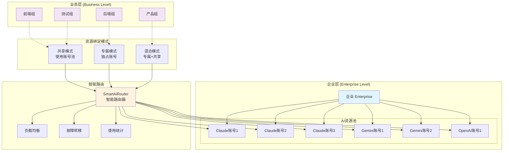
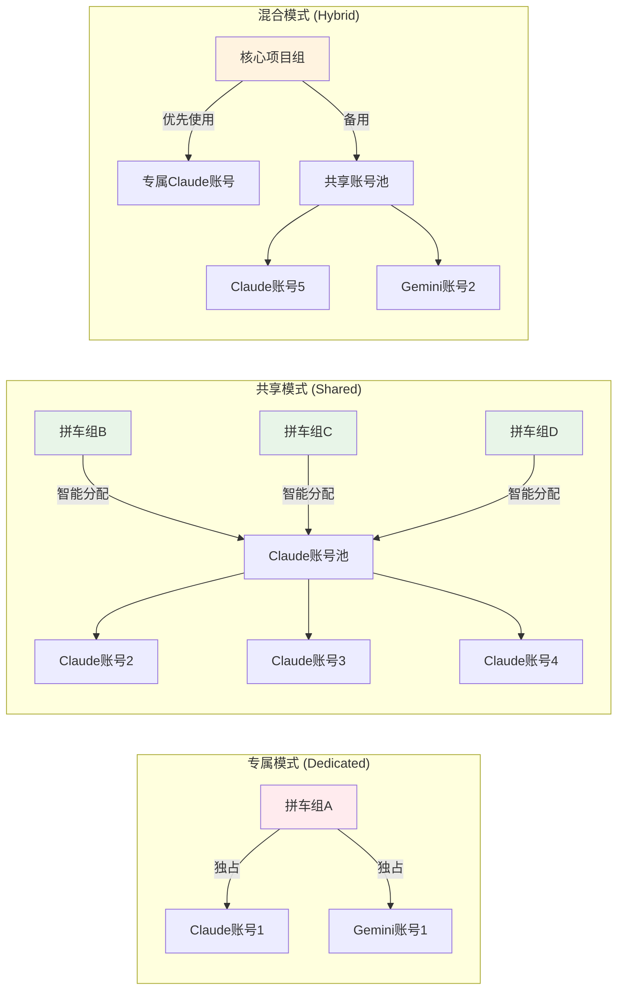
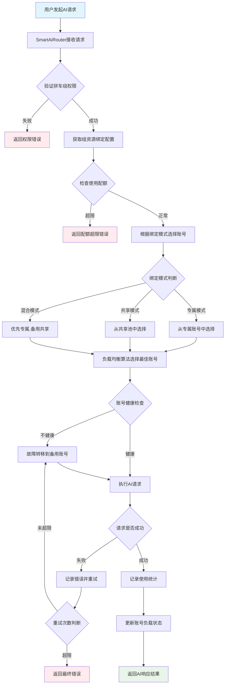
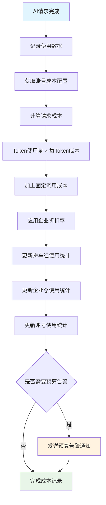
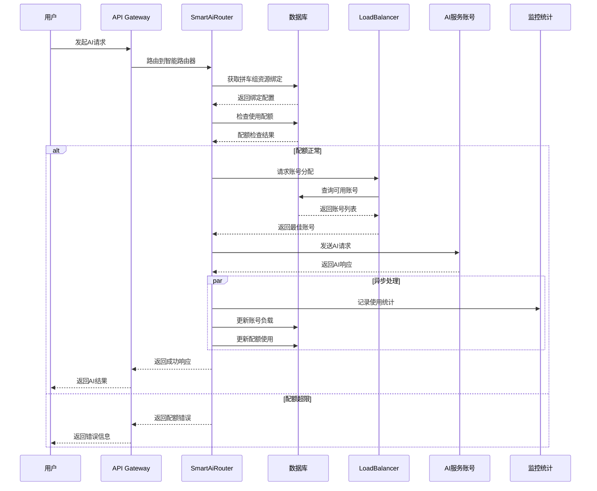
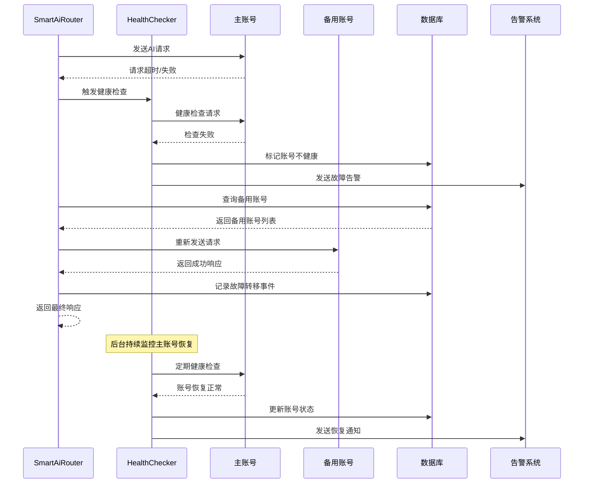

# AiCarpool v2.1 企业级AI资源管理平台 PRD

## 📋 文档信息

| 项目 | 内容 |
|------|------|
| **产品名称** | AiCarpool - 企业级AI资源管理平台 |
| **版本** | v2.1 |
| **文档版本** | 1.0 |
| **创建时间** | 2025-08-01 |
| **负责人** | coso |
| **状态** | 架构设计完成 |

---

## 🎯 产品概述

### 产品定位

AiCarpool v2.1 是一个**以拼车组为中心的企业级AI资源管理平台**，通过清晰的"企业→拼车组→AI账号"层级关系，实现AI资源的统一管理、智能分配和成本优化。

### 核心价值主张

- **简单清晰**：企业拥有AI账号，拼车组灵活使用，管理关系一目了然
- **灵活分配**：支持专属、共享、混合三种资源绑定模式
- **智能路由**：统一的AI服务调用接口，自动选择最佳账号
- **成本可控**：精确的使用量统计和灵活的预算控制

### 目标用户

1. **企业管理员**：统一管理企业AI资源，分配给各业务团队
2. **拼车组管理员**：管理团队AI资源使用，监控成本和效果
3. **普通用户**：透明使用AI服务，无需关心底层账号分配

---

## 🏗️ 核心架构设计

### 整体架构图



### 资源绑定模式图



---

## 🔧 核心功能设计

### 1. 企业AI资源管理

#### 1.1 AI账号统一管理

```typescript
interface AiServiceAccount {
  id: string;
  enterpriseId: string;
  name: string;
  serviceType: 'claude' | 'gemini' | 'openai' | 'qwen';
  accountType: 'dedicated' | 'shared';
  
  // API配置
  apiKey: string;
  apiEndpoint?: string;
  
  // 状态信息
  isEnabled: boolean;
  status: 'active' | 'inactive' | 'error';
  currentLoad: number; // 当前负载百分比
  
  // 能力信息
  supportedModels: string[];
  currentModel: string;
  dailyLimit: number;
  costPerToken: number;
}
```

#### 1.2 账号状态监控

- **实时负载监控**：显示各账号的当前使用情况
- **健康状态检查**：定期检查账号可用性
- **成本追踪**：实时计算各账号的使用成本
- **性能分析**：响应时间、成功率等指标

### 2. 拼车组资源配置

#### 2.1 三种绑定模式

**专属模式 (Dedicated)**：
```typescript
interface DedicatedBinding {
  mode: 'dedicated';
  accounts: {
    accountId: string;
    serviceType: string;
    priority: number;
  }[];
}
```

**共享模式 (Shared)**：
```typescript
interface SharedBinding {
  mode: 'shared';
  poolConfig: {
    serviceType: string;
    maxUsagePercent: number;
    priority: number;
  }[];
}
```

**混合模式 (Hybrid)**：
```typescript
interface HybridBinding {
  mode: 'hybrid';
  primaryAccounts: string[];
  fallbackPools: {
    serviceType: string;
    priority: number;
  }[];
}
```

#### 2.2 使用配额管理

```typescript
interface UsageQuota {
  groupId: string;
  dailyTokenLimit: number;
  monthlyBudget: number;
  priorityLevel: 'high' | 'medium' | 'low';
  
  // 当前使用情况
  dailyUsedTokens: number;
  monthlyUsedBudget: number;
  
  // 告警设置
  warningThreshold: number;
  alertThreshold: number;
}
```

### 3. 智能AI服务路由

#### 3.1 统一调用接口

```typescript
class SmartAiRouter {
  /**
   * 智能路由AI请求到最佳账号
   */
  async routeRequest(groupId: string, aiRequest: AiRequest): Promise<AiResponse> {
    // 1. 获取拼车组资源绑定配置
    const binding = await this.getGroupBinding(groupId);
    
    // 2. 检查使用配额
    await this.checkQuota(groupId, aiRequest);
    
    // 3. 选择最佳账号
    const account = await this.selectOptimalAccount(binding, aiRequest);
    
    // 4. 执行请求
    const response = await this.executeRequest(account, aiRequest);
    
    // 5. 记录使用统计
    await this.recordUsage(groupId, account.id, aiRequest, response);
    
    return response;
  }
  
  /**
   * 根据绑定模式选择最佳账号
   */
  private async selectOptimalAccount(
    binding: GroupResourceBinding, 
    request: AiRequest
  ): Promise<AiServiceAccount> {
    switch (binding.mode) {
      case 'dedicated':
        return this.selectDedicatedAccount(binding.accounts, request);
      
      case 'shared':
        return this.selectFromSharedPool(binding.poolConfig, request);
      
      case 'hybrid':
        // 优先使用专属账号，不可用时切换到共享池
        try {
          return await this.selectDedicatedAccount(binding.primaryAccounts, request);
        } catch (error) {
          return this.selectFromSharedPool(binding.fallbackPools, request);
        }
    }
  }
}
```

#### 3.2 负载均衡算法

```typescript
class LoadBalancer {
  /**
   * 轮询算法
   */
  roundRobin(accounts: AiServiceAccount[]): AiServiceAccount {
    const availableAccounts = accounts.filter(acc => 
      acc.isEnabled && acc.currentLoad < 90
    );
    
    const index = this.getNextRoundRobinIndex(availableAccounts.length);
    return availableAccounts[index];
  }
  
  /**
   * 最少连接算法
   */
  leastConnections(accounts: AiServiceAccount[]): AiServiceAccount {
    return accounts
      .filter(acc => acc.isEnabled)
      .sort((a, b) => a.currentLoad - b.currentLoad)[0];
  }
  
  /**
   * 加权算法
   */
  weighted(accounts: AiServiceAccount[], weights: number[]): AiServiceAccount {
    const totalWeight = weights.reduce((sum, weight) => sum + weight, 0);
    const random = Math.random() * totalWeight;
    
    let currentWeight = 0;
    for (let i = 0; i < accounts.length; i++) {
      currentWeight += weights[i];
      if (random <= currentWeight) {
        return accounts[i];
      }
    }
    
    return accounts[0];
  }
}
```

---

## 📊 数据模型设计

### 核心数据表结构

```prisma
// 企业表
model Enterprise {
  id          String   @id @default(cuid())
  name        String
  planType    String   @default("basic")
  settings    Json?
  createdAt   DateTime @default(now())
  updatedAt   DateTime @updatedAt
  
  // 关联关系
  aiAccounts  AiServiceAccount[]
  groups      Group[]
  
  @@map("enterprises")
}

// AI服务账号表
model AiServiceAccount {
  id           String   @id @default(cuid())
  enterpriseId String
  name         String
  serviceType  String   // 'claude', 'gemini', 'openai', 'qwen'
  accountType  String   @default("shared") // 'dedicated', 'shared'
  
  // API配置
  apiKey       String?  @db.Text
  apiEndpoint  String?
  
  // 状态信息
  isEnabled    Boolean  @default(true)
  status       String   @default("active")
  currentLoad  Int      @default(0)
  
  // 能力信息
  supportedModels Json   @default("[]")
  currentModel    String?
  dailyLimit      Int    @default(10000)
  costPerToken    Decimal @default(0.00001) @db.Decimal(10, 8)
  
  // 统计信息
  totalRequests   BigInt  @default(0)
  totalTokens     BigInt  @default(0)
  totalCost       Decimal @default(0) @db.Decimal(12, 4)
  lastUsedAt      DateTime?
  
  createdAt   DateTime @default(now())
  updatedAt   DateTime @updatedAt
  
  // 关联关系
  enterprise  Enterprise @relation(fields: [enterpriseId], references: [id], onDelete: Cascade)
  
  @@index([enterpriseId])
  @@index([serviceType])
  @@index([status])
  @@map("ai_service_accounts")
}

// 拼车组表（扩展现有）
model Group {
  id            String   @id @default(cuid())
  name          String
  description   String?
  maxMembers    Int      @default(5)
  status        String   @default("active")
  createdAt     DateTime @default(now())
  updatedAt     DateTime @updatedAt
  
  // 企业关联
  enterpriseId  String?
  
  // 资源绑定
  resourceBinding GroupResourceBinding?
  
  // 关联关系
  enterprise    Enterprise? @relation(fields: [enterpriseId], references: [id])
  members       GroupMember[]
  usageStats    UsageStat[]
  
  @@index([enterpriseId])
  @@map("groups")
}

// 拼车组资源绑定表
model GroupResourceBinding {
  id          String   @id @default(cuid())
  groupId     String   @unique
  bindingMode String   // 'dedicated', 'shared', 'hybrid'
  
  // 绑定配置 (JSON格式)
  bindingConfig Json
  
  // 使用配额
  dailyTokenLimit    Int      @default(10000)
  monthlyBudget      Decimal? @db.Decimal(10, 2)
  priorityLevel      String   @default("medium") // 'high', 'medium', 'low'
  
  // 告警设置
  warningThreshold   Int      @default(80)
  alertThreshold     Int      @default(95)
  
  createdAt   DateTime @default(now())
  updatedAt   DateTime @updatedAt
  
  // 关联关系
  group       Group    @relation(fields: [groupId], references: [id], onDelete: Cascade)
  
  @@map("group_resource_bindings")
}

// 使用统计表（扩展现有）
model UsageStat {
  id              String   @id @default(cuid())
  groupId         String
  userId          String?
  accountId       String   // 实际使用的AI账号ID
  
  // 请求信息
  serviceType     String   // 'claude', 'gemini', 'openai'
  modelUsed       String   // 实际使用的模型
  requestType     String   // 'chat', 'completion', 'embedding'
  
  // 使用量信息
  requestTokens   Int      @default(0)
  responseTokens  Int      @default(0)
  totalTokens     Int
  cost            Decimal  @db.Decimal(10, 6)
  
  // 性能信息
  responseTime    Int?     // 响应时间(ms)
  status          String   // 'success', 'error', 'timeout'
  errorCode       String?
  
  // 时间信息
  requestTime     DateTime @default(now())
  
  // 元数据
  metadata        Json?
  
  // 关联关系
  group           Group    @relation(fields: [groupId], references: [id], onDelete: Cascade)
  user            User?    @relation(fields: [userId], references: [id], onDelete: SetNull)
  
  @@index([groupId, requestTime])
  @@index([accountId, requestTime])
  @@index([serviceType, requestTime])
  @@map("usage_stats")
}

// 账号健康监控表
model AccountHealthCheck {
  id          String   @id @default(cuid())
  accountId   String
  
  // 健康状态
  isHealthy   Boolean
  responseTime Int?    // 健康检查响应时间(ms)
  errorMessage String?
  
  // 检查时间
  checkedAt   DateTime @default(now())
  
  @@index([accountId, checkedAt])
  @@map("account_health_checks")
}
```

---

## 🔄 业务流程设计

### AI服务调用完整流程



### 成本分摊计算流程



---

## 🕐 关键操作时序图

### 用户AI请求处理时序图



### 账号故障转移时序图



---

## 💻 API接口设计

### 核心API接口

#### 1. AI服务调用接口

```typescript
// POST /api/ai/chat
interface AiChatRequest {
  groupId: string;
  messages: {
    role: 'user' | 'assistant' | 'system';
    content: string;
  }[];
  
  // 可选参数
  serviceType?: 'claude' | 'gemini' | 'openai';
  model?: string;
  maxTokens?: number;
  temperature?: number;
  stream?: boolean;
}

interface AiChatResponse {
  success: boolean;
  data?: {
    message: {
      role: 'assistant';
      content: string;
    };
    usage: {
      promptTokens: number;
      completionTokens: number;
      totalTokens: number;
    };
    cost: number;
    accountUsed: {
      id: string;
      name: string;
      serviceType: string;
    };
  };
  error?: string;
}
```

#### 2. 企业AI账号管理接口

```typescript
// GET /api/enterprises/{enterpriseId}/ai-accounts
interface ListAiAccountsResponse {
  success: boolean;
  data: {
    accounts: AiServiceAccount[];
    totalCount: number;
    pagination: {
      page: number;
      pageSize: number;
      hasMore: boolean;
    };
  };
}

// POST /api/enterprises/{enterpriseId}/ai-accounts
interface CreateAiAccountRequest {
  name: string;
  serviceType: 'claude' | 'gemini' | 'openai' | 'qwen';
  accountType: 'dedicated' | 'shared';
  apiKey: string;
  apiEndpoint?: string;
  supportedModels: string[];
  dailyLimit: number;
}
```

#### 3. 拼车组资源配置接口

```typescript
// GET /api/groups/{groupId}/resource-binding
interface GetResourceBindingResponse {
  success: boolean;
  data: {
    binding: GroupResourceBinding;
    availableAccounts: AiServiceAccount[];
    currentUsage: {
      dailyTokens: number;
      monthlyBudget: number;
      utilizationRate: number;
    };
  };
}

// PUT /api/groups/{groupId}/resource-binding
interface UpdateResourceBindingRequest {
  bindingMode: 'dedicated' | 'shared' | 'hybrid';
  bindingConfig: DedicatedBinding | SharedBinding | HybridBinding;
  quotaConfig: {
    dailyTokenLimit: number;
    monthlyBudget: number;
    priorityLevel: 'high' | 'medium' | 'low';
  };
}
```

#### 4. 使用统计和监控接口

```typescript
// GET /api/groups/{groupId}/usage-stats
interface GetUsageStatsRequest {
  startDate: string;
  endDate: string;
  granularity: 'hour' | 'day' | 'week' | 'month';
  serviceType?: string;
}

interface GetUsageStatsResponse {
  success: boolean;
  data: {
    stats: {
      period: string;
      totalRequests: number;
      totalTokens: number;
      totalCost: number;
      averageResponseTime: number;
      successRate: number;
      breakdown: {
        serviceType: string;
        requests: number;
        tokens: number;
        cost: number;
      }[];
    }[];
    summary: {
      totalCost: number;
      topModels: string[];
      peakHours: number[];
    };
  };
}
```

---

## 🎨 用户界面设计

### 企业管理员界面

#### 1. AI资源总览页面

```typescript
interface AiResourceDashboard {
  // 资源概览
  totalAccounts: number;
  activeAccounts: number;
  totalGroups: number;
  
  // 使用统计
  dailyRequests: number;
  dailyCost: number;
  averageResponseTime: number;
  
  // 账号状态分布
  accountsByService: {
    serviceType: string;
    count: number;
    healthyCount: number;
    avgLoad: number;
  }[];
  
  // 拼车组使用排行
  topGroupsByUsage: {
    groupId: string;
    groupName: string;
    dailyCost: number;
    requestCount: number;
  }[];
}
```

#### 2. AI账号管理页面

```typescript
interface AiAccountManagement {
  accounts: AiServiceAccount[];
  
  // 筛选和搜索
  filters: {
    serviceType: string[];
    accountType: string[];
    status: string[];
  };
  
  // 批量操作
  bulkActions: {
    enable: (accountIds: string[]) => void;
    disable: (accountIds: string[]) => void;
    delete: (accountIds: string[]) => void;
    healthCheck: (accountIds: string[]) => void;
  };
  
  // 账号详情
  accountDetails: {
    usage24h: UsageChart;
    performanceMetrics: PerformanceData;
    boundGroups: Group[];
    costAnalysis: CostBreakdown;
  };
}
```

### 拼车组用户界面

#### 1. 资源配置页面

```typescript
interface GroupResourceConfig {
  // 当前绑定配置
  currentBinding: GroupResourceBinding;
  
  // 可选择的绑定模式
  bindingModes: {
    mode: 'dedicated' | 'shared' | 'hybrid';
    description: string;
    pros: string[];
    cons: string[];
    estimatedCost: number;
  }[];
  
  // 可用资源
  availableResources: {
    dedicatedAccounts: AiServiceAccount[];
    sharedPools: {
      serviceType: string;
      totalAccounts: number;
      currentLoad: number;
      averageCost: number;
    }[];
  };
}
```

#### 2. 使用监控页面

```typescript
interface GroupUsageMonitor {
  // 实时状态
  realTimeStatus: {
    activeRequests: number;
    queuedRequests: number;
    currentAccount: AiServiceAccount;
    nextSwitchTime?: number;
  };
  
  // 使用统计
  usageStats: {
    today: UsageSummary;
    thisWeek: UsageSummary;
    thisMonth: UsageSummary;
    trend: UsageTrend[];
  };
  
  // 成本分析
  costAnalysis: {
    dailyCost: number;
    monthlyBudget: number;
    budgetUtilization: number;
    costForecast: number;
    breakdown: CostBreakdown[];
  };
  
  // 性能指标
  performance: {
    averageResponseTime: number;
    successRate: number;
    errorRate: number;
    availabilityRate: number;
  };
}
```

---

## 📈 实施计划

### Phase 1: 核心架构搭建 (2-3周)

#### 目标
建立企业-拼车组-AI账号的清晰层级关系和基础功能

#### 主要任务
1. **数据模型设计** (1周)
   - 扩展Prisma Schema
   - 数据迁移脚本
   - 向后兼容处理

2. **SmartAiRouter开发** (1-2周)
   - 统一AI服务调用接口
   - 三种资源绑定模式实现
   - 基础负载均衡算法

3. **企业AI账号管理** (1周)
   - AI账号CRUD功能
   - 账号状态监控
   - 健康检查机制

#### 验收标准
- [ ] 支持三种资源绑定模式
- [ ] 统一的AI服务调用接口正常工作
- [ ] 企业AI账号管理功能完整
- [ ] 原有功能保持兼容

### Phase 2: 智能路由和监控 (2-3周)

#### 目标
实现智能的账号选择、负载均衡和故障转移机制

#### 主要任务
1. **负载均衡算法** (1-2周)
   - 轮询、最少连接、加权分配
   - 故障转移逻辑
   - 账号健康监控

2. **使用统计系统** (1-2周)
   - 精确的使用量记录
   - 成本计算和分摊
   - 实时监控面板

3. **配额管理** (1周)
   - 多维度配额控制
   - 预警和告警机制
   - 自动限流功能

#### 验收标准
- [ ] 负载均衡算法正常工作
- [ ] 故障转移机制有效
- [ ] 使用统计准确完整
- [ ] 配额管理功能正常

### Phase 3: 用户界面完善 (2-3周)

#### 目标
提供完整的管理界面和用户体验

#### 主要任务
1. **企业管理界面** (1-2周)
   - AI资源总览页面
   - AI账号管理页面
   - 拼车组资源分配页面

2. **拼车组用户界面** (1-2周)
   - 资源配置页面
   - 使用监控页面
   - 成本分析页面

3. **监控和告警** (1周)
   - 实时监控面板
   - 告警通知系统
   - 报表生成功能

#### 验收标准
- [ ] 管理界面功能完整
- [ ] 用户体验良好
- [ ] 监控告警正常工作
- [ ] 报表数据准确

### Phase 4: 优化和部署 (1-2周)

#### 目标
系统优化和生产环境准备

#### 主要任务
1. **性能优化** (1周)
   - 接口响应时间优化
   - 数据库查询优化
   - 缓存策略优化

2. **安全加固** (1周)
   - 数据加密和脱敏
   - 访问控制优化
   - 审计日志完善

3. **文档和测试** (1周)
   - 用户使用手册
   - API文档完善
   - 自动化测试覆盖

#### 验收标准
- [ ] 系统性能满足要求
- [ ] 安全措施完备
- [ ] 文档完整准确
- [ ] 测试覆盖率达标

---

## 📊 成功指标 (KPI)

### 技术指标
- **系统可用性**: ≥99.9%
- **API响应时间**: ＜500ms (P95)
- **故障转移时间**: ＜10秒
- **数据准确性**: ≥99.99%

### 业务指标
- **资源利用率**: ≥80%
- **成本节约**: 相比直接购买节约30%+
- **用户满意度**: NPS ≥8.0
- **功能使用率**: 核心功能使用率≥70%

### 运营指标
- **故障恢复时间**: ＜30分钟
- **功能交付周期**: 平均≤2周
- **Bug修复时间**: ＜24小时
- **文档更新及时性**: ≥95%

---

## 🔒 风险评估与应对

### 技术风险

#### 1. 数据迁移风险
**风险等级**: 中
**影响**: 可能导致数据丢失或业务中断
**应对措施**:
- 制定详细的迁移计划和回滚方案
- 在测试环境充分验证
- 分批次迁移，降低影响范围

#### 2. 性能瓶颈风险
**风险等级**: 中
**影响**: 系统响应慢，用户体验差
**应对措施**:
- 早期进行压力测试
- 设计合理的缓存策略
- 准备水平扩展方案

### 业务风险

#### 1. 用户接受度风险
**风险等级**: 低
**影响**: 用户不适应新的资源管理模式
**应对措施**:
- 提供详细的用户培训
- 渐进式功能发布
- 收集反馈持续改进

---

## 📝 总结

### 核心创新点
1. **清晰的层级关系**：企业→拼车组→AI账号的简单明了架构
2. **灵活的绑定模式**：专属、共享、混合三种模式覆盖所有场景
3. **智能化管理**：统一的AI服务调用和智能账号分配
4. **精细化控制**：准确的使用统计和灵活的配额管理

### 预期收益
- **管理简化**：统一的企业级AI资源管理，提升50%以上管理效率
- **成本优化**：通过智能分配和负载均衡，预计节约30-40%成本
- **可用性提升**：故障转移和负载均衡机制，确保99.9%以上可用性
- **用户体验**：透明的AI服务使用，用户无需关心底层复杂性

### 长期规划
- **AI服务扩展**：支持更多AI服务提供商和模型
- **智能优化**：基于使用数据的自动化资源分配优化
- **生态建设**：开放API，支持第三方系统集成
- **国际化支持**：多语言和多地区部署能力

---

*本PRD文档将根据开发进展和用户反馈持续更新迭代*