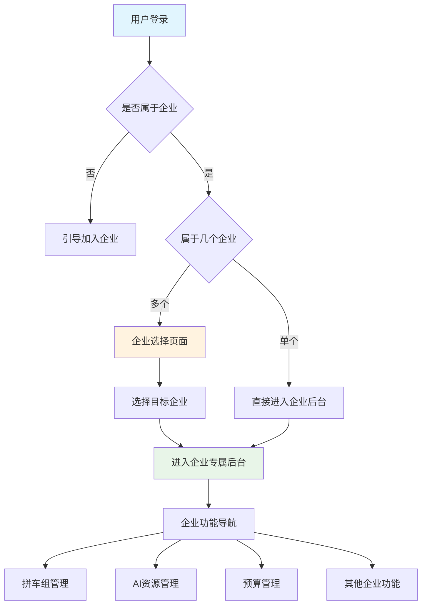
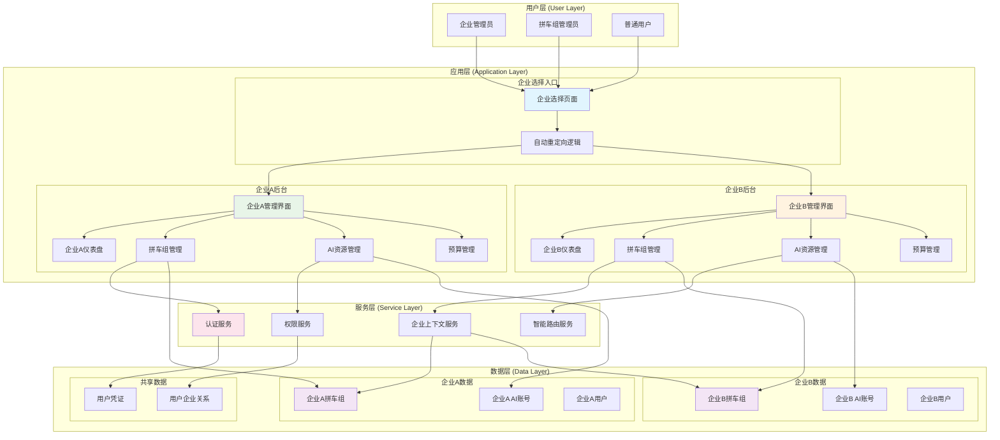
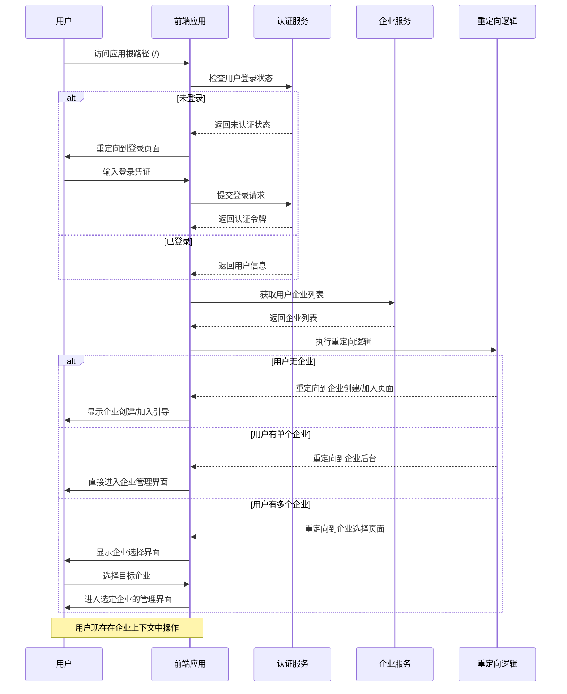
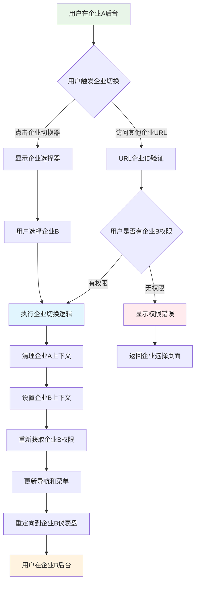
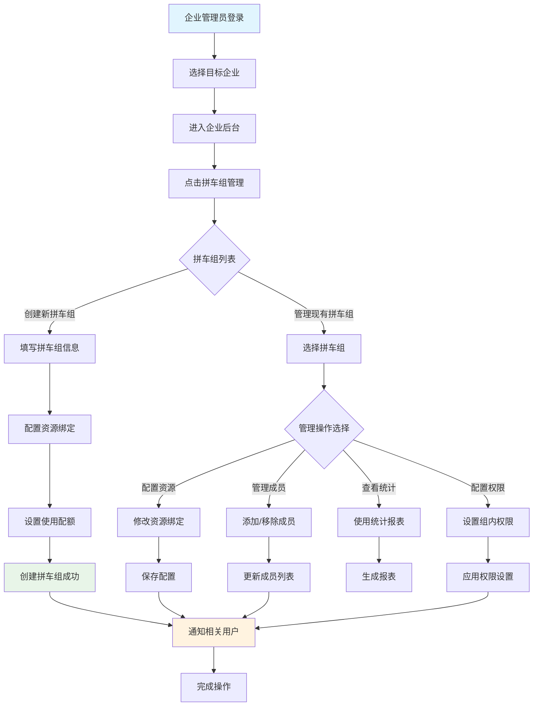
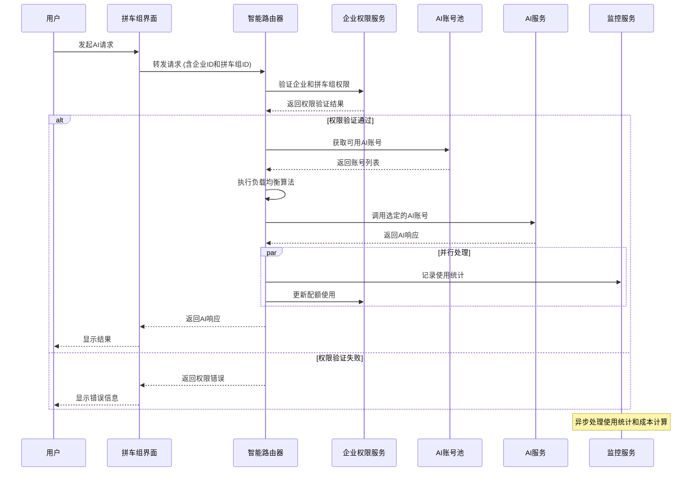
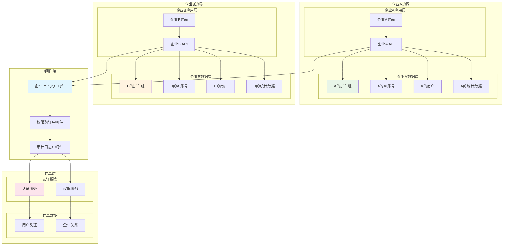

# AiCarpool v2.2 企业优先架构调整 PRD

## 📋 文档信息

| 项目 | 内容 |
|------|------|
| **产品名称** | AiCarpool - 企业优先AI资源管理平台 |
| **版本** | v2.2 |
| **文档版本** | 1.0 |
| **创建时间** | 2025-08-02 |
| **负责人** | coso |
| **状态** | 架构调整设计 |
| **基于版本** | v2.1 |

---

## 🎯 架构调整背景

### 当前v2.1存在的问题

1. **用户流程不符合企业级软件惯例**
   - 用户登录后看到通用后台界面
   - 需要点击"企业管理"才能选择企业
   - 缺乏明确的企业上下文

2. **权限模型混乱**
   - 通用功能和企业功能混合在一起
   - 用户可能在没有企业上下文的情况下操作
   - 数据隔离不够清晰

3. **用户体验不一致**
   - 部分功能需要企业上下文，部分不需要
   - 导航层级复杂，用户容易迷失

### v2.2调整目标

**核心理念**：将AiCarpool从"通用后台+企业选择"模式调整为"企业优先"模式，让企业成为用户操作的主要上下文。

---

## 🏗️ 新架构设计

### 用户流程重构



### 导航架构重构

#### 调整前 (v2.1)
```
登录后台
├── 仪表盘 (个人)
├── 企业管理 → 选择企业 → 企业功能
├── 账号池 (混乱的上下文)
├── 预算管理 (缺乏企业上下文)
└── 其他通用功能
```

#### 调整后 (v2.2)
```
登录 → 企业选择页面
         ↓
    选择企业A
         ↓
企业A专属后台
├── 企业总览 (企业A的仪表盘)
├── 拼车组管理 ⭐
├── AI资源管理
├── 组织架构
├── 预算管理
├── 权限管理
├── 监控中心
└── 系统设置
```

---

## 📊 架构图和流程图

### 整体系统架构图



### 用户登录和企业选择时序图



### 企业上下文切换流程图



### 拼车组创建和管理流程图



### AI资源调用时序图



### 企业数据隔离架构图



---

## 🔧 详细功能设计

### 1. 企业选择页面 (Entry Point)

#### 页面路径
- **主路径**: `/` (登录后的默认页面)
- **备用路径**: `/enterprises` (用于企业切换)

#### 页面功能
```typescript
interface EnterpriseSelectionPage {
  // 用户的企业列表
  userEnterprises: Enterprise[];
  
  // 快速操作
  quickActions: {
    createEnterprise: boolean; // 是否可创建企业
    requestAccess: boolean;    // 是否可申请加入企业
  };
  
  // 最近访问的企业
  recentEnterprises: Enterprise[];
  
  // 企业预览信息
  enterprisePreview: {
    memberCount: number;
    groupCount: number;
    monthlyUsage: number;
    lastActive: Date;
  };
}
```

#### 用户场景处理
1. **首次登录用户**：显示创建企业或申请加入企业的引导
2. **单企业用户**：自动跳转到企业后台，无需选择
3. **多企业用户**：显示企业列表，支持搜索和筛选
4. **企业管理员**：显示创建新企业的选项

### 2. 企业专属后台

#### 路由结构
```
/enterprise/[enterpriseId]/
├── dashboard              # 企业总览
├── groups/               # 拼车组管理
│   ├── list             # 拼车组列表
│   ├── create           # 创建拼车组
│   └── [groupId]/       # 拼车组详情
├── ai-resources/         # AI资源管理
│   ├── accounts         # AI账号管理
│   ├── pools            # 账号池管理
│   └── monitoring       # 资源监控
├── organization/         # 组织架构
│   ├── departments      # 部门管理
│   └── members          # 成员管理
├── budget/              # 预算管理
│   ├── overview         # 预算概览
│   ├── allocation       # 预算分配
│   └── reports          # 预算报表
├── permissions/         # 权限管理
├── monitoring/          # 监控中心
└── settings/            # 企业设置
```

#### 左侧导航设计
```typescript
interface EnterpriseNavigation {
  items: NavItem[];
  context: {
    enterpriseId: string;
    enterpriseName: string;
    userRole: 'owner' | 'admin' | 'member';
  };
  
  // 企业切换器 (如果用户属于多个企业)
  enterpriseSwitcher?: {
    currentEnterprise: Enterprise;
    availableEnterprises: Enterprise[];
  };
}

const navigationItems: NavItem[] = [
  { 
    label: '企业总览', 
    path: '/enterprise/[enterpriseId]/dashboard', 
    icon: 'LayoutDashboard',
    roles: ['owner', 'admin', 'member']
  },
  { 
    label: '拼车组管理', 
    path: '/enterprise/[enterpriseId]/groups', 
    icon: 'Users',
    roles: ['owner', 'admin'],
    badge: 'groupCount' // 显示拼车组数量
  },
  { 
    label: 'AI资源管理', 
    path: '/enterprise/[enterpriseId]/ai-resources', 
    icon: 'Database',
    roles: ['owner', 'admin']
  },
  // ... 其他导航项
];
```

### 3. 企业总览仪表盘

#### 设计原则
- **企业专属数据**：所有数据都基于当前企业
- **角色适配显示**：不同角色看到不同的信息
- **快速操作入口**：提供常用功能的快速访问

#### 核心组件
```typescript
interface EnterpriseDashboard {
  // 企业基本信息
  enterpriseInfo: {
    name: string;
    planType: string;
    memberCount: number;
    activeGroups: number;
  };
  
  // 资源使用概览
  resourceOverview: {
    totalAiAccounts: number;
    activeAccounts: number;
    monthlyUsage: {
      requests: number;
      tokens: number;
      cost: number;
    };
    efficiency: number; // 资源利用率
  };
  
  // 拼车组活动
  groupActivity: {
    topGroups: GroupUsageSummary[];
    recentActivities: Activity[];
    pendingTasks: Task[];
  };
  
  // 快速操作
  quickActions: QuickAction[];
}
```

---

## 🔄 技术实现规范

### 1. 路由中间件

#### 企业上下文验证
```typescript
// middleware/enterprise-context.ts
export async function enterpriseContextMiddleware(
  request: NextRequest,
  context: { params: { enterpriseId: string } }
) {
  const { enterpriseId } = context.params;
  const user = await verifyToken(request);
  
  // 验证用户是否有权限访问此企业
  const hasAccess = await verifyEnterpriseAccess(user.id, enterpriseId);
  
  if (!hasAccess) {
    return NextResponse.redirect('/enterprises');
  }
  
  // 设置企业上下文
  request.headers.set('x-enterprise-id', enterpriseId);
  return NextResponse.next();
}
```

#### 自动重定向逻辑
```typescript
// app/page.tsx - 根路径处理
export default async function RootPage() {
  const user = await getCurrentUser();
  
  if (!user) {
    redirect('/auth/login');
  }
  
  const userEnterprises = await getUserEnterprises(user.id);
  
  // 根据企业数量决定跳转逻辑
  if (userEnterprises.length === 0) {
    redirect('/onboarding'); // 引导创建或加入企业
  } else if (userEnterprises.length === 1) {
    redirect(`/enterprise/${userEnterprises[0].id}/dashboard`);
  } else {
    redirect('/enterprises'); // 企业选择页面
  }
}
```

### 2. 状态管理

#### 企业上下文状态
```typescript
// contexts/enterprise-context.tsx
interface EnterpriseContextState {
  currentEnterprise: Enterprise | null;
  userRole: EnterpriseRole;
  permissions: Permission[];
  
  // 操作方法
  switchEnterprise: (enterpriseId: string) => Promise<void>;
  refreshPermissions: () => Promise<void>;
}

export const EnterpriseContext = createContext<EnterpriseContextState>();

export function EnterpriseProvider({ children, enterpriseId }: Props) {
  // 实现企业上下文管理逻辑
  // 包括权限检查、数据获取、状态同步等
}
```

#### 权限控制组件
```typescript
// components/auth/enterprise-gate.tsx
interface EnterpriseGateProps {
  requiredRoles: EnterpriseRole[];
  requiredPermissions?: Permission[];
  fallback?: React.ReactNode;
  children: React.ReactNode;
}

export function EnterpriseGate({ 
  requiredRoles, 
  requiredPermissions, 
  fallback, 
  children 
}: EnterpriseGateProps) {
  const { userRole, permissions } = useEnterpriseContext();
  
  const hasRole = requiredRoles.includes(userRole);
  const hasPermissions = requiredPermissions?.every(p => 
    permissions.includes(p)
  ) ?? true;
  
  if (!hasRole || !hasPermissions) {
    return fallback || <AccessDenied />;
  }
  
  return <>{children}</>;
}
```

### 3. API设计规范

#### 统一的企业级API
```typescript
// 所有企业相关API都包含企业ID
// GET /api/enterprise/[enterpriseId]/groups
// POST /api/enterprise/[enterpriseId]/groups
// GET /api/enterprise/[enterpriseId]/ai-accounts
// PUT /api/enterprise/[enterpriseId]/settings

// API响应格式统一包含企业上下文
interface EnterpriseApiResponse<T> {
  success: boolean;
  data: T;
  enterpriseContext: {
    id: string;
    name: string;
    permissions: Permission[];
  };
  message?: string;
}
```

---

## 🎨 用户界面设计

### 1. 企业选择页面

#### 设计要点
- **卡片式企业展示**：每个企业一个卡片，显示关键信息
- **搜索和筛选**：支持按企业名称、角色、活跃度筛选
- **快速操作**：创建企业、申请加入、最近访问等

#### 界面组件
```typescript
interface EnterpriseCard {
  enterprise: Enterprise;
  userRole: EnterpriseRole;
  stats: {
    memberCount: number;
    groupCount: number;
    monthlyUsage: number;
  };
  lastAccessed: Date;
  actions: {
    enter: () => void;
    settings?: () => void; // 仅管理员可见
  };
}
```

### 2. 企业后台顶部栏

#### 设计要点
- **企业标识**：清晰显示当前企业名称和logo
- **企业切换器**：如果用户属于多个企业，提供切换功能
- **用户菜单**：个人设置、退出等，但保持企业上下文
- **面包屑导航**：始终显示当前位置

#### 组件结构
```typescript
interface EnterpriseHeader {
  currentEnterprise: Enterprise;
  breadcrumbs: BreadcrumbItem[];
  
  // 企业切换器 (可选)
  enterpriseSwitcher?: {
    onSwitch: (enterpriseId: string) => void;
    availableEnterprises: Enterprise[];
  };
  
  // 用户菜单
  userMenu: {
    user: User;
    actions: UserAction[];
  };
}
```

---

## 📊 数据模型调整

### 1. 用户企业关系模型

```prisma
// 用户可以属于多个企业，每个企业中有不同角色
model UserEnterprise {
  id           String   @id @default(cuid())
  userId       String
  enterpriseId String
  role         EnterpriseRole
  permissions  Permission[]
  joinedAt     DateTime @default(now())
  lastAccessed DateTime @default(now())
  isActive     Boolean  @default(true)
  
  user         User       @relation(fields: [userId], references: [id])
  enterprise   Enterprise @relation(fields: [enterpriseId], references: [id])
  
  @@unique([userId, enterpriseId])
  @@map("user_enterprises")
}

enum EnterpriseRole {
  OWNER       // 企业所有者
  ADMIN       // 企业管理员
  MEMBER      // 普通成员
  VIEWER      // 只读用户
}
```

### 2. 企业配置模型

```prisma
model EnterpriseSettings {
  id           String @id @default(cuid())
  enterpriseId String @unique
  
  // 主题配置
  theme        Json?  @default("{}")
  
  // 功能开关
  features     Json   @default("{}")
  
  // 安全设置
  security     Json   @default("{}")
  
  // 集成配置
  integrations Json   @default("{}")
  
  enterprise   Enterprise @relation(fields: [enterpriseId], references: [id])
  
  @@map("enterprise_settings")
}
```

---

## 🚀 迁移计划

### Phase 1: 基础架构调整 (3-5天)

#### 1.1 路由重构
- [ ] 创建新的企业选择页面 (`/`)
- [ ] 重构所有企业功能页面到 `/enterprise/[enterpriseId]/` 路径下
- [ ] 实现自动重定向逻辑

#### 1.2 状态管理
- [ ] 实现 EnterpriseContext
- [ ] 创建权限控制组件
- [ ] 更新全局状态管理

#### 1.3 中间件和API
- [ ] 实现企业上下文中间件
- [ ] 调整所有API路由到企业级路径
- [ ] 统一API响应格式

### Phase 2: UI/UX优化 (2-3天)

#### 2.1 企业选择页面
- [ ] 设计和实现企业卡片组件
- [ ] 添加搜索和筛选功能
- [ ] 实现快速操作

#### 2.2 企业后台界面
- [ ] 重新设计左侧导航
- [ ] 实现企业切换器
- [ ] 优化面包屑导航

#### 2.3 权限适配
- [ ] 根据用户角色调整界面显示
- [ ] 实现功能级权限控制
- [ ] 添加权限提示和引导

### Phase 3: 数据迁移和测试 (2-3天)

#### 3.1 数据库迁移
- [ ] 更新 Prisma schema
- [ ] 编写数据迁移脚本
- [ ] 处理现有数据的企业关联

#### 3.2 测试和优化
- [ ] 功能测试：确保所有功能在新架构下正常工作
- [ ] 性能测试：验证企业上下文切换的性能
- [ ] 用户体验测试：确保流程顺畅

---

## 🎯 成功指标

### 技术指标
- **页面加载时间**: 企业选择页面 < 1s，企业后台 < 2s
- **权限检查性能**: 平均响应时间 < 100ms
- **数据隔离**: 100% 的数据按企业隔离，无泄露

### 用户体验指标
- **用户流程完成率**: 新用户从登录到进入企业后台 > 95%
- **企业切换效率**: 多企业用户切换时间 < 3s
- **功能发现率**: 用户能快速找到拼车组管理等核心功能 > 90%

### 业务指标
- **企业活跃度**: 企业日活跃用户增长 > 20%
- **功能使用率**: 拼车组创建和管理功能使用率 > 80%
- **用户满意度**: NPS > 8.5

---

## 🔒 安全考虑

### 1. 数据隔离
- **严格的企业边界**：确保用户只能访问其所属企业的数据
- **API级别隔离**：所有API都包含企业ID验证
- **前端状态隔离**：切换企业时清理所有缓存状态

### 2. 权限控制
- **最小权限原则**：用户只拥有执行其角色所需的最小权限
- **动态权限检查**：每次操作都进行实时权限验证
- **审计日志**：记录所有企业级操作的详细日志

### 3. 会话安全
- **企业会话绑定**：会话令牌绑定到特定企业
- **自动会话清理**：切换企业时清理敏感数据
- **异常检测**：监控异常的企业访问模式

---

## 📝 总结

AiCarpool v2.2 的"企业优先"架构调整将从根本上改善用户体验，使其真正符合企业级AI资源管理平台的定位。

### 核心改进
1. **用户流程优化**：登录后直接进入企业上下文，消除困惑
2. **权限模型清晰**：基于企业的清晰权限边界和角色管理
3. **功能组织合理**：所有功能都在明确的企业上下文中组织
4. **扩展性更强**：支持多企业用户，为未来的企业级功能奠定基础

### 与v2.1的关键差异
- **架构理念**：从"功能优先"转向"企业优先"
- **用户流程**：从"选择功能后选择企业"转向"选择企业后使用功能"
- **数据组织**：从"混合数据上下文"转向"严格企业数据隔离"

这个调整将使AiCarpool真正成为符合企业级标准的AI资源管理平台，为未来的功能扩展和商业化发展奠定坚实基础。