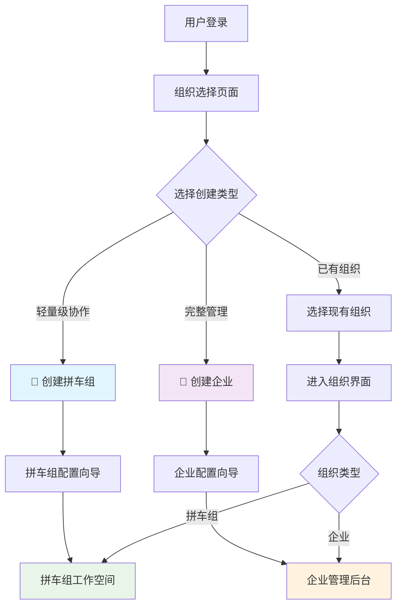

# AiCarpool v2.3 场景化创建架构 PRD

## 📋 文档信息

| 项目 | 内容 |
|------|------|
| **产品名称** | AiCarpool - 场景化AI资源管理平台 |
| **版本** | v2.3 |
| **文档版本** | 1.0 |
| **创建时间** | 2025-08-02 |
| **负责人** | coso |
| **状态** | 架构设计 |
| **基于版本** | v2.2 企业优先架构 |

---

## 🎯 v2.3 架构调整背景

### 设计理念转变

基于对**Authing用户池管理系统**的深入研究，我们发现优秀的B2B SaaS产品在用户创建体验上有明确的**场景化引导**设计。Authing通过ToB（企业员工管理）、ToB（B端客户身份认证）、ToC（C端用户身份认证）的场景区分，让用户能够快速找到最适合的解决方案。

### AiCarpool的场景区分需求

AiCarpool作为AI资源管理平台，天然存在两种不同的使用场景：

1. **🚗 拼车组场景**：小团队、临时项目、轻量级协作
2. **🏢 企业场景**：正式企业、完整管理、深度集成

v2.3版本的核心目标是通过**场景化创建流程**，让用户根据实际需求选择最合适的组织形式。

---

## 🏗️ 场景化架构设计

### 核心场景定义



### 场景对比分析

| 维度 | 🚗 拼车组模式 | 🏢 企业模式 |
|------|-------------|------------|
| **目标用户** | 3-15人开发团队、工作室、项目组 | 正式企业、大型团队、多部门组织 |
| **使用场景** | 临时协作、项目拼车、成本分摊 | 企业级管理、长期运营、规范化流程 |
| **创建复杂度** | 简单快速，5分钟完成 | 完整配置，15-30分钟 |
| **权限模型** | 扁平化（创建者、成员） | 层级化（所有者、管理员、成员、观察者） |
| **功能范围** | 核心拼车功能 | 全功能企业管理 |
| **界面复杂度** | 简洁友好 | 专业完整 |

---

## 🚗 拼车组模式设计

### 产品定位
**轻量级AI资源共享解决方案**，专为小团队快速协作设计。

### 目标场景
- **开发团队**：3-15人的技术团队需要共享Claude Code、Cursor等AI工具
- **临时项目**：短期项目需要快速组建拼车组分摊成本
- **工作室/自由职业者**：小型工作室需要灵活的资源管理
- **学习小组**：学生团体或学习小组的AI工具共享

### 核心功能特性

#### 简化权限模型
```
拼车组创建者 (Group Owner)
├── 拼车组管理权限
├── 成员邀请/移除
├── 账号绑定管理
└── 费用设置

拼车组成员 (Group Member)  
├── AI工具使用权限
├── 个人使用统计查看
└── 基础设置修改
```

#### 快速创建流程
1. **基础信息**：拼车组名称、描述、头像
2. **AI服务选择**：选择要拼车的AI服务（Claude、OpenAI、Gemini等）
3. **成员邀请**：添加初始成员
4. **完成创建**：自动生成邀请链接

#### 简洁界面设计
- **单页面仪表盘**：所有核心信息一屏展示
- **卡片式布局**：AI服务、成员、统计数据用卡片展示
- **快捷操作**：一键邀请、一键使用、一键统计

### 技术实现特点
- **轻量级数据模型**：简化的权限和配置结构
- **快速部署**：预设模板，减少配置步骤
- **移动端友好**：响应式设计，支持手机管理

---

## 🏢 企业模式设计

### 产品定位
**企业级AI资源管理平台**，提供完整的组织架构、权限管理和成本控制能力。

### 目标场景
- **中大型企业**：50人以上需要规范化AI资源管理的公司
- **多部门组织**：需要按部门分配和管理AI资源的企业
- **合规要求高**：需要详细审计日志和权限控制的组织
- **长期运营**：需要稳定、可扩展的AI资源管理解决方案

### 核心功能特性

#### 完整权限模型
```
企业所有者 (Enterprise Owner)
├── 企业全局管理
├── 组织架构配置
├── 全局权限控制
└── 财务和合规管理

企业管理员 (Enterprise Admin)
├── 部门/项目管理
├── 成员权限管理
├── 资源分配管理
└── 运营数据分析

部门管理员 (Department Admin)
├── 部门成员管理
├── 部门资源分配
├── 部门统计查看
└── 拼车组创建

企业成员 (Enterprise Member)
├── 拼车组参与
├── AI工具使用
├── 个人数据查看
└── 基础设置

观察者 (Viewer)
├── 只读权限
├── 统计数据查看
└── 报告生成
```

#### 完整创建流程
1. **企业基础信息**：企业名称、行业、规模、Logo
2. **组织架构设计**：部门结构、层级关系
3. **权限策略配置**：管理员设置、权限模板
4. **AI服务规划**：企业级服务选择、预算分配
5. **合规设置**：审计规则、安全策略
6. **初始化完成**：管理员账号设置

#### 专业界面设计
- **多级导航**：企业级功能的完整导航结构
- **数据仪表盘**：多维度数据分析和可视化
- **管理工作台**：面向管理员的专业化操作界面

### 技术实现特点
- **企业级架构**：支持大规模用户和复杂权限
- **可扩展设计**：模块化架构，支持功能扩展
- **安全增强**：企业级安全特性和合规支持

---

## 🎨 创建流程用户体验设计

### 参考Authing的优秀实践

基于Authing用户池创建的设计模式，设计AiCarpool的场景选择界面：

#### 场景选择页面设计
```
┌─────────────────────────────────────────────────────────────┐
│                      选择创建类型                            │
│                                                             │
│  ┌──────────────────┐    ┌──────────────────┐              │
│  │     🚗 拼车组     │    │     🏢 企业      │              │
│  │                  │    │                  │              │
│  │   轻量级团队协作   │    │   完整企业管理    │              │
│  │   3-15人团队     │    │   50+人组织     │              │
│  │   快速创建       │    │   专业功能       │              │
│  │                  │    │                  │              │
│  │   [选择拼车组]    │    │   [选择企业]     │              │
│  └──────────────────┘    └──────────────────┘              │
│                                                             │
│            或者加入现有组织: [输入邀请码]                    │
└─────────────────────────────────────────────────────────────┘
```

#### 引导式配置向导

**拼车组创建向导**：
1. **欢迎页面**：场景介绍和预期时间（约5分钟）
2. **基础信息**：名称、描述、头像上传
3. **服务选择**：推荐热门AI服务套餐
4. **成员邀请**：邮箱邀请或分享链接
5. **完成创建**：成功页面和下一步指引

**企业创建向导**：
1. **欢迎页面**：企业级功能介绍（约20分钟）
2. **企业信息**：详细企业资料和认证
3. **组织设计**：部门结构和层级规划
4. **权限配置**：管理员设置和权限模板
5. **服务规划**：企业级套餐和预算设置
6. **完成创建**：企业后台访问和管理指南

---

## 🔄 数据模型扩展

### 组织类型字段扩展

```sql
-- Enterprise表扩展
ALTER TABLE Enterprise ADD COLUMN organizationType ENUM('carpool_group', 'enterprise') DEFAULT 'enterprise';
ALTER TABLE Enterprise ADD COLUMN creationTemplate VARCHAR(50); -- 'quick_carpool', 'full_enterprise'
ALTER TABLE Enterprise ADD COLUMN uiTheme VARCHAR(20) DEFAULT 'professional'; -- 'simple', 'professional'
ALTER TABLE Enterprise ADD COLUMN featureSet JSON; -- 启用的功能模块配置

-- EnterpriseSettings表扩展
ALTER TABLE EnterpriseSettings ADD COLUMN carpoolGroupSettings JSON; -- 拼车组特有设置
ALTER TABLE EnterpriseSettings ADD COLUMN enterpriseSettings JSON; -- 企业特有设置
```

### 权限模型优化

```sql
-- 简化权限角色
CREATE TABLE IF NOT EXISTS OrganizationRoles (
  id VARCHAR(50) PRIMARY KEY,
  organizationType ENUM('carpool_group', 'enterprise'),
  roleName VARCHAR(50),
  roleDescription TEXT,
  permissions JSON,
  isDefault BOOLEAN DEFAULT FALSE
);

-- 预设角色数据
INSERT INTO OrganizationRoles VALUES
-- 拼车组角色
('carpool_owner', 'carpool_group', '拼车组长', '拼车组创建者和管理者', '["group.manage", "member.invite", "account.bind"]', TRUE),
('carpool_member', 'carpool_group', '拼车成员', '拼车组普通成员', '["ai.use", "stats.view"]', TRUE),

-- 企业角色  
('enterprise_owner', 'enterprise', '企业所有者', '企业最高管理者', '["enterprise.manage", "organization.design", "global.admin"]', TRUE),
('enterprise_admin', 'enterprise', '企业管理员', '企业运营管理者', '["department.manage", "member.manage", "resource.allocate"]', TRUE),
('enterprise_member', 'enterprise', '企业成员', '企业普通员工', '["ai.use", "group.join", "stats.view"]', TRUE);
```

---

## 🎯 实施计划

### Phase 1: 基础架构调整（1-2周）
- [ ] 数据模型扩展和迁移
- [ ] 组织类型区分的后端逻辑
- [ ] 简化权限模型实现
- [ ] 基础UI组件准备

### Phase 2: 场景选择界面（1周）
- [ ] 场景选择页面开发
- [ ] 创建向导组件开发
- [ ] 拼车组快速创建流程
- [ ] 企业完整创建流程

### Phase 3: 差异化界面（2-3周）
- [ ] 拼车组简洁界面开发
- [ ] 企业专业界面优化
- [ ] 权限控制的前端实现
- [ ] 响应式设计和移动端适配

### Phase 4: 测试和优化（1周）
- [ ] 创建流程用户测试
- [ ] 界面体验优化
- [ ] 性能测试和优化
- [ ] 文档和帮助指南

---

## 📊 用户体验对比

### 创建流程体验对比

| 对比维度 | v2.2 企业优先 | v2.3 场景化创建 |
|---------|-------------|---------------|
| **用户选择** | 只能创建企业 | 拼车组 vs 企业选择 |
| **创建时间** | 15-20分钟 | 拼车组：5分钟<br>企业：20分钟 |
| **配置复杂度** | 统一复杂配置 | 按场景分层配置 |
| **学习成本** | 较高 | 拼车组：很低<br>企业：中等 |
| **上手速度** | 中等 | 拼车组：很快<br>企业：正常 |

### 功能使用体验对比

| 对比维度 | v2.2 企业优先 | v2.3 场景化创建 |
|---------|-------------|---------------|
| **界面复杂度** | 统一专业界面 | 拼车组：简洁<br>企业：专业 |
| **权限理解** | 复杂4级权限 | 拼车组：2级权限<br>企业：5级权限 |
| **功能发现** | 功能较隐藏 | 按需展示功能 |
| **移动端使用** | 一般 | 拼车组：优秀<br>企业：良好 |

---

## 🎨 UI/UX设计指导

### 设计原则

#### 拼车组模式设计原则
1. **极简主义**：去除不必要的复杂功能，专注核心体验
2. **一屏可见**：重要信息和操作在一屏内完成
3. **友好温馨**：使用温暖色调和友好语言
4. **移动优先**：优先考虑移动端使用体验

#### 企业模式设计原则
1. **专业可信**：使用专业的设计语言和严谨的交互
2. **信息密度**：合理组织大量信息的展示
3. **效率优先**：提供快捷操作和批量处理能力
4. **可扩展性**：支持复杂功能的渐进式展示

### 视觉设计差异

#### 色彩系统
- **拼车组**：主色调蓝色 (#2196F3)，辅助色绿色 (#4CAF50)
- **企业**：主色调深蓝 (#1565C0)，辅助色橙色 (#FF9800)

#### 布局结构
- **拼车组**：单栏布局为主，卡片式信息组织
- **企业**：多栏布局，表格和列表为主要信息载体

#### 图标风格
- **拼车组**：圆润友好的线性图标
- **企业**：严谨专业的实体图标

---

## 🔮 未来扩展规划

### v2.4+ 功能展望

#### 智能推荐系统
- 根据团队规模和使用模式推荐最佳组织类型
- AI驱动的拼车组匹配和推荐
- 智能成本优化建议

#### 高级企业功能
- SSO单点登录集成
- 企业级API和SDK
- 高级审计和合规功能
- 多地区部署支持

#### 拼车组生态
- 公开拼车组市场
- 拼车组评级和推荐系统
- 跨拼车组资源共享

---

## 📝 总结

AiCarpool v2.3通过引入**场景化创建架构**，成功解决了v2.2版本中"一刀切"企业模式的局限性。通过清晰的**拼车组 vs 企业**场景区分，不同用户群体都能找到最适合的解决方案：

### 核心价值
- **🚗 拼车组模式**：为小团队提供极简、高效的AI资源共享体验
- **🏢 企业模式**：为正式企业提供完整、专业的AI资源管理平台
- **🎯 场景化引导**：让用户快速找到最适合的组织形式

### 竞争优势
- **差异化定位**：同时满足轻量级和企业级两种截然不同的需求
- **用户体验优化**：基于Authing等优秀产品的设计理念
- **技术架构先进**：支持场景化的灵活架构设计

v2.3版本将使AiCarpool真正成为覆盖全场景的AI资源管理解决方案，从3人小团队到1000+人大企业都能找到合适的使用模式。