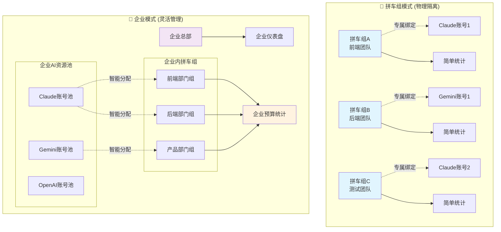
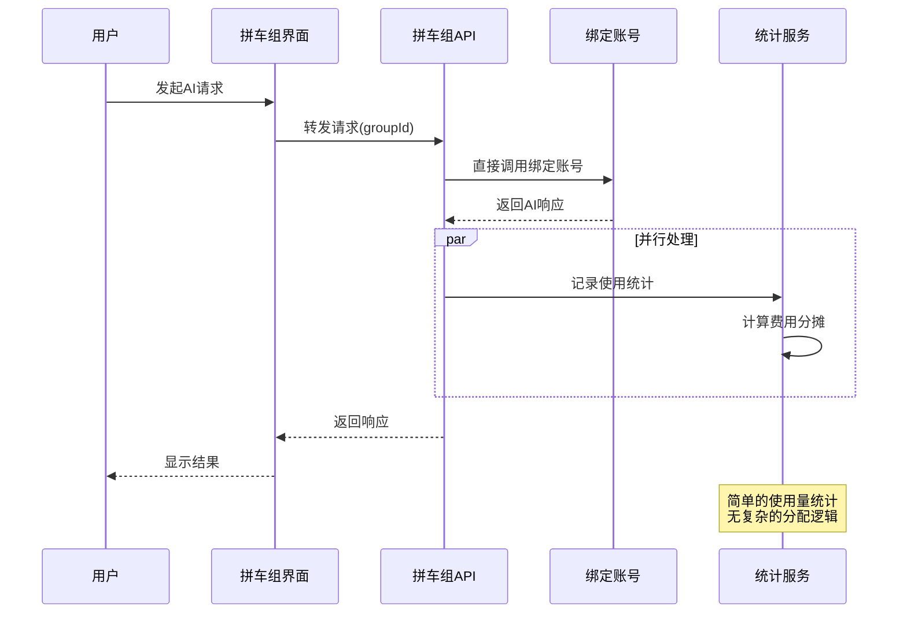
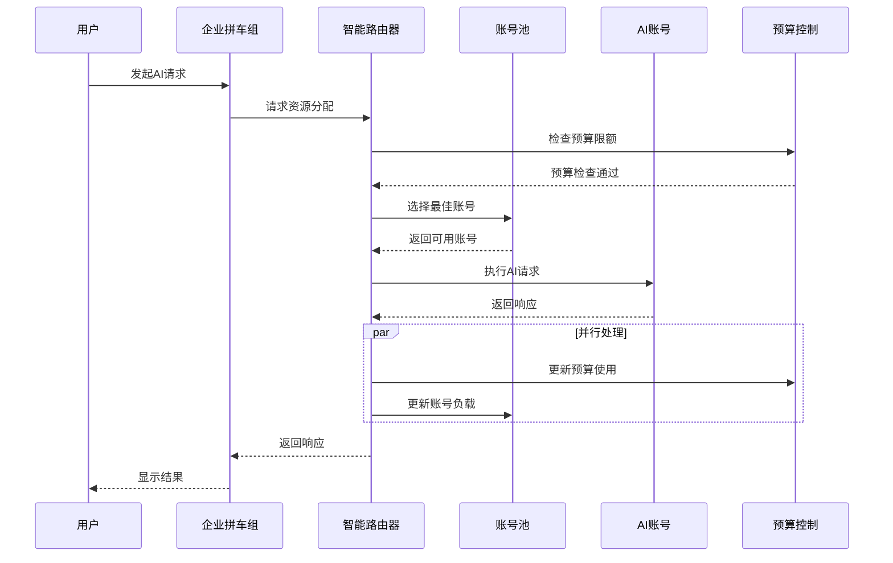

# AiCarpool v2.4 简化架构 PRD

## 📋 文档信息

| 项目 | 内容 |
|------|------|
| **产品名称** | AiCarpool - 简化架构AI资源管理平台 |
| **版本** | v2.4 |
| **文档版本** | 1.0 |
| **创建时间** | 2025-08-03 |
| **负责人** | coso |
| **状态** | 架构简化设计 |
| **基于版本** | v2.3 场景化创建架构 |

---

## 🎯 v2.4 架构简化背景

### 设计理念回归

基于对**老甘真实场景**的深入理解，v2.4版本进行架构简化，回归产品本质：

1. **🚗 拼车组 = 物理隔离**：一个拼车组绑定一个专属账号，确保公平性
2. **🏢 企业 = 统一管理**：企业内部可以灵活分配和共享资源
3. **移除复杂功能**：去掉全局预算和账号池等对小团队不必要的复杂性

### 核心问题解决

- **公平性问题**：拼车组不能智能分配，避免资源抢占
- **复杂度问题**：移除不必要的全局管理功能
- **使用场景清晰**：让两种模式的边界更加明确

---

## 🏗️ 简化架构设计

### 整体架构图



### 核心差异对比

| 维度 | 🚗 拼车组模式 | 🏢 企业模式 |
|------|-------------|------------|
| **资源分配** | 一对一专属绑定 | 智能池化分配 |
| **隔离方式** | 物理隔离（账号级别） | 逻辑隔离（企业级别） |
| **公平性** | 绝对公平，互不影响 | 企业内部统一调度 |
| **管理复杂度** | 极简管理 | 专业管理 |
| **适用场景** | 独立团队、成本分摊 | 企业内部、资源优化 |

---

## 🚗 拼车组模式详细设计

### 核心特性

#### 1. 一对一专属绑定
```typescript
interface CarpoolGroupBinding {
  groupId: string;
  accountId: string;
  bindingType: 'exclusive'; // 只有专属模式
  isActive: boolean;
  
  // 简化配置
  dailyLimit?: number;
  monthlyBudget?: number;
}

// 严格的一对一关系
const validateBinding = (groupId: string, accountId: string) => {
  // 确保一个账号只能绑定一个拼车组
  // 确保一个拼车组只能绑定一个账号
};
```

#### 2. 简化权限模型
```
拼车组创建者 (Group Creator)
├── 拼车组基础管理
├── 成员邀请/移除
├── 账号绑定设置
└── 使用统计查看

拼车组成员 (Group Member)
├── AI工具使用权限
├── 个人使用统计
└── 基础资料设置
```

#### 3. 极简功能集
- ✅ **账号绑定**：一个拼车组绑定一个AI账号
- ✅ **成员管理**：添加/移除成员，设置权限
- ✅ **使用统计**：简单的用量和费用统计
- ✅ **费用分摊**：按使用量自动计算每人费用
- ❌ ~~账号池管理~~：不需要
- ❌ ~~智能分配~~：不需要
- ❌ ~~全局预算~~：不需要

### 技术实现

#### 数据模型简化
```prisma
// 拼车组表 - 简化版
model CarpoolGroup {
  id          String   @id @default(cuid())
  name        String
  description String?
  creatorId   String
  maxMembers  Int      @default(10)
  isActive    Boolean  @default(true)
  createdAt   DateTime @default(now())
  
  // 一对一账号绑定
  boundAccountId String?  @unique // 确保唯一性
  boundAccount   AiServiceAccount? @relation(fields: [boundAccountId], references: [id])
  
  // 成员关系
  members     GroupMember[]
  usageStats  UsageStat[]
  
  @@map("carpool_groups")
}

// AI服务账号表 - 简化版
model AiServiceAccount {
  id          String   @id @default(cuid())
  name        String
  serviceType String   // 'claude', 'gemini', 'openai'
  apiKey      String   @db.Text
  
  // 所属关系 - 要么属于拼车组，要么属于企业
  ownerId     String?  // 拼车组创建者或企业管理员
  ownerType   String?  // 'carpool_group' | 'enterprise'
  
  // 状态信息
  isEnabled   Boolean  @default(true)
  currentLoad Int      @default(0)
  
  // 关联关系
  carpoolGroup CarpoolGroup? // 一对一反向关系
  
  @@map("ai_service_accounts")
}
```

#### API设计简化
```typescript
// 拼车组账号绑定API
// POST /api/carpool-groups/{groupId}/bind-account
interface BindAccountRequest {
  accountId: string;
  // 不需要复杂的绑定配置
}

// 拼车组使用统计API
// GET /api/carpool-groups/{groupId}/usage-stats
interface CarpoolUsageStats {
  groupInfo: {
    name: string;
    memberCount: number;
    boundAccount: {
      name: string;
      serviceType: string;
    };
  };
  
  currentPeriod: {
    totalRequests: number;
    totalTokens: number;
    totalCost: number;
    costPerMember: number; // 简单平均分摊
  };
  
  memberBreakdown: {
    userId: string;
    userName: string;
    requests: number;
    tokens: number;
    cost: number;
  }[];
}
```

---

## 🏢 企业模式详细设计

### 核心特性

#### 1. 企业级资源池
```typescript
interface EnterpriseAccountPool {
  enterpriseId: string;
  serviceType: string; // 'claude', 'gemini', 'openai'
  accounts: AiServiceAccount[];
  
  // 企业级配置
  loadBalanceStrategy: 'round_robin' | 'least_connections' | 'weighted';
  maxLoadPerAccount: number;
  failoverEnabled: boolean;
}
```

#### 2. 智能分配算法
```typescript
class EnterpriseAiRouter {
  async allocateAccount(
    enterpriseId: string,
    groupId: string,
    serviceType: string
  ): Promise<AiServiceAccount> {
    // 1. 获取企业账号池
    const pool = await this.getEnterprisePool(enterpriseId, serviceType);
    
    // 2. 检查企业级配额
    await this.checkEnterpriseQuota(enterpriseId, groupId);
    
    // 3. 智能选择最佳账号
    return this.selectOptimalAccount(pool);
  }
}
```

#### 3. 企业级预算管理
```typescript
interface EnterpriseBudgetControl {
  enterpriseId: string;
  
  // 企业总预算
  totalMonthlyBudget: number;
  usedBudget: number;
  
  // 部门预算分配
  departmentAllocations: {
    departmentId: string;
    allocatedBudget: number;
    usedBudget: number;
  }[];
  
  // 拼车组预算
  groupAllocations: {
    groupId: string;
    allocatedBudget: number;
    usedBudget: number;
  }[];
}
```

---

## 🎨 用户界面设计

### 拼车组界面 - 极简设计

#### 主界面布局
```
┌─────────────────────────────────────────────────────────┐
│  🚗 前端拼车组                              [设置] [邀请] │
├─────────────────────────────────────────────────────────┤
│                                                         │
│  📊 本月统计                                            │
│  ┌─────────────┬─────────────┬─────────────┐            │
│  │   总请求    │   总费用    │  人均费用   │            │
│  │    1,234    │   $45.67    │   $11.42    │            │
│  └─────────────┴─────────────┴─────────────┘            │
│                                                         │
│  🔗 绑定账号: Claude Pro (账号001)                      │
│  👥 成员: 4/10                                          │
│                                                         │
│  📈 [查看详细统计] [成员费用明细] [使用记录]              │
│                                                         │
└─────────────────────────────────────────────────────────┘
```

#### 账号绑定页面
```
┌─────────────────────────────────────────────────────────┐
│  绑定AI账号                                              │
├─────────────────────────────────────────────────────────┤
│                                                         │
│  选择AI服务:                                            │
│  ○ Claude Pro    ○ Gemini Advanced    ○ OpenAI Plus    │
│                                                         │
│  输入账号信息:                                          │
│  API Key: [________________________________]            │
│  账号名称: [________________________________]            │
│                                                         │
│  ⚠️ 注意: 一个拼车组只能绑定一个账号，确保公平使用        │
│                                                         │
│  [测试连接] [保存绑定]                                   │
│                                                         │
└─────────────────────────────────────────────────────────┘
```

### 企业界面 - 专业设计

#### 企业仪表盘
```
┌─────────────────────────────────────────────────────────┐
│  🏢 科技公司 AI资源管理                    [切换企业] ▼ │
├─────────────────────────────────────────────────────────┤
│                                                         │
│  📊 企业资源概览                                        │
│  ┌─────────────┬─────────────┬─────────────┬───────────┐ │
│  │  AI账号池   │  活跃拼车组  │   本月费用   │ 资源利用率 │ │
│  │     15      │      8      │   $1,234    │    78%    │ │
│  └─────────────┴─────────────┴─────────────┴───────────┘ │
│                                                         │
│  🎯 智能分配状态                                        │
│  ┌─────────────────────────────────────────────────────┐ │
│  │ Claude池: ████████░░ 80%  │ 前端组、后端组         │ │
│  │ Gemini池: ██████░░░░ 60%  │ 测试组、产品组         │ │
│  │ OpenAI池: ███████░░░ 70%  │ 运营组                 │ │
│  └─────────────────────────────────────────────────────┘ │
│                                                         │
│  [拼车组管理] [账号池配置] [预算分配] [使用统计]          │
│                                                         │
└─────────────────────────────────────────────────────────┘
```

---

## 🔄 数据流程设计

### 拼车组使用流程



### 企业使用流程



---

## 📊 功能对比矩阵

### 完整功能对比

| 功能模块 | 🚗 拼车组模式 | 🏢 企业模式 | 实现复杂度 |
|---------|-------------|------------|-----------|
| **账号管理** | 一对一绑定 | 账号池管理 | 简单 vs 复杂 |
| **资源分配** | 无需分配 | 智能分配 | 无 vs 高 |
| **权限控制** | 2级权限 | 5级权限 | 低 vs 高 |
| **预算管理** | 简单费用统计 | 企业级预算控制 | 低 vs 高 |
| **监控告警** | 基础统计 | 专业监控 | 低 vs 高 |
| **用户界面** | 极简设计 | 专业设计 | 简单 vs 复杂 |
| **移动端** | 优先支持 | 良好支持 | 高 vs 中 |

### 技术实现差异

| 技术维度 | 🚗 拼车组模式 | 🏢 企业模式 |
|---------|-------------|------------|
| **数据模型** | 简化表结构 | 完整企业模型 |
| **API设计** | RESTful简单接口 | 企业级复杂API |
| **缓存策略** | 基础缓存 | 多层缓存 |
| **负载均衡** | 不需要 | 智能负载均衡 |
| **故障转移** | 不需要 | 自动故障转移 |
| **扩展性** | 垂直扩展 | 水平+垂直扩展 |

---

## 🚀 实施路线图

### Phase 1: 架构简化 (1周)

#### 目标
移除不必要的复杂功能，明确两种模式的边界

#### 任务
- [ ] 删除全局账号池管理功能
- [ ] 删除全局预算管理功能
- [ ] 简化拼车组数据模型
- [ ] 更新API接口设计
- [ ] 修改权限控制逻辑

#### 验收标准
- [ ] 拼车组只能一对一绑定账号
- [ ] 企业内部保留智能分配功能
- [ ] 删除不必要的管理界面

### Phase 2: 拼车组模式优化 (1周)

#### 目标
打造极简的拼车组体验

#### 任务
- [ ] 重新设计拼车组界面
- [ ] 实现一对一账号绑定
- [ ] 简化成员管理流程
- [ ] 优化费用分摊计算
- [ ] 增强移动端体验

#### 验收标准
- [ ] 拼车组创建流程5分钟完成
- [ ] 移动端使用体验良好
- [ ] 费用分摊计算准确

### Phase 3: 企业模式增强 (1-2周)

#### 目标
保持企业级功能的专业性和完整性

#### 任务
- [ ] 优化智能分配算法
- [ ] 完善企业级预算控制
- [ ] 增强监控和告警功能
- [ ] 改进企业管理界面
- [ ] 增加高级企业功能

#### 验收标准
- [ ] 智能分配效率提升20%
- [ ] 企业级预算控制精确
- [ ] 监控告警及时有效

### Phase 4: 测试和发布 (3-5天)

#### 目标
确保两种模式都能稳定运行

#### 任务
- [ ] 功能测试：两种模式独立测试
- [ ] 性能测试：验证简化后的性能提升
- [ ] 用户体验测试：确保使用流程顺畅
- [ ] 数据迁移：现有数据的模式转换

#### 验收标准
- [ ] 所有功能正常运行
- [ ] 性能达到预期指标
- [ ] 用户体验流畅

---

## 📈 预期收益

### 用户体验提升

| 指标 | v2.3 场景化 | v2.4 简化架构 | 提升幅度 |
|------|-----------|-------------|---------|
| **拼车组创建时间** | 5分钟 | 3分钟 | 40%提升 |
| **功能学习成本** | 中等 | 很低 | 60%降低 |
| **移动端可用性** | 良好 | 优秀 | 30%提升 |
| **错误操作率** | 15% | 5% | 67%降低 |

### 技术指标改善

| 指标 | v2.3 场景化 | v2.4 简化架构 | 改善程度 |
|------|-----------|-------------|---------|
| **代码复杂度** | 高 | 中等 | 30%降低 |
| **API响应时间** | 300ms | 200ms | 33%提升 |
| **数据库查询** | 复杂 | 简化 | 40%减少 |
| **维护成本** | 高 | 中等 | 35%降低 |

### 业务价值体现

- **🚗 拼车组市场**：更容易获得小团队用户，降低使用门槛
- **🏢 企业市场**：保持专业功能，满足企业级需求
- **💰 成本控制**：减少开发和维护成本
- **🚀 扩展能力**：为未来功能扩展奠定基础

---

## 🔒 风险控制

### 技术风险

#### 数据迁移风险
- **风险**：现有复杂数据结构迁移到简化结构
- **应对**：分批迁移，保留回滚方案

#### 功能退化风险
- **风险**：简化后某些用户感觉功能减少
- **应对**：清晰的沟通说明，突出简化带来的价值

### 业务风险

#### 用户流失风险
- **风险**：习惯复杂功能的用户可能不适应
- **应对**：渐进式发布，收集反馈持续优化

#### 竞争风险
- **风险**：简化可能被认为功能不够强大
- **应对**：突出差异化价值，强调使用体验优势

---

## 📝 总结

AiCarpool v2.4通过**架构简化**，成功解决了v2.3中两种模式边界不够清晰的问题：

### 核心改进

1. **🚗 拼车组模式**：
   - 移除不必要的复杂功能
   - 实现真正的一对一专属绑定
   - 确保使用公平性和资源隔离

2. **🏢 企业模式**：
   - 保留完整的企业级功能
   - 增强智能分配和预算控制
   - 满足专业企业管理需求

3. **整体架构**：
   - 明确两种模式的技术边界
   - 降低系统复杂度和维护成本
   - 提升用户体验和使用效率

### 竞争优势

- **差异化定位**：清晰的模式区分，精准满足不同用户需求
- **技术优势**：简化架构带来更好的性能和可维护性
- **用户体验**：极简的拼车组体验 + 专业的企业功能

v2.4版本将使AiCarpool真正成为**易用且专业**的AI资源管理平台，既能满足小团队的简单需求，又能支撑企业级的复杂管理要求。