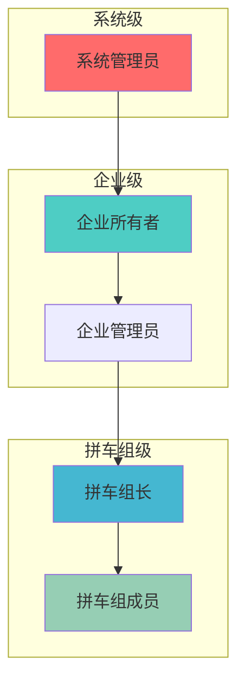

# AiCarpool v2.5 权限管理系统 PRD

## 📋 文档信息

| 项目 | 内容 |
|------|------|
| **产品名称** | AiCarpool - 权限管理系统 |
| **版本** | v2.5 |
| **文档版本** | 1.0 |
| **创建时间** | 2025-08-03 |
| **负责人** | coso |
| **状态** | 架构设计 |
| **基于版本** | v2.4 简化架构 |

---

## 🎯 v2.5 权限管理升级背景

### 当前问题

基于v2.4简化架构，权限管理存在以下问题：

1. **权限页面无法使用**
   - `/permissions` 页面依赖localStorage，显示假数据
   - 企业权限页面显示"访问受限"，无实际功能
   - 用户无法进行权限管理操作

2. **权限验证不真实**
   - 大量mock数据，缺乏真实的权限检查
   - 数据库权限模型不完整
   - 权限验证逻辑分散

### v2.5 目标

**核心目标**：让权限页面真正可用，提供基础的权限管理功能。

**设计原则**：
- **实用优先**：只做必要的权限功能，避免过度设计
- **真实数据**：所有功能基于真实数据库，杜绝mock
- **简单维护**：简化权限模型，易于理解和维护

---

## 🏗️ 简化权限架构

### 权限层级设计



### 权限资源分类

```typescript
// 简化的权限资源
const PERMISSIONS = {
  // 系统管理
  'system.admin': '系统管理员权限',
  
  // 企业管理
  'enterprise.manage': '企业管理',
  'enterprise.view': '企业查看',
  
  // 拼车组管理
  'group.create': '创建拼车组',
  'group.manage': '管理拼车组',
  'group.view': '查看拼车组',
  
  // AI资源使用
  'ai.use': '使用AI服务',
  'ai.manage': '管理AI账号',
  
  // 用户管理
  'user.invite': '邀请用户',
  'user.manage': '管理用户'
};

// 简化的角色定义
const ROLES = {
  'system_admin': {
    name: '系统管理员',
    permissions: ['system.admin', 'enterprise.manage', 'group.manage', 'ai.manage', 'user.manage']
  },
  'enterprise_owner': {
    name: '企业所有者',
    permissions: ['enterprise.manage', 'group.create', 'group.manage', 'ai.manage', 'user.invite']
  },
  'enterprise_admin': {
    name: '企业管理员',
    permissions: ['enterprise.view', 'group.create', 'group.manage', 'user.invite']
  },
  'group_owner': {
    name: '拼车组长',
    permissions: ['group.manage', 'ai.use', 'user.invite']
  },
  'group_member': {
    name: '拼车组成员',
    permissions: ['group.view', 'ai.use']
  }
};
```

---

## 🔧 数据库模型

### 核心权限表

```sql
-- 修复现有UserEnterpriseRole表
DROP TABLE IF EXISTS user_enterprise_roles;
CREATE TABLE user_enterprise_roles (
  id VARCHAR(50) PRIMARY KEY,
  user_id VARCHAR(50) NOT NULL,
  enterprise_id VARCHAR(50),
  role VARCHAR(50) NOT NULL,
  scope VARCHAR(20) DEFAULT 'enterprise', -- 'global', 'enterprise', 'group'
  resource_id VARCHAR(50), -- 具体资源ID（如groupId）
  is_active BOOLEAN DEFAULT TRUE,
  created_at DATETIME DEFAULT CURRENT_TIMESTAMP,
  updated_at DATETIME DEFAULT CURRENT_TIMESTAMP ON UPDATE CURRENT_TIMESTAMP,
  
  INDEX idx_user_enterprise (user_id, enterprise_id),
  INDEX idx_role_scope (role, scope)
);

-- 权限检查视图（简化查询）
CREATE VIEW user_permissions AS
SELECT 
  uer.user_id,
  uer.enterprise_id,
  uer.scope,
  uer.resource_id,
  uer.role,
  CASE uer.role
    WHEN 'system_admin' THEN JSON_ARRAY('system.admin', 'enterprise.manage', 'group.manage', 'ai.manage', 'user.manage')
    WHEN 'enterprise_owner' THEN JSON_ARRAY('enterprise.manage', 'group.create', 'group.manage', 'ai.manage', 'user.invite')
    WHEN 'enterprise_admin' THEN JSON_ARRAY('enterprise.view', 'group.create', 'group.manage', 'user.invite')
    WHEN 'group_owner' THEN JSON_ARRAY('group.manage', 'ai.use', 'user.invite')
    WHEN 'group_member' THEN JSON_ARRAY('group.view', 'ai.use')
    ELSE JSON_ARRAY()
  END as permissions
FROM user_enterprise_roles uer
WHERE uer.is_active = TRUE;
```

---

## 🔐 权限管理器

### 简化的权限检查

```typescript
// /src/lib/permission/simple-permission-manager.ts
import { PrismaClient } from '@prisma/client';

export interface PermissionContext {
  userId: string;
  enterpriseId?: string;
  groupId?: string;
}

export class SimplePermissionManager {
  private prisma: PrismaClient;

  constructor(prisma: PrismaClient) {
    this.prisma = prisma;
  }

  /**
   * 简单的权限检查
   */
  async hasPermission(
    context: PermissionContext,
    permission: string
  ): Promise<boolean> {
    try {
      // 构建查询条件
      const whereConditions: any = {
        userId: context.userId,
        isActive: true
      };

      // 根据上下文确定查询范围
      if (context.groupId) {
        whereConditions.OR = [
          { scope: 'group', resourceId: context.groupId },
          { scope: 'enterprise', enterpriseId: context.enterpriseId },
          { scope: 'global' }
        ];
      } else if (context.enterpriseId) {
        whereConditions.OR = [
          { scope: 'enterprise', enterpriseId: context.enterpriseId },
          { scope: 'global' }
        ];
      } else {
        whereConditions.scope = 'global';
      }

      // 查询用户角色
      const userRoles = await this.prisma.userEnterpriseRole.findMany({
        where: whereConditions
      });

      // 检查角色权限
      for (const userRole of userRoles) {
        const rolePermissions = this.getRolePermissions(userRole.role);
        if (rolePermissions.includes(permission) || rolePermissions.includes('system.admin')) {
          return true;
        }
      }

      return false;
    } catch (error) {
      console.error('Permission check error:', error);
      return false;
    }
  }

  /**
   * 获取用户权限列表
   */
  async getUserPermissions(context: PermissionContext): Promise<string[]> {
    const whereConditions: any = {
      userId: context.userId,
      isActive: true
    };

    if (context.enterpriseId) {
      whereConditions.enterpriseId = context.enterpriseId;
    }

    const userRoles = await this.prisma.userEnterpriseRole.findMany({
      where: whereConditions
    });

    const allPermissions = new Set<string>();
    
    userRoles.forEach(userRole => {
      const permissions = this.getRolePermissions(userRole.role);
      permissions.forEach(perm => allPermissions.add(perm));
    });

    return Array.from(allPermissions);
  }

  /**
   * 分配角色给用户
   */
  async assignRole(
    assignerContext: PermissionContext,
    targetUserId: string,
    role: string,
    scope: 'global' | 'enterprise' | 'group' = 'enterprise',
    resourceId?: string
  ): Promise<boolean> {
    // 检查分配者权限
    const canAssign = await this.hasPermission(assignerContext, 'user.manage') || 
                     await this.hasPermission(assignerContext, 'user.invite');
    
    if (!canAssign) {
      throw new Error('权限不足，无法分配角色');
    }

    try {
      await this.prisma.userEnterpriseRole.create({
        data: {
          userId: targetUserId,
          enterpriseId: assignerContext.enterpriseId,
          role,
          scope,
          resourceId
        }
      });
      return true;
    } catch (error) {
      console.error('Assign role error:', error);
      return false;
    }
  }

  /**
   * 获取角色对应的权限
   */
  private getRolePermissions(role: string): string[] {
    const rolePermissions: Record<string, string[]> = {
      'system_admin': ['system.admin', 'enterprise.manage', 'group.manage', 'ai.manage', 'user.manage'],
      'enterprise_owner': ['enterprise.manage', 'group.create', 'group.manage', 'ai.manage', 'user.invite'],
      'enterprise_admin': ['enterprise.view', 'group.create', 'group.manage', 'user.invite'],
      'group_owner': ['group.manage', 'ai.use', 'user.invite'],
      'group_member': ['group.view', 'ai.use']
    };

    return rolePermissions[role] || [];
  }
}

// 全局实例
export const permissionManager = new SimplePermissionManager(prisma);
```

---

## 📊 API接口

### 全局权限API

```typescript
// /src/app/api/permissions/route.ts
import { permissionManager } from '@/lib/permission/simple-permission-manager';
import { getCurrentUser } from '@/lib/auth/auth-utils';

export async function GET(request: NextRequest) {
  try {
    const user = await getCurrentUser(request);
    if (!user) {
      return Response.json({ success: false, message: '未登录' }, { status: 401 });
    }

    // 获取用户权限
    const context = { userId: user.id };
    const permissions = await permissionManager.getUserPermissions(context);

    // 获取用户企业
    const userEnterprises = await prisma.userEnterprise.findMany({
      where: { userId: user.id, isActive: true },
      include: { enterprise: true }
    });

    return Response.json({
      success: true,
      data: {
        user: {
          id: user.id,
          name: user.name,
          email: user.email
        },
        permissions,
        enterprises: userEnterprises.map(ue => ({
          id: ue.enterprise.id,
          name: ue.enterprise.name,
          role: ue.role
        }))
      }
    });

  } catch (error) {
    console.error('Get permissions error:', error);
    return Response.json({ success: false, message: '获取权限失败' }, { status: 500 });
  }
}
```

### 企业权限API

```typescript
// /src/app/api/enterprises/[enterpriseId]/permissions/route.ts
export async function GET(
  request: NextRequest,
  { params }: { params: Promise<{ enterpriseId: string }> }
) {
  try {
    const { enterpriseId } = await params;
    const user = await getCurrentUser(request);
    
    if (!user) {
      return Response.json({ success: false, message: '未登录' }, { status: 401 });
    }

    // 检查企业访问权限
    const context = { userId: user.id, enterpriseId };
    const hasAccess = await permissionManager.hasPermission(context, 'enterprise.view');

    if (!hasAccess) {
      return Response.json({ success: false, message: '无访问权限' }, { status: 403 });
    }

    // 获取企业信息和用户列表
    const enterprise = await prisma.enterprise.findUnique({
      where: { id: enterpriseId },
      include: {
        userEnterprises: {
          include: {
            user: {
              select: { id: true, name: true, email: true }
            }
          }
        }
      }
    });

    if (!enterprise) {
      return Response.json({ success: false, message: '企业不存在' }, { status: 404 });
    }

    // 获取企业用户的详细权限
    const usersWithPermissions = await Promise.all(
      enterprise.userEnterprises.map(async (ue) => {
        const userContext = { userId: ue.user.id, enterpriseId };
        const permissions = await permissionManager.getUserPermissions(userContext);
        
        return {
          ...ue.user,
          role: ue.role,
          permissions,
          joinedAt: ue.joinedAt
        };
      })
    );

    return Response.json({
      success: true,
      data: {
        enterprise: {
          id: enterprise.id,
          name: enterprise.name
        },
        users: usersWithPermissions,
        currentUserPermissions: await permissionManager.getUserPermissions(context)
      }
    });

  } catch (error) {
    console.error('Get enterprise permissions error:', error);
    return Response.json({ success: false, message: '获取企业权限失败' }, { status: 500 });
  }
}
```

---

## 🎨 用户界面

### 全局权限页面

```typescript
// /src/app/permissions/page.tsx - 简化版
'use client';

import React, { useState, useEffect } from 'react';
import { Card, CardContent, CardHeader, CardTitle } from '@/components/ui/card';
import { Button } from '@/components/ui/button';
import { Badge } from '@/components/ui/badge';
import { Shield, Users, Building, CheckCircle } from 'lucide-react';

interface PermissionsData {
  user: {
    id: string;
    name: string;
    email: string;
  };
  permissions: string[];
  enterprises: Array<{
    id: string;
    name: string;
    role: string;
  }>;
}

export default function PermissionsPage() {
  const [data, setData] = useState<PermissionsData | null>(null);
  const [loading, setLoading] = useState(true);

  useEffect(() => {
    fetchPermissions();
  }, []);

  const fetchPermissions = async () => {
    try {
      const response = await fetch('/api/permissions');
      const result = await response.json();
      
      if (result.success) {
        setData(result.data);
      }
    } catch (error) {
      console.error('获取权限失败:', error);
    } finally {
      setLoading(false);
    }
  };

  if (loading) {
    return <div className="container mx-auto px-4 py-8">加载中...</div>;
  }

  if (!data) {
    return <div className="container mx-auto px-4 py-8">获取权限数据失败</div>;
  }

  return (
    <div className="container mx-auto px-4 py-8">
      <div className="max-w-4xl mx-auto space-y-6">
        {/* 页面标题 */}
        <div className="flex items-center gap-2">
          <Shield className="w-6 h-6 text-blue-600" />
          <h1 className="text-2xl font-bold">权限管理</h1>
        </div>

        {/* 用户信息 */}
        <Card>
          <CardHeader>
            <CardTitle>当前用户</CardTitle>
          </CardHeader>
          <CardContent>
            <div className="flex items-center space-x-4">
              <div>
                <p className="font-medium">{data.user.name}</p>
                <p className="text-sm text-gray-600">{data.user.email}</p>
              </div>
            </div>
          </CardContent>
        </Card>

        {/* 我的权限 */}
        <Card>
          <CardHeader>
            <CardTitle>我的权限</CardTitle>
          </CardHeader>
          <CardContent>
            <div className="grid grid-cols-1 md:grid-cols-2 gap-2">
              {data.permissions.map((permission) => (
                <Badge key={permission} variant="outline" className="justify-start p-2">
                  <CheckCircle className="w-3 h-3 mr-2 text-green-500" />
                  {permission}
                </Badge>
              ))}
            </div>
          </CardContent>
        </Card>

        {/* 我的企业 */}
        <Card>
          <CardHeader>
            <CardTitle>管理企业</CardTitle>
          </CardHeader>
          <CardContent>
            <div className="space-y-3">
              {data.enterprises.map((enterprise) => (
                <div key={enterprise.id} className="flex items-center justify-between p-3 border rounded">
                  <div className="flex items-center space-x-3">
                    <Building className="w-5 h-5 text-blue-500" />
                    <span className="font-medium">{enterprise.name}</span>
                    <Badge>{enterprise.role}</Badge>
                  </div>
                  <Button 
                    variant="outline" 
                    size="sm"
                    onClick={() => window.open(`/enterprise/${enterprise.id}/permissions`, '_blank')}
                  >
                    管理权限
                  </Button>
                </div>
              ))}
            </div>
          </CardContent>
        </Card>
      </div>
    </div>
  );
}
```

---

## 📋 实施计划

### Phase 1: 数据库和API (2天)

**第1天：数据库修复**
- [ ] 修复UserEnterpriseRole表结构
- [ ] 创建权限检查视图
- [ ] 编写数据迁移脚本

**第2天：API开发**
- [ ] 实现SimplePermissionManager
- [ ] 开发全局权限API
- [ ] 开发企业权限API

### Phase 2: 用户界面 (2天)

**第3天：全局权限页面**
- [ ] 重构/permissions页面
- [ ] 实现真实的权限展示
- [ ] 集成权限API

**第4天：企业权限页面**
- [ ] 完善企业权限页面
- [ ] 实现用户权限管理
- [ ] 添加角色分配功能

### 验收标准

- [ ] 权限页面显示真实数据，无mock数据
- [ ] 企业权限页面完全可用
- [ ] 权限检查基于数据库，响应时间 < 100ms
- [ ] 用户可以正常进行权限管理操作

---

## 📝 总结

v2.5权限管理系统的核心改进：

### 主要特点

1. **简单实用**：避免过度复杂的设计，专注解决核心问题
2. **真实功能**：所有权限功能基于真实数据库，完全替换mock数据
3. **易于维护**：简化的权限模型和清晰的代码结构
4. **快速开发**：4天即可完成核心功能开发

### 核心价值

- **功能可用**：权限页面从"展示页面"变为"管理工具"
- **数据真实**：杜绝mock数据，提供真实的权限验证
- **维护简单**：避免过度设计，降低长期维护成本
- **用户友好**：简洁的权限管理界面，操作直观

v2.5将让AiCarpool拥有真正可用的权限管理系统，为用户提供实际的权限管理功能。