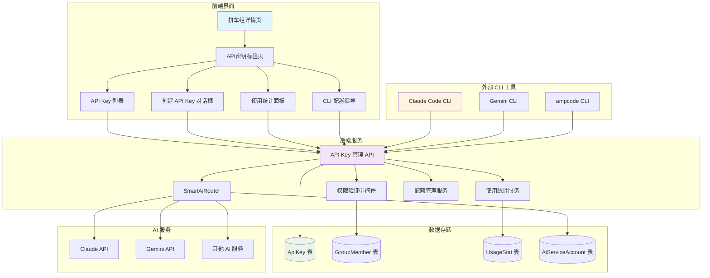
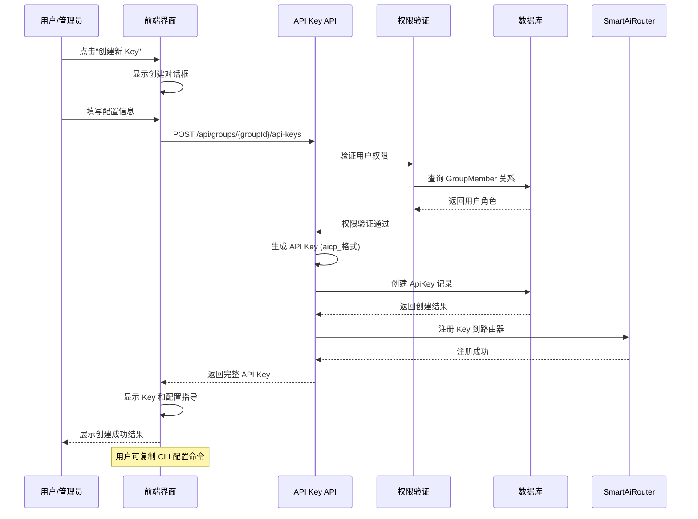
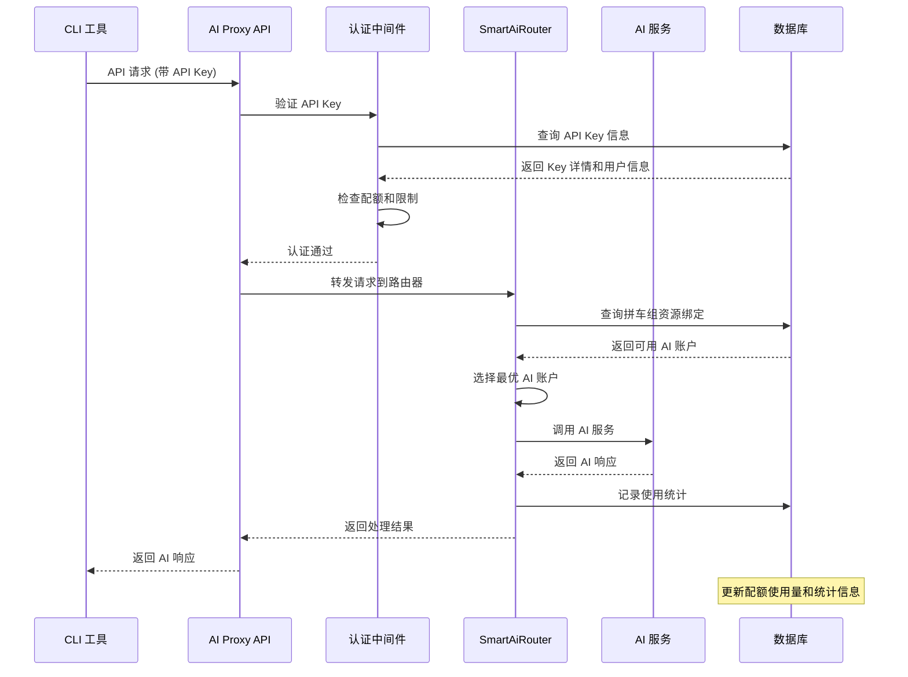
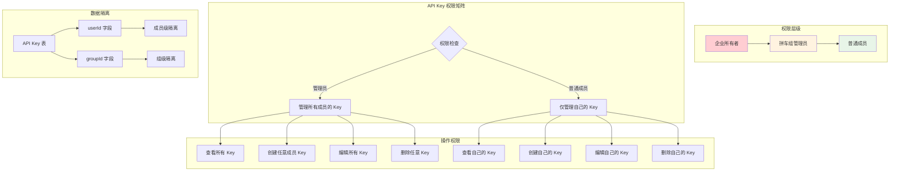
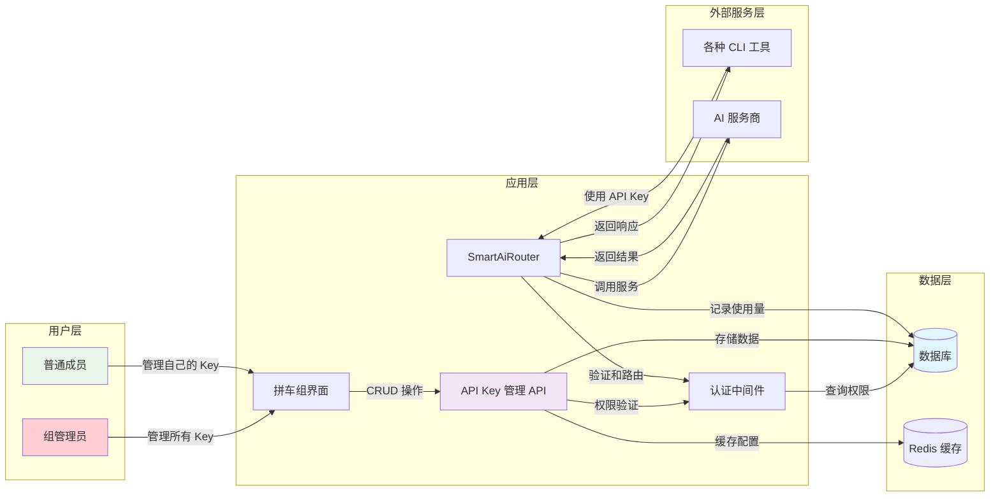
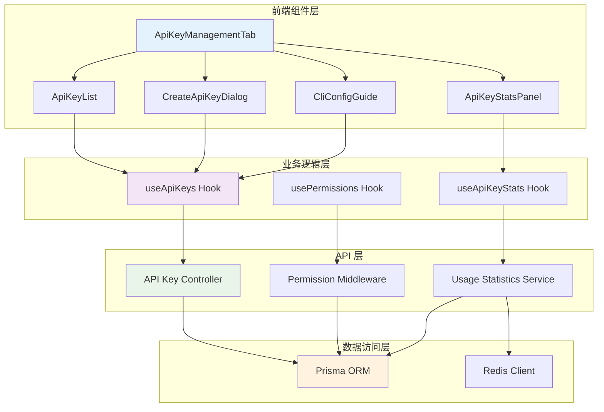

# aicarpool v2.6 API Key 管理系统 PRD

## 版本信息

- **版本**: v2.6
- **发布时间**: 2025 年 8 月
- **核心功能**: 成员级 API Key 管理系统
- **目标用户**: 拼车组成员和管理员

## 项目背景

### 现状分析
- 现有系统缺乏统一的 API Key 管理界面
- 多种 CLI 工具（Claude Code、Gemini CLI、ampcode）需要不同的配置方式
- 缺乏基于成员身份的精细化权限控制
- 使用统计和成本控制功能不完善

### 核心目标
1. **统一管理**: 提供完整的 API Key 生命周期管理
2. **成员绑定**: 每个 API Key 绑定特定的拼车组成员
3. **多 CLI 支持**: 一个 Key 支持多种 CLI 工具
4. **权限控制**: 基于组内角色的精细化权限管理
5. **使用监控**: 详细的使用统计和成本分析

## 功能设计

### 1. 核心概念

#### 1.1 API Key 与成员绑定
```
API Key 1:1 Group Member
- 每个 API Key 属于特定的拼车组成员
- 基于 GroupMember 表的身份和权限进行控制
- 成员离开拼车组时，自动禁用相关 API Key
```

#### 1.2 统一的 Key 格式
```
格式: aicp_<groupId前8位>_<userId前8位>_<随机16位>
示例: aicp_cmdyads9_cmdvk08g_a1b2c3d4e5f6g7h8

优势:
- 包含组和用户信息，便于识别和路由
- 支持智能路由到拼车组配置的 AI 资源
- 统一格式，兼容所有 CLI 工具
```

### 2. 界面设计

#### 2.1 页面布局
**位置**: 拼车组详情页面 → "API密钥" 标签页

**现有标签页**:
- 概览
- 资源配置
- 成员管理
- 邀请管理
- 使用统计
- 权限设置
- **API密钥** ← 新增

#### 2.2 创建 API Key 对话框

基于参考界面设计，包含以下配置项：

##### 基础信息
- **名称**: API Key 的描述性名称
- **绑定成员**: 
  - 管理员可选择任意成员
  - 普通成员只能为自己创建
- **备注**: 可选的使用说明

##### 配额限制
- **速度限制设置**:
  - 时间窗口（分钟）: 1, 5, 10, 60 分钟可选
  - 窗口内最大请求数
  - 窗口内最大 Token 数
- **每日费用限制**: 美元计价
- **过期时间**: 可设置具体到期日期或永不过期

##### 服务权限
- **全部服务**: 使用拼车组配置的所有 AI 服务
- **仅 Claude**: 只能访问 Claude 相关服务
- **仅 Gemini**: 只能访问 Gemini 相关服务
- **自定义**: 手动选择可访问的服务

##### 资源绑定
- **使用共享池**: 使用拼车组的共享 AI 账号资源
- **专属绑定**: 绑定到特定的 AI 服务账号（如果有的话）

#### 2.3 API Key 管理列表

##### 列表字段
| 字段 | 说明 |
|------|------|
| 成员名称 | API Key 所属成员 |
| Key 名称 | 用户定义的名称 |
| 标签 | 可选的分类标签 |
| API KEY | 显示前缀，完整 Key 需点击查看 |
| 状态 | 活跃/禁用/过期 |
| 使用统计 | 请求数、Token 使用量、费用 |
| 创建时间 | Key 创建日期 |
| 过期时间 | 到期日期或"永不过期" |
| 操作 | 统计/编辑/删除按钮 |

##### 使用统计详情
- **今日使用**: 当前费用、Token 使用量、请求数
- **RPM/TPM 限制**: 实时显示当前限制和使用情况
- **模型使用分布**: 显示使用了哪些 AI 模型
- **成本趋势**: 最近 7 天/30 天的使用趋势图

### 3. 系统架构与流程

#### 3.1 整体架构图



#### 3.2 API Key 创建流程时序图



#### 3.3 CLI 工具调用流程时序图



#### 3.4 权限控制架构图



#### 3.5 数据流架构图



#### 3.6 组件交互图



#### 3.7 技术实现

##### 3.7.1 数据库设计

**利用现有表结构**:
```sql
-- ApiKey 表（现有，无需修改）
ApiKey {
  id: String
  key: String          -- 格式: aicp_<groupId>_<userId>_<random>
  name: String         -- 用户定义的名称
  description: String? -- 可选说明
  groupId: String      -- 绑定的拼车组
  userId: String       -- 绑定的成员
  aiServiceId: String  -- 默认 'smart-router'
  quotaLimit: BigInt?  -- 配额限制
  quotaUsed: BigInt    -- 已使用配额
  status: String       -- active/inactive/deleted
  expiresAt: DateTime? -- 过期时间
  lastUsedAt: DateTime?-- 最后使用时间
  createdAt: DateTime
  updatedAt: DateTime
}

-- 新增字段（通过 metadata 存储）
metadata: Json {
  rateLimit: {
    windowMinutes: number,    -- 时间窗口
    maxRequests: number,      -- 最大请求数
    maxTokens: number         -- 最大 Token 数
  },
  dailyCostLimit: number,     -- 每日费用限制
  servicePermissions: string[],-- 可访问的服务类型
  resourceBinding: string     -- 'shared' | 'dedicated'
}
```

#### 3.2 API 端点设计

##### 获取 API Key 列表
```
GET /api/groups/[groupId]/api-keys
Response: {
  success: boolean,
  data: {
    apiKeys: ApiKeyWithStats[],
    totalCount: number,
    userRole: string,
    canCreateForOthers: boolean
  }
}
```

##### 创建 API Key
```
POST /api/groups/[groupId]/api-keys
Body: {
  name: string,
  description?: string,
  targetUserId?: string,    -- 管理员可指定其他成员
  rateLimit: {
    windowMinutes: number,
    maxRequests: number,
    maxTokens: number
  },
  dailyCostLimit?: number,
  expiresInDays?: number,
  servicePermissions: string[],
  resourceBinding: 'shared' | 'dedicated'
}
```

##### 管理 API Key
```
PATCH /api/groups/[groupId]/api-keys/[keyId]
Body: {
  action: 'toggle' | 'updateQuota' | 'resetUsage' | 'delete' | 'regenerate'
  // 其他参数根据 action 决定
}
```

##### 获取使用统计
```
GET /api/groups/[groupId]/api-keys/[keyId]/stats
Query: {
  period: 'today' | '7days' | '30days',
  includeModelBreakdown: boolean
}
```

#### 3.3 前端组件结构

```
ApiKeyManagementTab/
├── index.tsx                 -- 主容器组件
├── components/
│   ├── ApiKeyList.tsx        -- API Key 列表
│   ├── CreateApiKeyDialog.tsx-- 创建对话框
│   ├── ApiKeyStatsPanel.tsx  -- 使用统计面板
│   ├── MemberSelector.tsx    -- 成员选择器
│   ├── RateLimitConfig.tsx   -- 速率限制配置
│   ├── ServicePermissions.tsx-- 服务权限配置
│   └── CliConfigGuide.tsx    -- CLI 配置指导
└── hooks/
    ├── useApiKeys.ts         -- API Key 数据管理
    ├── useApiKeyStats.ts     -- 统计数据管理
    └── usePermissions.ts     -- 权限检查逻辑
```

### 4. 权限管理

#### 4.1 权限矩阵

| 用户角色 | 查看权限 | 创建权限 | 管理权限 | 删除权限 |
|----------|----------|----------|----------|----------|
| 组所有者 | 所有 Key | 为任意成员创建 | 管理所有 Key | 删除任意 Key |
| 组管理员 | 所有 Key | 为任意成员创建 | 管理所有 Key | 删除任意 Key |
| 普通成员 | 仅自己的 Key | 仅为自己创建 | 仅管理自己的 | 仅删除自己的 |

#### 4.2 权限控制逻辑

```typescript
const getApiKeyPermissions = (userRole: string, keyOwner: string, currentUser: string) => {
  const isAdmin = ['owner', 'admin'].includes(userRole);
  const isOwner = keyOwner === currentUser;
  
  return {
    canView: isAdmin || isOwner,
    canEdit: isAdmin || isOwner,
    canDelete: isAdmin || isOwner,
    canViewStats: isAdmin || isOwner,
    canCreateForOthers: isAdmin
  };
};
```

### 5. CLI 工具集成

#### 5.1 配置自动生成

每个 API Key 创建后，自动生成对应的 CLI 配置：

##### Claude Code CLI
```bash
# Claude Code 配置
export ANTHROPIC_BASE_URL="https://your-domain.com/api/v1"
export ANTHROPIC_AUTH_TOKEN="aicp_cmdyads9_cmdvk08g_a1b2c3d4e5f6g7h8"

# 验证配置
curl -H "Authorization: Bearer $ANTHROPIC_AUTH_TOKEN" \
     "$ANTHROPIC_BASE_URL/models"
```

##### Gemini CLI
```bash
# Gemini CLI 配置
export GEMINI_API_URL="https://your-domain.com/api/ai-proxy"
export GEMINI_API_KEY="aicp_cmdyads9_cmdvk08g_a1b2c3d4e5f6g7h8"

# 验证配置
curl -H "X-API-Key: $GEMINI_API_KEY" \
     "$GEMINI_API_URL/health"
```

##### ampcode CLI
```bash
# ampcode CLI 配置
export AMPCODE_BASE_URL="https://your-domain.com/api/ai-proxy"
export AMPCODE_API_KEY="aicp_cmdyads9_cmdvk08g_a1b2c3d4e5f6g7h8"
```

#### 5.2 配置指导界面

- **一键复制**: 点击复制完整的环境变量配置
- **测试连接**: 在线测试 API Key 是否正常工作
- **使用示例**: 提供常见 CLI 命令的使用示例
- **故障排除**: 常见问题和解决方案

### 6. 使用监控与统计

#### 6.1 实时监控

- **RPM (Requests Per Minute)**: 实时请求速率
- **TPM (Tokens Per Minute)**: 实时 Token 使用速率
- **成本跟踪**: 实时费用消耗
- **异常检测**: 使用量异常告警

#### 6.2 统计报表

##### 个人统计
- 每日/周/月使用趋势
- 模型使用分布
- 成本分析
- Peak 时间段分析

##### 组级统计
- 成员使用排行
- 总体成本分摊
- 资源利用率
- 预算使用情况

#### 6.3 告警机制

- **配额预警**: 达到 80% 配额时提醒
- **成本预警**: 超过每日费用限制时告警
- **异常使用**: 检测到异常使用模式时通知
- **过期提醒**: API Key 即将过期时提前通知

### 7. 安全考虑

#### 7.1 API Key 安全
- **完整 Key 显示**: 仅在创建时完整显示，之后只显示前缀
- **传输加密**: 所有 API 调用使用 HTTPS
- **访问日志**: 记录所有 API Key 的使用日志
- **定期轮换**: 支持 API Key 重新生成功能

#### 7.2 权限安全
- **最小权限原则**: 用户只能访问自己的资源
- **会话验证**: 每次操作验证用户身份
- **操作审计**: 记录所有管理操作的审计日志

### 8. 开发计划

#### 8.1 Phase 1: 基础功能（2 周）
- [ ] 在拼车组页面添加"API密钥"标签页
- [ ] 实现基础的 API Key 列表展示
- [ ] 实现创建 API Key 对话框
- [ ] 基于成员身份的权限控制
- [ ] API Key 基础管理操作（启用/禁用/删除）

#### 8.2 Phase 2: 增强功能（1.5 周）
- [ ] 使用统计图表和数据展示
- [ ] CLI 配置自动生成和复制功能
- [ ] 速率限制和配额管理
- [ ] API Key 测试和验证功能

#### 8.3 Phase 3: 高级功能（1 周）
- [ ] 批量管理操作
- [ ] 高级统计报表
- [ ] 告警和通知机制
- [ ] 使用审计日志

#### 8.4 Phase 4: 优化和测试（0.5 周）
- [ ] 性能优化
- [ ] 界面优化和用户体验改进
- [ ] 完整测试和 Bug 修复
- [ ] 文档更新

### 9. 成功指标

#### 9.1 功能指标
- API Key 创建成功率 > 99%
- 界面响应时间 < 2 秒
- API 调用成功率 > 99.5%

#### 9.2 用户体验指标
- 用户能够在 5 分钟内完成首次 API Key 创建和 CLI 配置
- 90% 的用户能够无需帮助完成 API Key 管理操作
- CLI 配置成功率 > 95%

#### 9.3 管理效率指标
- 管理员能够在 2 分钟内为新成员创建 API Key
- 问题排查时间减少 70%
- 成本控制准确率 > 99%

### 10. 风险与缓解

#### 10.1 技术风险
- **风险**: 现有数据库结构不完全适配
- **缓解**: 通过 metadata 字段存储扩展配置，无需修改表结构

#### 10.2 用户体验风险
- **风险**: 界面复杂度增加，用户学习成本高
- **缓解**: 提供详细的使用指导和默认配置

#### 10.3 安全风险
- **风险**: API Key 泄露风险
- **缓解**: 实施完整的访问控制和审计机制

### 11. 未来规划

#### 11.1 v2.7 计划功能
- API Key 批量导入/导出
- 更多 CLI 工具支持
- 高级分析和预测功能

#### 11.2 长期规划
- 机器学习驱动的使用优化建议
- 跨企业的资源共享机制
- 更精细的成本分摊算法

---

## 附录

### A. 界面设计参考
基于提供的参考界面，重点参考以下设计元素：
- 创建对话框的配置项组织方式
- 速率限制的直观配置界面
- 使用统计的图表和数据展示
- 操作按钮的布局和交互方式

### B. 技术参考
- 现有 `/api/groups/[groupId]/api-keys/route.ts` 实现
- `ApiKeysTab.tsx` 组件结构
- SmartAiRouter 的路由逻辑
- 现有权限管理机制

### C. 测试用例
详细的功能测试用例将在开发阶段制定，包括：
- 权限控制测试
- API Key 生命周期测试
- CLI 工具集成测试
- 性能和安全测试