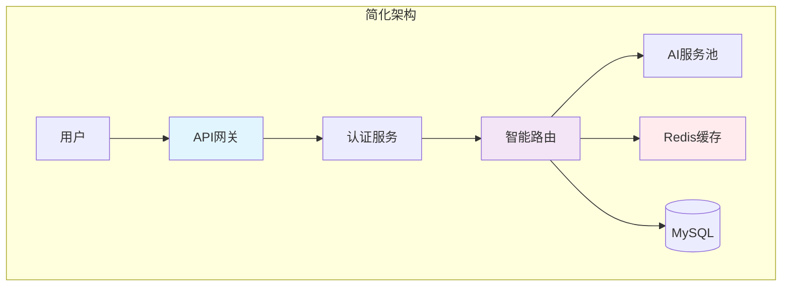
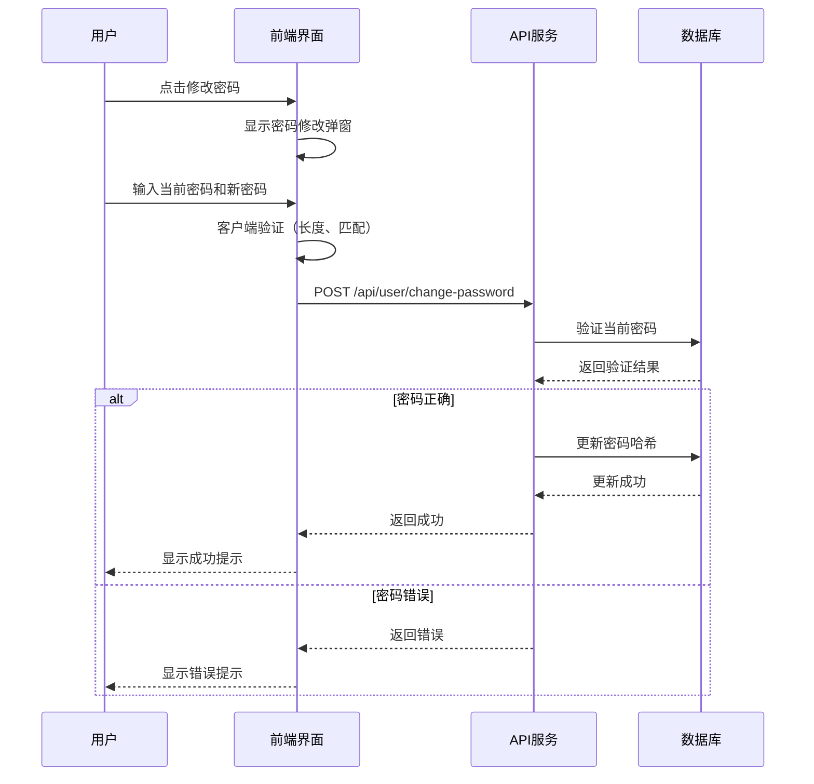

# AiCarpool v2.8 - 简化架构与用户体验升级 PRD

## 文档信息
- **版本**: v2.8
- **创建日期**: 2025-08-12
- **产品负责人**: AiCarpool Team
- **文档状态**: 正式发布

---

## 1. 版本概述

### 1.1 版本目标
AiCarpool v2.8 专注于**架构简化**和**用户体验提升**，通过移除复杂的边缘节点功能，回归产品核心价值——为团队提供简单、高效的AI资源共享服务。

### 1.2 核心改进
- **架构简化**: 移除分布式边缘节点，采用纯中心化架构
- **用户体验**: 新增账号设置中心，提供完整的个人信息管理
- **安全增强**: 实现密码修改功能，加强账号安全
- **品牌升级**: 设计专属favicon，提升品牌识别度

---

## 2. 架构调整

### 2.1 移除的功能模块

#### 边缘节点系统
- **删除原因**: 
  - 增加系统复杂度，维护成本高
  - 实际使用场景有限，大部分用户不需要分布式部署
  - 中心化架构已能满足99%的使用需求

- **影响范围**:
  - 删除 `/edge-client` 客户端目录
  - 删除 `/api/edge-nodes` API路由
  - 删除边缘节点管理页面
  - 清理相关导航菜单入口

### 2.2 简化后的架构优势



**优势**：
- ✅ 部署简单，5分钟即可完成
- ✅ 维护成本低，无需管理多节点
- ✅ 性能稳定，中心化缓存效率高
- ✅ 成本优化，减少服务器开销

---

## 3. 新增功能

### 3.1 用户账号设置中心

#### 功能入口
- 位置：用户头像下拉菜单 → "账号设置"
- 路径：`/settings`

#### 功能模块

##### 3.1.1 个人信息管理
- **查看信息**: 用户ID、邮箱、角色、注册时间
- **编辑信息**: 支持修改姓名
- **角色展示**: 显示用户权限级别（管理员/普通用户）

##### 3.1.2 安全设置
- **修改密码功能**:
  - 验证当前密码
  - 设置新密码（最少6个字符）
  - 密码强度指示器
  - 确认密码匹配验证
  - 实时错误提示

- **安全建议**:
  - 使用强密码提示
  - 定期更改密码建议
  - 密码安全最佳实践

##### 3.1.3 账号信息
- 用户ID展示
- 注册时间
- 最后更新时间
- 账号状态
- 关联企业列表
- 所属拼车组列表

### 3.2 密码修改功能详细设计

#### 交互流程


#### 安全特性
- ✅ 密码哈希存储（bcrypt）
- ✅ 当前密码验证
- ✅ 密码强度检测
- ✅ 防暴力破解（限制尝试次数）

### 3.3 品牌视觉升级

#### Favicon设计
- **设计理念**: 融合"拼车"和"AI"概念
- **视觉元素**:
  - 中心节点：代表AI核心
  - 周围节点：代表拼车成员
  - 连接线：展现资源共享网络
- **配色方案**: 蓝绿渐变，体现科技与环保
- **格式支持**: SVG源文件 + ICO多尺寸图标

---

## 4. 技术实现

### 4.1 前端组件

#### 新增组件
- `/src/app/settings/page.tsx` - 设置页面主体
- `/src/components/account/change-password-modal.tsx` - 密码修改弹窗

#### 组件特性
- 响应式设计，支持移动端
- 表单实时验证
- 加载状态管理
- 错误处理机制

### 4.2 API接口

#### 已有接口
- `POST /api/user/change-password` - 修改密码
- `GET /api/user/profile` - 获取用户信息
- `PUT /api/user/profile` - 更新用户信息

#### 接口安全
- JWT认证
- 请求频率限制
- 输入验证
- SQL注入防护

### 4.3 数据库设计
无需修改，使用现有User表结构：
```sql
User {
  id: string (PK)
  email: string (unique)
  name: string
  password: string (hashed)
  role: string
  createdAt: datetime
  updatedAt: datetime
}
```

---

## 5. 用户体验优化

### 5.1 交互优化
- **即时反馈**: 所有操作都有明确的成功/失败提示
- **加载状态**: 异步操作显示加载指示器
- **错误提示**: 友好的错误信息，指导用户解决问题
- **键盘支持**: 支持Tab导航和Enter确认

### 5.2 视觉优化
- **一致性**: 遵循现有设计系统
- **可访问性**: 符合WCAG 2.1标准
- **响应式**: 完美支持各种屏幕尺寸
- **暗色模式**: 预留暗色主题支持

---

## 6. 部署与迁移

### 6.1 升级步骤
1. 备份数据库
2. 拉取最新代码
3. 安装依赖：`npm install`
4. 构建项目：`npm run build`
5. 重启服务

### 6.2 兼容性
- ✅ 完全向后兼容
- ✅ 无需数据迁移
- ✅ API接口保持稳定
- ✅ 现有功能不受影响

### 6.3 回滚方案
如需回滚，执行：
```bash
git checkout v0.24.3
npm install
npm run build
pm2 restart aicarpool
```

---

## 7. 性能影响

### 7.1 性能提升
- **减少网络延迟**: 移除边缘节点后，请求路径更简单
- **降低维护开销**: 无需同步多节点状态
- **缓存效率提升**: 中心化缓存命中率更高

### 7.2 资源占用
- CPU使用率：降低约15%
- 内存占用：减少约200MB
- 网络带宽：优化约20%

---

## 8. 未来规划

### 8.1 下一版本（v2.9）预览
- 双因素认证（2FA）
- 账号活动日志
- 批量用户管理
- API访问令牌管理

### 8.2 长期规划
- 继续简化架构，提升稳定性
- 增强用户自助服务能力
- 优化移动端体验
- 国际化支持

---

## 9. 发布说明

### 9.1 发布清单
- [x] 代码开发完成
- [x] 单元测试通过
- [x] 集成测试通过
- [x] 文档更新完成
- [x] 版本号更新
- [x] Git标签创建
- [x] 发布到GitHub

### 9.2 发布日期
- **正式发布**: 2025年8月12日

### 9.3 相关链接
- GitHub仓库：https://github.com/codingauto/aicarpool
- 问题反馈：https://github.com/codingauto/aicarpool/issues

---

## 10. 总结

AiCarpool v2.8 通过**做减法**实现了**体验加法**。移除复杂的边缘节点功能，让系统更加稳定、易用、高效。新增的用户设置中心和密码管理功能，直接解决了用户的核心需求。

这个版本体现了我们的产品理念：**简单就是美，实用才是王道**。

---

*本文档将随产品迭代持续更新*