# AiCarpool - 产品需求文档 (PRD)
*Share AI, Share Costs*

## 文档信息
- **产品名称**: AiCarpool - AI编程工具拼车服务平台
- **英文名称**: AiCarpool - AI Programming Tools Carpool Service Platform  
- **产品描述**: 协作式AI编程工具共享平台，支持Claude Code、Gemini CLI、AmpCode等多种AI服务，提供中心化代理、分布式边缘节点、混合架构等灵活部署模式
- **版本**: v2.0
- **创建日期**: 2025-07-21
- **更新日期**: 2025-07-22
- **文档类型**: 产品需求文档 (PRD)

---

## 1. 产品概述

### 1.1 项目背景

**AiCarpool**是一个协作式AI编程工具共享平台，专为解决多AI服务的统一管理和成本分摊而设计。

当前AI编程工具生态呈现多元化发展：**Claude Code**凭借强大的代码理解能力、**Gemini CLI**以高性价比著称、**AmpCode**提供独特的开发工具链。然而，现有的拼车服务主要依赖手动操作，包括多种AI服务账户配置、API Key 生成、用户通知等环节，存在效率低、易出错、难扩展的问题。

不同AI服务的API接口、认证方式、配额机制各不相同，给统一管理带来挑战。同时传统的中心化代理方式存在延迟高、成本大的问题。**AiCarpool** 通过创新的分布式架构，支持中心化、边缘节点、混合等多种部署模式，实现高效的多AI服务资源管理和低延迟的服务提供。

### 1.2 目标用户
- **主要用户**: 拼车服务运营者（管理员）
- **次要用户**: 拼车组成员（AI编程工具使用者）
- **使用场景**: 企业内部多种AI编程工具共享、小团队成本分摊、跨AI服务的统一管理

### 1.3 核心价值
- **多AI服务统一管理**: 支持Claude Code、Gemini CLI、AmpCode等多种AI编程工具的统一管理
- **运营自动化**: 将手动的多种AI服务账户配置、Key 分发等操作自动化
- **用户自助化**: 用户可以自主选择AI服务并创建管理对应的API Key
- **跨服务兼容**: 统一的API接口适配不同AI服务的差异化需求
- **分布式架构**: 边缘节点就近处理，降低延迟提升性能
- **成本透明化**: 跨AI服务的统一使用统计和配额管理
- **规模化运营**: 支持多组并行管理，轻松扩展用户规模

### 1.4 解决的问题
1. **多AI服务分散管理**: 不同AI工具需要分别管理，缺乏统一平台
2. **API接口差异化**: 各AI服务API格式、认证方式不统一，集成复杂
3. **手动操作繁琐**: 每次添加用户需要在多个AI服务中手动配置
4. **用户体验差**: 用户无法在统一界面管理多种AI服务的Key
5. **缺乏透明度**: 跨AI服务的使用情况和配额难以统一查看
6. **扩展性差**: 人工操作难以支撑大规模多AI服务用户
7. **成本核算复杂**: 多种AI服务的成本分摊和统计困难
8. **网络延迟高**: 中心化代理导致请求延迟和性能问题
9. **资源利用低**: IP 资源管理复杂，服务器利用率不高

### 1.5 混合架构概览

本平台采用混合架构设计，同时支持两种部署模式：**中心化代理模式**和**分布式边缘节点模式**，为不同规模和需求的用户提供灵活的部署选择。

#### 1.5.1 架构模式对比

| 特性 | 中心化代理模式 | 分布式边缘节点模式 |
|------|---------------|------------------|
| **部署复杂度** | 简单，单一服务器 | 复杂，多节点管理 |
| **扩展性** | 垂直扩展为主 | 水平扩展优势明显 |
| **延迟** | 可能存在地理延迟 | 就近处理，延迟更低 |
| **成本** | 初期成本低 | 适合大规模部署 |
| **适用场景** | 中小规模拼车组 | 大规模、多地域需求 |
| **运维复杂度** | 低 | 中等 |

#### 1.5.2 中心化代理架构图

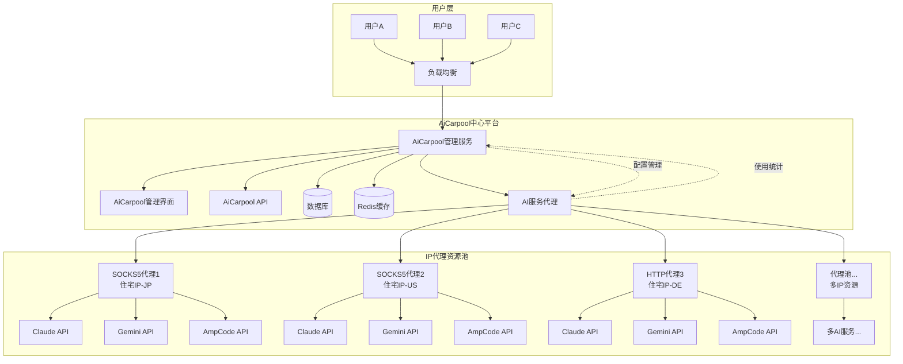

#### 1.5.3 分布式边缘节点架构图
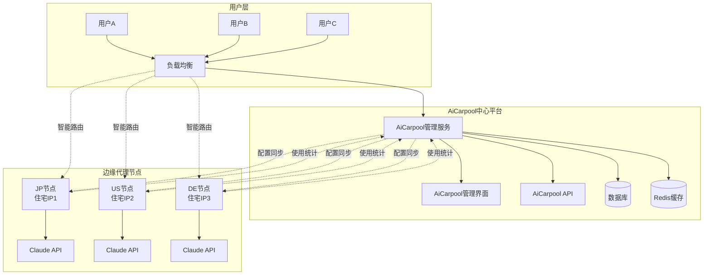

#### 1.5.4 混合架构核心设计原则

- **模式灵活性**: 支持运行时在中心化和分布式模式间切换
- **统一管理**: 无论采用何种模式，管理界面和API保持统一
- **渐进升级**: 可从中心化模式平滑升级到分布式模式
- **资源共享**: 两种模式可共享IP代理资源池
- **智能调度**: 根据负载和地理位置自动选择最优路由
- **统一监控**: 统一收集和展示所有代理资源的使用数据

#### 1.5.5 架构选择策略

**推荐中心化代理模式的场景：**
- 拼车组数量 < 10个
- 用户总数 < 100人  
- 主要服务单一地区
- 运维团队规模较小
- 希望快速启动项目

**推荐分布式边缘节点模式的场景：**
- 拼车组数量 > 20个
- 用户总数 > 200人
- 服务多个地区/国家
- 对延迟要求较高
- 有专业运维团队

---

## 2. 用户角色与权限

### 2.1 超级管理员 (Super Admin)
**职责**: 系统全局管理
**权限**:
- 创建和管理所有拼车组
- 配置 Claude 账户和代理设置
- 管理 IP 代理资源池和套餐产品
- 管理所有用户（增删改查）
- 查看全平台使用统计
- 系统配置和维护

### 2.2 组管理员 (Group Manager) 
**职责**: 特定拼车组的运营管理
**权限**:
- 管理自己的拼车组设置
- 邀请和管理组内成员
- 设置组级配额和限制
- 查看组内使用统计
- 处理组内用户问题

### 2.3 组成员 (Group Member)
**职责**: API 的实际使用者
**权限**:
- 查看个人仪表板
- 自助创建和管理 API Key
- 查看个人使用统计和配额
- 获取使用教程和技术支持
- 管理个人账户信息

---

## 3. 功能需求

### 3.1 组管理功能

#### 3.1.1 拼车组创建
**功能描述**: 管理员可以创建新的拼车组，配置多AI服务支持和管理规则。

**详细需求**:
- 组基本信息设置（组名、描述、最大成员数）
- **AI服务选择和配置**：
  - 支持的AI服务选择（Claude Code、Gemini CLI、AmpCode）
  - 主要服务设置（主要使用的AI服务）
  - 服务优先级配置（服务使用顺序）
  - 故障转移启用（自动切换到备用服务）
- **认证配置**：
  - 共享账户模式（组级别的AI服务账户）
  - 个人Key模式（成员使用自己的API Key）
  - 代理认证模式（通过代理服务认证）
- **配额和限制管理**：
  - 跨服务全局配额设置（总Token限制、成本限制）
  - 单服务配额分配（各AI服务的使用限制）
  - 单用户配额限制（每个成员的使用限额）
  - 成本控制设置（每日/每月成本限制和告警阈值）
- **模型访问控制**：
  - 按服务的模型白名单（允许使用的模型）
  - 功能限制设置（工具调用、视觉理解等）
  - 模型使用权重配置（负载均衡）
- **部署模式选择**：
  - 中心化代理模式（通过IP代理转发）
  - 分布式边缘节点模式（边缘节点处理）
  - 混合模式（中心化+分布式）
- 组状态管理（草稿、激活、暂停、关闭）

**验收标准**:
- [ ] 可以成功创建支持多AI服务的拼车组
- [ ] AI服务选择和优先级配置正确生效
- [ ] 认证方式配置正确且安全可靠
- [ ] 配额分配算法合理，总量不超限
- [ ] 成本控制机制有效，超限时能及时告警
- [ ] 模型访问控制规则正确执行
- [ ] 故障转移机制在服务异常时正常工作
- [ ] 部署模式切换不影响服务可用性
- [ ] 组状态变更能正确影响所有AI服务权限

#### 3.1.2 多AI服务集成
**功能描述**: 为拼车组配置多种AI服务账户、认证和网络设置。

**详细需求**:
- **AI服务账户配置**：
  - Claude Code账户：OAuth流程（复用现有功能）
  - Gemini CLI账户：API Key配置和验证
  - AmpCode账户：认证信息配置和测试
  - 批量账户导入和管理
- **认证方式管理**：
  - 共享账户：组级别统一认证，成员共享使用
  - 个人Key：成员提供自己的API Key，独立计费
  - 代理认证：通过统一代理服务进行认证转发
- **网络代理配置**：
  - IP代理配置界面（SOCKS5/HTTP代理支持）
  - 代理池管理（多代理轮换）
  - 地理位置选择（不同地区的代理）
  - 代理健康检查和故障转移
- **服务健康监控**：
  - 各AI服务连接性实时监控
  - Token/Key有效性定期检查
  - 服务响应时间和成功率统计
  - 异常告警和自动恢复
- **负载均衡策略**：
  - 权重分配（不同服务的使用比例）
  - 成本优化（优先使用低成本服务）
  - 性能优化（优先使用响应快的服务）
  - 功能匹配（根据需求选择合适服务）
- **使用统计和成本追踪**：
  - 跨服务统一使用统计
  - 实时成本计算和预警
  - 详细的使用报表和分析
  - 成本分摊和计费管理

**验收标准**:
- [ ] 能够成功添加和配置多种AI服务账户
- [ ] 不同认证方式都能正常工作且安全可靠
- [ ] 代理设置正确且连接测试通过
- [ ] 服务健康监控准确及时，异常告警有效
- [ ] 负载均衡策略按配置正确执行
- [ ] 使用统计数据准确，成本计算无误
- [ ] 服务间切换平滑，不影响用户体验

### 3.2 AI服务使用功能

#### 3.2.1 智能服务路由
**功能描述**: 根据用户请求和组配置，智能选择最优的AI服务。

**详细需求**:
- **请求路由算法**：
  - 基于服务优先级的路由（按配置顺序选择）
  - 负载均衡路由（根据权重分配请求）
  - 成本优化路由（优先选择低成本服务）
  - 功能匹配路由（根据需求特性选择合适服务）
- **动态切换机制**：
  - 服务健康状态实时检查
  - 故障自动检测和切换
  - 服务恢复后的回切
  - 用户会话保持和状态同步
- **请求适配层**：
  - 统一的API接口格式
  - 不同AI服务的请求格式转换
  - 响应格式标准化
  - 流式响应统一处理
- **性能优化**：
  - 请求缓存和去重
  - 连接池管理
  - 超时和重试策略
  - 并发控制和限流

**验收标准**:
- [ ] 路由算法按配置正确选择AI服务
- [ ] 故障切换及时且对用户透明
- [ ] API接口统一，不同服务调用体验一致
- [ ] 性能优化有效，响应时间在可接受范围

#### 3.2.2 多服务API统一接口
**功能描述**: 提供统一的API接口，支持多种AI服务的透明访问。

**详细需求**:
- **统一消息接口**：
  - `/api/v1/messages` 端点支持所有AI服务
  - 自动服务选择和请求转发
  - 统一的请求和响应格式
  - 兼容现有Claude Code API格式
- **模型选择机制**：
  - 跨服务的模型名称映射
  - 用户可指定优先使用的服务
  - 模型能力自动匹配（工具调用、视觉等）
  - 模型不可用时的自动降级
- **认证和授权**：
  - 统一的API Key认证
  - 基于组配置的服务权限控制
  - 用户级别的配额管理
  - 成本控制和超限保护
- **响应处理**：
  - 流式响应统一格式
  - 错误信息标准化
  - 使用统计自动收集
  - 成本计算和记录

**验收标准**:
- [ ] 统一接口能够正确路由到各AI服务
- [ ] 模型选择机制智能且准确
- [ ] 认证授权安全可靠，权限控制精确
- [ ] 响应格式统一，错误处理完善

#### 3.2.3 分布式AI服务监控和告警
**功能描述**: 基于边缘节点的轻量化监控架构，减少中心服务器负担，实现分布式监控和告警。

**详细需求**:
- **边缘节点本地监控**：
  - 各边缘节点独立监控本地AI服务可用性
  - 本地存储响应时间和成功率统计（SQLite）
  - 本地API配额使用情况跟踪
  - 本地服务限流和异常状态检测
  - 边缘节点自主故障转移决策
- **轻量化中心监控**：
  - 只收集边缘节点心跳状态
  - 汇总节点健康度基本指标
  - 接收关键告警事件（非统计数据）
  - 维护全局服务配置状态
- **分层告警机制**：
  - **节点级告警**：边缘节点本地处理一般性告警
  - **关键告警上报**：服务完全不可用、配额严重超限等
  - **全局告警汇总**：中心服务器汇总多节点告警模式
  - **用户通知**：只针对影响业务的关键问题
- **自主故障恢复**：
  - 边缘节点本地自动重试机制
  - 本地服务降级策略执行
  - 本地故障转移记录（存储在SQLite）
  - 关键故障向中心上报
- **分布式监控面板**：
  - **实时视图**：显示在线节点状态（来自心跳）
  - **按需查询**：统计数据从边缘节点按需聚合
  - **数据完整性提示**：标明数据的完整性和时效性
  - **轻量化图表**：避免实时统计，使用缓存和预聚合数据

**架构优化特性**:
- **减压设计**：
  - 中心服务器不存储详细统计数据
  - 不进行实时数据聚合和复杂计算
  - 最小化网络传输和存储需求
- **容错机制**：
  - 部分节点离线不影响整体监控
  - 监控数据的最终一致性
  - 优雅处理数据不完整的情况
- **性能优化**：
  - 心跳间隔优化（60秒）
  - 监控数据本地缓存和预聚合
  - 分页和异步查询大量数据

**验收标准**:
- [ ] 边缘节点能够独立进行本地监控，无需依赖中心服务器
- [ ] 中心服务器资源占用低，处理能力需求小
- [ ] 关键告警能够及时上报，告警机制可靠
- [ ] 监控面板能够适配分布式数据展示，用户体验良好
- [ ] 部分节点离线时系统仍能正常提供监控服务
- [ ] 数据完整性和时效性有明确的提示和标识

### 3.3 用户管理功能

#### 3.3.1 用户邀请系统
**功能描述**: 通过邮件邀请用户加入拼车组。

**详细需求**:
- 批量邮件邀请（输入多个邮箱地址）
- 邀请链接生成（包含加密的组信息）
- 邀请状态跟踪（已发送、已注册、已激活）
- 邀请链接有效期管理（默认7天）
- 重发邀请功能
- 自定义邀请邮件模板

**验收标准**:
- [ ] 可以批量发送邀请邮件
- [ ] 邀请链接安全且在有效期内可用
- [ ] 邀请状态准确跟踪和显示
- [ ] 邮件模板内容正确且美观

#### 3.2.2 用户注册流程
**功能描述**: 受邀用户通过邀请链接注册账号并加入组。

**详细需求**:
- 通过邀请链接访问注册页面
- 用户基本信息收集（姓名、邮箱、密码）
- 邮箱验证流程
- 自动加入对应拼车组
- 账户激活和欢迎引导

**验收标准**:
- [ ] 注册流程顺畅且用户体验良好
- [ ] 邮箱验证功能正常工作
- [ ] 用户能够成功加入指定的拼车组
- [ ] 新用户能获得清晰的使用指导

### 3.3 自助 Key 生成功能

#### 3.3.1 Key 创建界面
**功能描述**: 用户可以根据需要自主创建 API Key。

**详细需求**:
- Key 基本信息设置（名称、描述）
- Token 配额设置（在组配额范围内）
- 速率限制配置（请求频率、时间窗口）
- 模型访问限制（基于组允许的模型）
- Key 有效期设置（可选）
- 立即生成并安全显示 Key

**验收标准**:
- [ ] 界面清晰易用，配置选项完整
- [ ] Key 生成即时且唯一
- [ ] 配额验证准确（不能超出组限制）
- [ ] Key 信息安全显示和复制功能

#### 3.3.2 Key 管理功能
**功能描述**: 用户可以查看和管理自己创建的所有 Key。

**详细需求**:
- Key 列表展示（名称、创建时间、状态、使用统计）
- Key 启用/禁用功能
- Key 删除功能（需确认）
- Key 使用统计详情（请求次数、Token 消耗、模型分布）
- Key 配置编辑（部分属性可修改）
- 使用趋势图表展示

**验收标准**:
- [ ] Key 列表完整准确显示
- [ ] 启用/禁用功能即时生效
- [ ] 使用统计数据准确且实时更新
- [ ] 删除操作有适当的安全确认

### 3.4 配额控制功能

#### 3.4.1 组级配额管理
**功能描述**: 管理员设置和监控拼车组的整体资源配额。

**详细需求**:
- 总 Token 配额设置
- 单用户最大 Token 限制
- 用户最大 Key 数量限制
- 模型访问权限控制
- 配额使用监控和告警
- 配额调整历史记录

**验收标准**:
- [ ] 配额设置灵活且验证正确
- [ ] 配额使用实时监控和统计
- [ ] 接近限制时有告警提醒
- [ ] 配额调整有完整的审计日志

#### 3.4.2 个人配额显示
**功能描述**: 用户清晰了解自己的配额和使用情况。

**详细需求**:
- 个人可用配额显示（剩余 Token、可创建 Key 数）
- 当前使用情况统计（已用 Token、活跃 Key 数）
- 配额使用趋势图表
- 配额预警通知（接近限制时提醒）
- 历史使用数据查询

**验收标准**:
- [ ] 配额信息准确实时显示
- [ ] 图表数据可视化清晰
- [ ] 预警功能及时有效
- [ ] 历史数据查询功能完整

### 3.5 邮件通知功能

#### 3.5.1 邮件服务集成
**功能描述**: 集成邮件服务提供商，支持各类通知邮件发送。

**详细需求**:
- 邮件服务商配置（SMTP 或 API 方式）
- 邮件模板管理系统
- 邮件发送队列和重试机制
- 邮件发送状态跟踪
- 退信处理机制

**验收标准**:
- [ ] 邮件发送稳定可靠
- [ ] 模板管理功能完整
- [ ] 发送状态准确跟踪
- [ ] 异常情况处理得当

#### 3.5.2 通知场景覆盖
**功能描述**: 覆盖用户生命周期中的关键通知场景。

**详细需求**:
- 邀请加入组邮件
- 账户注册成功确认
- Key 创建成功通知
- 配额告警通知
- 系统维护通知
- 账户异常通知

**验收标准**:
- [ ] 所有场景都有对应的邮件通知
- [ ] 邮件内容准确且用户友好
- [ ] 通知时机恰当不打扰用户
- [ ] 用户可以管理通知偏好设置

### 3.6 IP 代理套餐管理功能

#### 3.6.1 套餐产品管理
**功能描述**: 管理双 ISP 静态住宅 IP + 轻量云主机一体化套餐产品。

**详细需求**:
- 套餐产品定义（预配置的IP+服务器组合规格、价格、有效期）
- 服务器库存管理（每台服务器已预配置双ISP住宅IP）
- 套餐规格模板（CPU、内存、存储、带宽、IP类型、国家地区）
- 库存状态管理和自动分配
- 价格策略和优惠管理（如图中的43元/月，限时抢购）
- 套餐使用状态监控

**验收标准**:
- [ ] 可以创建和管理不同规格的一体化套餐产品
- [ ] 服务器资源自动分配且不重复使用（每台服务器只分配给一个组）
- [ ] 套餐规格和服务器实际配置一致
- [ ] 库存管理准确，避免超售
- [ ] 价格计算和限时优惠应用正确

#### 3.6.2 一体化服务器分配
**功能描述**: 为拼车组自动分配预配置的双ISP住宅IP服务器。

**详细需求**:
- 套餐选择界面（展示可用套餐规格和地区选项）
- 自动服务器分配（从库存池中分配空闲服务器）
- 服务器初始化和配置（SSH访问、代理服务配置）
- 双ISP住宅IP自动激活和配置（SOCKS5/HTTP代理端口）
- 服务器连接性测试和健康检查
- 使用统计和性能监控

**验收标准**:
- [ ] 套餐选择界面清晰展示规格和地区信息
- [ ] 服务器分配算法合理，避免冲突
- [ ] 服务器初始化成功，SSH和代理服务正常
- [ ] 双ISP住宅IP配置正确且可用
- [ ] 连接测试通过并持续监控服务器状态

#### 3.6.3 套餐生命周期管理
**功能描述**: 管理套餐从购买到过期的完整生命周期。

**详细需求**:
- 套餐订购和激活流程
- 使用期限管理和提醒
- 自动续费和手动续费
- 套餐升级和降级
- 过期处理和资源回收
- 使用记录和账单生成

**验收标准**:
- [ ] 订购流程顺畅且用户体验良好
- [ ] 期限管理准确，提醒及时
- [ ] 续费功能稳定可靠
- [ ] 套餐变更操作正确执行
- [ ] 过期资源自动回收，不影响其他用户

#### 3.6.4 套餐使用监控
**功能描述**: 实时监控套餐资源使用情况和性能指标。

**详细需求**:
- 带宽使用统计和图表展示
- IP 连接质量监控（延迟、丢包率）
- 云主机资源使用监控（CPU、内存、磁盘）
- 异常告警和故障处理
- 使用趋势分析和优化建议
- 多维度报表和数据导出

**验收标准**:
- [ ] 监控数据准确实时更新
- [ ] 图表展示清晰易懂
- [ ] 告警机制及时有效
- [ ] 故障处理响应迅速
- [ ] 报表数据完整可导出

### 3.7 边缘代理节点管理功能

#### 3.7.1 节点注册和认证
**功能描述**: 双ISP住宅IP服务器自动注册为边缘代理节点。

**详细需求**:
- 一键部署脚本自动下载和安装轻量级代理服务
- 节点自动向中心平台注册（提供服务器信息、IP信息等）
- 基于Token的节点认证机制
- 节点状态实时监控和心跳检测
- 节点配置自动同步和更新
- 节点异常自动重启和恢复

**验收标准**:
- [ ] 部署脚本能够在各种Linux发行版上正常运行
- [ ] 节点注册成功后能够在管理界面看到节点信息
- [ ] 节点认证安全可靠，防止恶意节点接入
- [ ] 心跳检测及时发现节点异常
- [ ] 配置同步实时有效

#### 3.7.2 智能负载调度
**功能描述**: 根据节点负载和地理位置智能分配用户请求。

**详细需求**:
- 基于地理位置的就近路由（GeoIP定位）
- 节点负载均衡算法（轮询、加权轮询、最少连接）
- 节点健康度评估（延迟、成功率、负载）
- 故障节点自动切换和隔离
- 用户粘性会话支持（相同用户尽量使用同一节点）
- 节点容量管理和自动扩缩容

**验收标准**:
- [ ] 用户请求能够被路由到最优节点
- [ ] 负载均衡算法有效分散请求压力
- [ ] 故障节点能够被及时发现和隔离
- [ ] 粘性会话保证用户体验一致性
- [ ] 容量管理避免节点过载

#### 3.7.3 配置同步机制
**功能描述**: 中心平台向边缘节点同步配置和用户Key信息。

**详细需求**:
- API Key白名单实时同步（增加、删除、更新）
- 用户配额信息同步（Token限制、速率限制等）
- 拼车组配置同步（模型限制、代理规则等）
- 增量同步机制（只同步变更部分，减少带宽）
- 同步失败重试和错误处理
- 配置版本管理和回滚机制

**验收标准**:
- [ ] 新创建的API Key能够在所有节点上立即生效
- [ ] 配额变更能够实时同步到边缘节点
- [ ] 同步机制高效，不影响节点性能
- [ ] 同步失败有完善的重试和报警机制
- [ ] 支持配置回滚和版本管理

#### 3.7.4 使用统计聚合
**功能描述**: 边缘节点定期上报使用统计到中心平台。

**详细需求**:
- 请求统计聚合（请求次数、Token使用量、响应时间）
- 用户维度统计（按API Key、用户组聚合）
- 模型使用统计（不同Claude模型的使用分布）
- 成本统计计算（按官方价格计算费用）
- 批量上报机制（减少网络开销）
- 统计数据持久化和备份

**验收标准**:
- [ ] 使用统计准确反映实际使用情况
- [ ] 统计数据实时性和准确性满足业务需求
- [ ] 上报机制高效，不影响代理服务性能
- [ ] 统计数据完整性和一致性得到保证
- [ ] 支持历史数据查询和分析

#### 3.7.5 节点运维管理
**功能描述**: 中心平台对边缘节点进行统一运维管理。

**详细需求**:
- 节点状态监控仪表板（在线状态、负载、性能指标）
- 远程节点重启和配置更新
- 节点日志收集和集中查看
- 节点版本管理和自动升级
- 节点异常告警和通知
- 节点性能分析和优化建议

**验收标准**:
- [ ] 管理界面能够清晰展示所有节点状态
- [ ] 远程操作功能稳定可靠
- [ ] 日志收集完整，便于问题排查
- [ ] 版本升级过程平滑，不影响服务
- [ ] 告警机制及时有效

### 3.8 中心化代理转发功能

#### 3.8.1 代理池管理
**功能描述**: 管理中心服务器的IP代理资源池，支持多种代理类型和供应商。
**详细需求**:
- 代理资源录入和管理（SOCKS5、HTTP、HTTPS代理）
- 代理供应商管理（支持多家代理服务提供商）
- 代理连接测试和健康检查（延迟、可用性、匿名性测试）
- 代理轮换策略配置（固定IP、轮询、随机选择）
- 代理地理位置标记和分类管理
- 代理使用统计和成本核算

**验收标准**:
- [ ] 支持主流代理协议和认证方式
- [ ] 代理健康检查准确及时
- [ ] 代理轮换策略灵活可配置
- [ ] 管理界面友好易用
- [ ] 统计数据准确完整

#### 3.8.2 智能代理路由
**功能描述**: 根据用户请求和代理状态智能选择最优代理进行转发。
**详细需求**:
- 基于地理位置的代理选择（用户IP匹配最近地区代理）
- 代理负载均衡算法（避免单个代理过载）
- 故障代理自动切换和隔离
- 用户粘性代理分配（同用户使用固定代理组）
- 请求重试机制和降级策略
- 代理性能监控和自动优化

**验收标准**:
- [ ] 代理选择算法高效合理
- [ ] 故障切换及时透明
- [ ] 用户体验一致稳定
- [ ] 性能监控数据准确
- [ ] 自动优化效果明显

#### 3.8.3 集中化配置管理
**功能描述**: 在中心服务器统一管理所有拼车组的代理配置和路由规则。
**详细需求**:
- 拼车组代理策略配置（优选地区、备用代理、轮换频率）
- 用户级代理规则设置（特定用户绑定特定代理）
- 配置热更新机制（无需重启服务即可生效）
- 配置版本管理和回滚
- 配置导入导出功能
- 批量配置操作界面

**验收标准**:
- [ ] 配置管理界面直观易用
- [ ] 热更新功能稳定可靠
- [ ] 版本管理和回滚功能完善
- [ ] 批量操作高效准确
- [ ] 配置验证机制完整

#### 3.8.4 中心化统计监控
**功能描述**: 在中心平台统一收集和展示所有代理转发的使用数据和性能指标。
**详细需求**:
- 实时监控仪表板（请求量、成功率、响应时间）
- 代理使用分析（各代理负载分布、性能对比）
- 用户使用统计（Token消耗、API调用频率、成本分析）
- 异常告警机制（代理失效、异常流量、配额超限）
- 历史数据查询和报表生成
- 成本分析和优化建议

**验收标准**:
- [ ] 监控数据实时准确
- [ ] 统计分析功能全面
- [ ] 告警机制及时有效
- [ ] 报表生成功能完善
- [ ] 成本分析准确合理

#### 3.8.5 部署模式切换
**功能描述**: 支持在中心化代理模式和分布式边缘节点模式之间灵活切换。
**详细需求**:
- 模式切换配置界面（可按拼车组选择模式）
- 数据迁移和同步机制（配置、统计数据的平滑迁移）
- 混合模式支持（部分组使用中心化，部分使用分布式）
- 切换过程用户透明（不影响正在进行的API请求）
- 回滚机制和安全保护
- 切换过程的监控和日志记录

**验收标准**:
- [ ] 模式切换界面清晰易懂
- [ ] 数据迁移完整无损失
- [ ] 混合模式运行稳定
- [ ] 切换过程对用户透明
- [ ] 回滚机制安全可靠

---

## 4. 业务流程

### 4.1 管理员操作流程

#### 4.1.1 创建拼车组流程
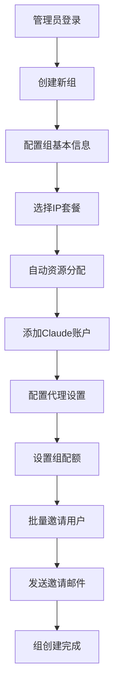

**详细步骤**:
1. **管理员登录**: 使用管理员账户登录系统
2. **创建新组**: 点击创建拼车组按钮，进入配置页面
3. **配置组基本信息**: 设置组名、描述、最大成员数等
4. **选择IP套餐**: 选择合适的双ISP住宅IP+云主机套餐
5. **自动资源分配**: 系统自动分配IP地址和云主机资源
6. **添加Claude账户**: 选择现有账户或通过OAuth流程添加新账户
7. **配置代理设置**: 使用分配的IP资源配置代理，测试连接性
8. **设置组配额**: 配置总Token限制、单用户限制、模型权限等
9. **批量邀请用户**: 输入用户邮箱列表，生成邀请链接
10. **发送邀请邮件**: 系统自动发送邀请邮件给所有用户
11. **组创建完成**: 组状态设为激活，等待用户加入

#### 4.1.2 组管理维护流程
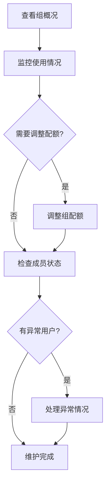

### 4.2 用户操作流程

#### 4.2.1 用户加入组流程
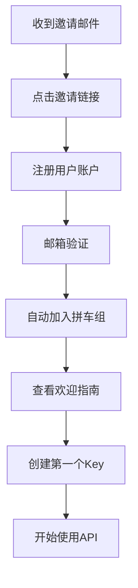

**详细步骤**:
1. **收到邀请邮件**: 用户邮箱收到加入拼车组的邀请
2. **点击邀请链接**: 访问个性化的注册页面
3. **注册用户账户**: 填写基本信息，设置密码
4. **邮箱验证**: 点击验证邮件激活账户
5. **自动加入拼车组**: 系统自动将用户加入指定组
6. **查看欢迎指南**: 了解平台使用方法和API接口
7. **创建第一个Key**: 根据需求配置并生成API Key
8. **开始使用API**: 使用Key调用Claude API服务

#### 4.2.2 日常使用流程
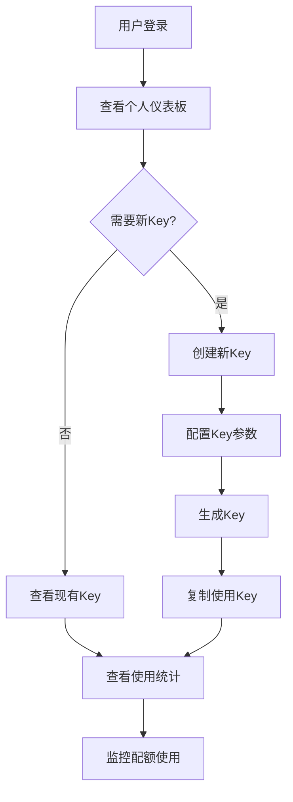

### 4.3 混合架构时序图

#### 4.3.1 中心化代理模式 - 多AI服务请求处理时序图

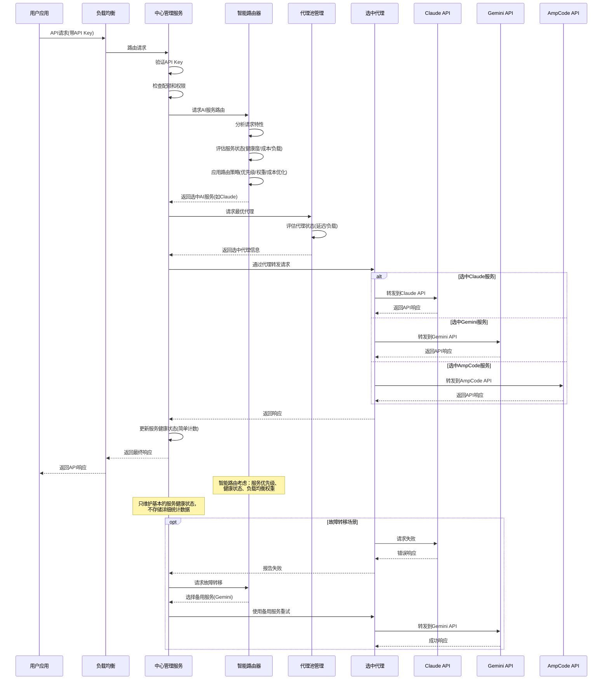

#### 4.3.2 分布式边缘节点模式 - 多AI服务请求处理时序图

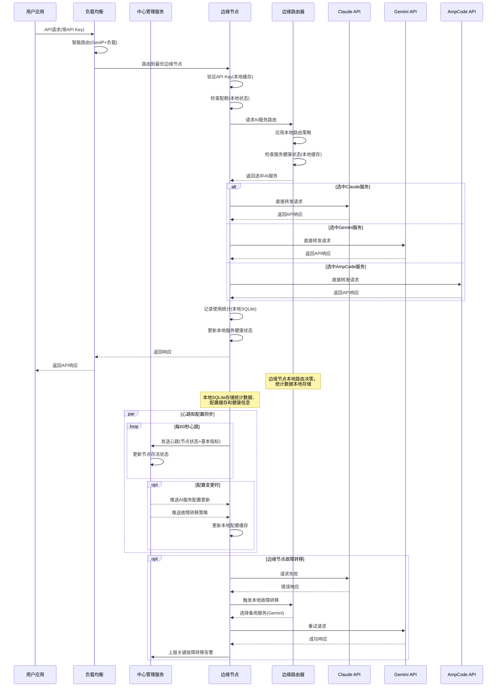

#### 4.3.3 边缘节点心跳和配置同步时序图

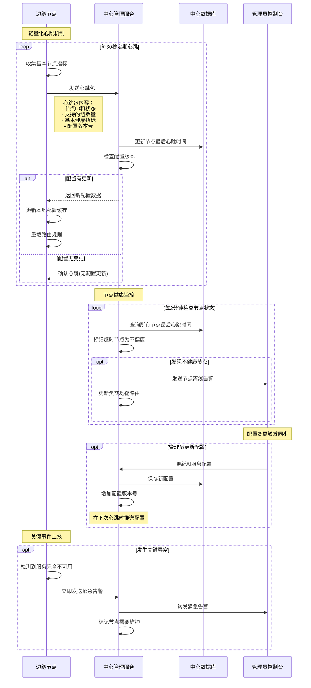

#### 4.3.4 AI服务故障转移和恢复时序图

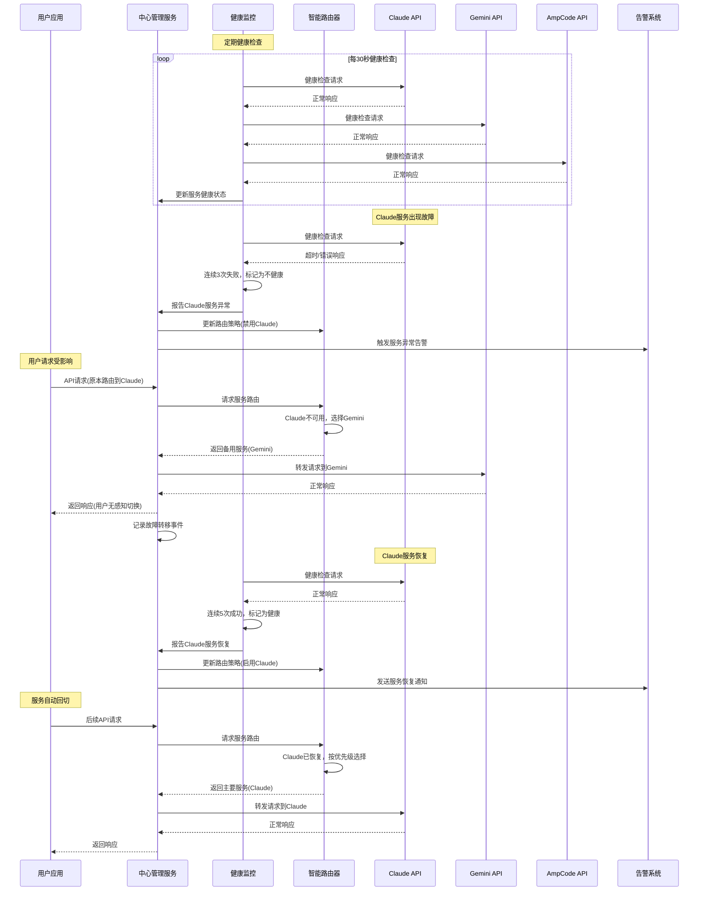

#### 4.3.4 边缘节点注册和AI服务同步时序图

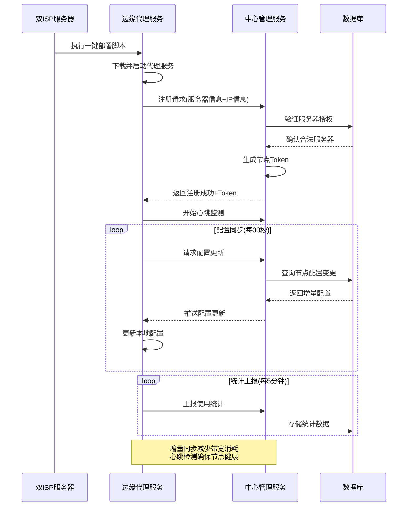

#### 4.3.4 模式切换时序图

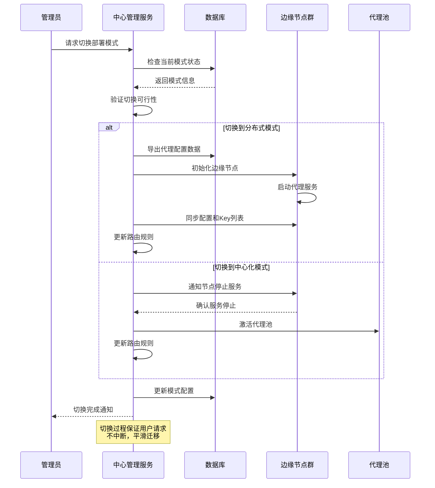

---

### 4.4 分布式统计查询和聚合机制

#### 4.4.1 分布式查询架构设计

**设计原则**：
- 按需查询：只在需要时才从边缘节点聚合数据
- 轻量中心：中心服务器作为查询代理，不存储统计数据
- 容错设计：部分节点不可用时仍能提供服务
- 缓存优化：查询结果适当缓存，减少重复查询

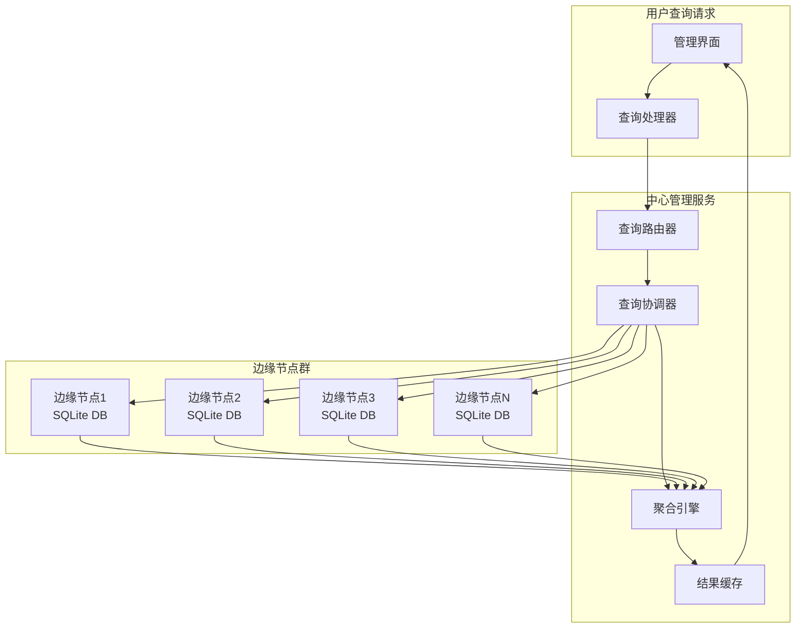

#### 4.4.2 分布式查询流程设计

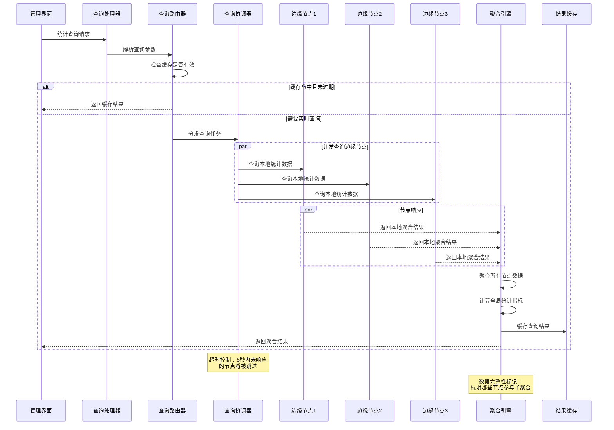

#### 4.4.3 查询类型和优化策略

**1. 实时查询（适用于仪表板）**：
- 查询范围：最近24小时数据
- 缓存时间：5分钟
- 超时设置：3秒
- 降级策略：显示可用节点的数据

**2. 历史查询（适用于报表）**：
- 查询范围：任意时间段
- 缓存时间：30分钟
- 超时设置：10秒
- 降级策略：分批查询，异步聚合

**3. 基础指标查询（适用于监控）**：
- 查询频率：每分钟
- 缓存时间：1分钟
- 包含内容：节点状态、服务健康度
- 降级策略：使用上次缓存结果

#### 4.4.4 数据聚合算法

**统计指标聚合规则**：
```javascript
// 可加性指标（直接求和）
sum_metrics = {
  request_count: sum(all_nodes.request_count),
  success_count: sum(all_nodes.success_count),
  error_count: sum(all_nodes.error_count),
  input_tokens: sum(all_nodes.input_tokens),
  output_tokens: sum(all_nodes.output_tokens),
  estimated_cost: sum(all_nodes.estimated_cost)
}

// 平均值指标（加权平均）
avg_metrics = {
  avg_response_time: weighted_avg(all_nodes.response_time, all_nodes.request_count),
  success_rate: sum(success_count) / sum(request_count) * 100
}

// 最值指标
extremum_metrics = {
  max_response_time: max(all_nodes.max_response_time),
  min_response_time: min(all_nodes.min_response_time)
}
```

**分组聚合策略**：
- 按AI服务分组：Claude、Gemini、AmpCode分别聚合
- 按时间分组：小时、日、月级别聚合
- 按组分组：各拼车组独立聚合
- 按用户分组：用户级别使用统计

#### 4.4.5 故障容错和降级策略

**节点不可用处理**：
1. **超时处理**：设置合理的查询超时时间
2. **部分结果**：标明数据的完整性程度
3. **历史补偿**：使用节点的历史数据进行估算
4. **用户提示**：明确告知用户数据的局限性

**查询性能优化**：
1. **预聚合**：边缘节点定期生成小时/日级别的预聚合数据
2. **分页查询**：大量数据分批次查询和展示
3. **异步处理**：复杂查询异步处理，通过轮询获取结果
4. **智能缓存**：根据查询模式动态调整缓存策略

**数据一致性保证**：
- 最终一致性：接受短时间的数据不一致
- 时间戳同步：所有节点使用统一的时间基准
- 幂等查询：相同查询条件返回一致结果
- 版本控制：配置变更时标记数据版本

## 5. 技术架构

### 5.1 系统架构设计

#### 5.1.1 整体架构图
```
┌─────────────────────────────────────────────────────────────┐
│                        前端层 (Frontend)                    │
├─────────────────┬─────────────────┬─────────────────────────┤
│   管理员界面     │    用户界面      │       公共页面          │
│   (Admin UI)    │   (User UI)     │   (Public Pages)       │
└─────────────────┴─────────────────┴─────────────────────────┘
                                │
┌─────────────────────────────────────────────────────────────┐
│                       API 网关层                            │
├─────────────────┬─────────────────┬─────────────────────────┤
│   认证中间件     │    权限控制      │       限流控制          │
│   (Auth)        │  (Permission)   │    (Rate Limit)        │
└─────────────────┴─────────────────┴─────────────────────────┘
                                │
┌─────────────────────────────────────────────────────────────┐
│                      业务逻辑层                              │
├───────────┬───────────┬───────────┬───────────┬─────────────┤
│ 组管理服务 │ 用户服务  │ Key服务   │ 邮件服务  │  配额服务   │
│(GroupSvc) │(UserSvc)  │(KeySvc)   │(EmailSvc) │ (QuotaSvc)  │
└───────────┴───────────┴───────────┴───────────┴─────────────┘
                                │
┌─────────────────────────────────────────────────────────────┐
│                        数据访问层                            │
├─────────────────┬─────────────────┬─────────────────────────┤
│   Redis 缓存     │   数据模型      │      外部API集成         │
│   (Cache)       │   (Models)      │    (External APIs)     │
└─────────────────┴─────────────────┴─────────────────────────┘
```

#### 5.1.2 基于现有项目的扩展
**复用现有模块**:
- `claudeAccountService.js` - Claude账户管理
- `apiKeyService.js` - API Key管理核心逻辑
- `claudeRelayService.js` - API请求转发
- `middleware/auth.js` - 认证中间件框架
- `models/redis.js` - Redis数据访问

**新增核心模块**:
```javascript
src/services/
├── carpoolService.js      // 拼车组管理服务
├── userService.js         // 用户管理服务  
├── quotaService.js        // 配额管理服务
├── emailService.js        // 邮件通知服务
├── invitationService.js   // 邀请管理服务
├── packageService.js      // IP套餐产品管理服务
├── serverService.js       // 一体化服务器资源管理服务
└── subscriptionService.js // 套餐订购和生命周期管理服务
```

### 5.2 数据库设计

#### 5.2.1 新增数据表结构

**AI服务配置表 (ai_services)**
```sql
CREATE TABLE ai_services (
  id VARCHAR(36) PRIMARY KEY DEFAULT (UUID()),
  service_name VARCHAR(50) NOT NULL, -- 'claude', 'gemini', 'ampcode'
  display_name VARCHAR(100) NOT NULL, -- 显示名称
  description TEXT,
  -- 服务基本配置
  api_base_url VARCHAR(255) NOT NULL, -- API基础URL
  api_version VARCHAR(20), -- API版本
  authentication_type ENUM('api_key', 'oauth', 'bearer_token') DEFAULT 'api_key',
  -- 认证配置
  auth_config JSON, -- 认证相关配置（OAuth客户端ID等）
  -- 服务特性
  supports_streaming BOOLEAN DEFAULT TRUE, -- 是否支持流式响应
  supports_tools BOOLEAN DEFAULT FALSE, -- 是否支持工具调用
  supports_vision BOOLEAN DEFAULT FALSE, -- 是否支持图像理解
  max_context_length INT DEFAULT 4096, -- 最大上下文长度
  -- 模型配置
  available_models JSON, -- 可用模型列表及其配置
  default_model VARCHAR(100), -- 默认模型
  -- 请求配置
  default_headers JSON, -- 默认请求头
  timeout_seconds INT DEFAULT 30, -- 超时时间
  retry_config JSON, -- 重试配置
  -- 限流配置
  rate_limit_config JSON, -- 速率限制配置
  -- 状态管理
  status ENUM('active', 'inactive', 'maintenance') DEFAULT 'active',
  health_check_config JSON, -- 健康检查配置
  last_health_check TIMESTAMP NULL,
  created_at TIMESTAMP DEFAULT CURRENT_TIMESTAMP,
  updated_at TIMESTAMP DEFAULT CURRENT_TIMESTAMP ON UPDATE CURRENT_TIMESTAMP,
  UNIQUE KEY uk_service_name (service_name),
  INDEX idx_status (status)
);
```

**AI服务模型表 (ai_service_models)**
```sql
CREATE TABLE ai_service_models (
  id VARCHAR(36) PRIMARY KEY DEFAULT (UUID()),
  service_id VARCHAR(36) NOT NULL,
  model_name VARCHAR(100) NOT NULL, -- claude-3-5-sonnet-20241022
  display_name VARCHAR(150) NOT NULL, -- Claude 3.5 Sonnet
  description TEXT,
  -- 模型规格
  context_length INT DEFAULT 4096, -- 上下文长度
  max_output_tokens INT, -- 最大输出token数
  supports_streaming BOOLEAN DEFAULT TRUE,
  supports_tools BOOLEAN DEFAULT FALSE,
  supports_vision BOOLEAN DEFAULT FALSE,
  supports_files BOOLEAN DEFAULT FALSE,
  -- 定价信息
  input_price_per_1k DECIMAL(10,6), -- 输入价格/1K tokens
  output_price_per_1k DECIMAL(10,6), -- 输出价格/1K tokens
  -- 性能配置
  recommended_temperature DECIMAL(3,2) DEFAULT 0.7,
  max_temperature DECIMAL(3,2) DEFAULT 1.0,
  -- 状态管理
  status ENUM('active', 'deprecated', 'beta') DEFAULT 'active',
  released_at TIMESTAMP NULL,
  deprecated_at TIMESTAMP NULL,
  created_at TIMESTAMP DEFAULT CURRENT_TIMESTAMP,
  updated_at TIMESTAMP DEFAULT CURRENT_TIMESTAMP ON UPDATE CURRENT_TIMESTAMP,
  FOREIGN KEY (service_id) REFERENCES ai_services(id) ON DELETE CASCADE,
  UNIQUE KEY uk_service_model (service_id, model_name),
  INDEX idx_service (service_id),
  INDEX idx_status (status)
);
```

**拼车组AI服务配置表 (group_ai_services)**
```sql
CREATE TABLE group_ai_services (
  id VARCHAR(36) PRIMARY KEY DEFAULT (UUID()),
  group_id VARCHAR(36) NOT NULL,
  service_id VARCHAR(36) NOT NULL,
  -- 服务启用配置
  enabled BOOLEAN DEFAULT TRUE,
  priority INT DEFAULT 1, -- 服务优先级，数字越小优先级越高
  -- 认证配置
  auth_method ENUM('shared_account', 'individual_keys', 'proxy_auth') DEFAULT 'shared_account',
  shared_credentials JSON, -- 共享认证信息（加密存储）
  -- 使用限制
  quota_config JSON, -- 配额配置（每日/每月token限制等）
  model_whitelist JSON, -- 允许使用的模型列表，NULL表示全部允许
  model_blacklist JSON, -- 禁止使用的模型列表
  -- 代理配置
  proxy_enabled BOOLEAN DEFAULT FALSE,
  proxy_config JSON, -- 代理服务器配置
  -- 负载均衡配置
  weight INT DEFAULT 100, -- 负载均衡权重
  fallback_enabled BOOLEAN DEFAULT TRUE, -- 是否允许作为备用服务
  -- 监控配置
  monitoring_enabled BOOLEAN DEFAULT TRUE,
  alert_config JSON, -- 告警配置
  -- 状态管理
  status ENUM('active', 'disabled', 'error') DEFAULT 'active',
  last_used_at TIMESTAMP NULL,
  error_count INT DEFAULT 0,
  created_at TIMESTAMP DEFAULT CURRENT_TIMESTAMP,
  updated_at TIMESTAMP DEFAULT CURRENT_TIMESTAMP ON UPDATE CURRENT_TIMESTAMP,
  FOREIGN KEY (group_id) REFERENCES carpool_groups(id) ON DELETE CASCADE,
  FOREIGN KEY (service_id) REFERENCES ai_services(id) ON DELETE CASCADE,
  UNIQUE KEY uk_group_service (group_id, service_id),
  INDEX idx_group (group_id),
  INDEX idx_service (service_id),
  INDEX idx_priority (priority),
  INDEX idx_status (status)
);
```


**用户表 (users)**
```sql
CREATE TABLE users (
  id VARCHAR(36) PRIMARY KEY DEFAULT (UUID()),
  email VARCHAR(255) UNIQUE NOT NULL,
  name VARCHAR(100) NOT NULL,
  password_hash VARCHAR(255) NOT NULL,
  role ENUM('super_admin', 'group_manager', 'group_member') DEFAULT 'group_member',
  status ENUM('pending', 'active', 'suspended', 'deleted') DEFAULT 'pending',
  email_verified BOOLEAN DEFAULT FALSE,
  email_verify_token VARCHAR(255),
  last_login_at TIMESTAMP NULL,
  created_at TIMESTAMP DEFAULT CURRENT_TIMESTAMP,
  updated_at TIMESTAMP DEFAULT CURRENT_TIMESTAMP ON UPDATE CURRENT_TIMESTAMP,
  INDEX idx_email (email),
  INDEX idx_status (status)
);
```

**拼车组表 (carpool_groups)**
```sql
CREATE TABLE carpool_groups (
  id VARCHAR(36) PRIMARY KEY DEFAULT (UUID()),
  name VARCHAR(100) NOT NULL,
  description TEXT,
  manager_id VARCHAR(36) NOT NULL,
  max_members INT DEFAULT 10,
  status ENUM('draft', 'active', 'suspended', 'closed') DEFAULT 'draft',
  -- AI服务配置
  enabled_services JSON, -- 启用的AI服务列表 ['claude', 'gemini', 'ampcode']
  primary_service VARCHAR(50) DEFAULT 'claude', -- 主要服务
  service_failover_enabled BOOLEAN DEFAULT TRUE, -- 是否启用服务故障转移
  -- 通用配额配置
  global_quota_config JSON, -- 全局配额配置（跨所有AI服务）
  -- 代理和网络配置
  proxy_config JSON, -- 代理配置信息
  deployment_mode ENUM('centralized', 'distributed', 'hybrid') DEFAULT 'centralized',
  -- 访问控制
  model_access_control JSON, -- 模型访问控制规则（按服务分组）
  feature_restrictions JSON, -- 功能限制（工具调用、视觉理解等）
  -- 成本管理
  cost_limit_daily DECIMAL(10,2), -- 每日成本限制
  cost_limit_monthly DECIMAL(10,2), -- 每月成本限制
  cost_alert_threshold DECIMAL(5,2) DEFAULT 0.8, -- 成本告警阈值(80%)
  created_at TIMESTAMP DEFAULT CURRENT_TIMESTAMP,
  updated_at TIMESTAMP DEFAULT CURRENT_TIMESTAMP ON UPDATE CURRENT_TIMESTAMP,
  FOREIGN KEY (manager_id) REFERENCES users(id),
  INDEX idx_manager (manager_id),
  INDEX idx_status (status),
  INDEX idx_primary_service (primary_service)
);
```

**用户组关联表 (group_memberships)**
```sql
CREATE TABLE group_memberships (
  id VARCHAR(36) PRIMARY KEY DEFAULT (UUID()),
  user_id VARCHAR(36) NOT NULL,
  group_id VARCHAR(36) NOT NULL,
  role ENUM('manager', 'member') DEFAULT 'member',
  status ENUM('invited', 'active', 'suspended') DEFAULT 'invited',
  joined_at TIMESTAMP NULL,
  created_at TIMESTAMP DEFAULT CURRENT_TIMESTAMP,
  FOREIGN KEY (user_id) REFERENCES users(id) ON DELETE CASCADE,
  FOREIGN KEY (group_id) REFERENCES carpool_groups(id) ON DELETE CASCADE,
  UNIQUE KEY uk_user_group (user_id, group_id),
  INDEX idx_user (user_id),
  INDEX idx_group (group_id)
);
```

**邀请记录表 (invitations)**
```sql
CREATE TABLE invitations (
  id VARCHAR(36) PRIMARY KEY DEFAULT (UUID()),
  group_id VARCHAR(36) NOT NULL,
  email VARCHAR(255) NOT NULL,
  invite_token VARCHAR(255) UNIQUE NOT NULL,
  invited_by VARCHAR(36) NOT NULL,
  status ENUM('sent', 'registered', 'expired', 'cancelled') DEFAULT 'sent',
  expires_at TIMESTAMP NOT NULL,
  used_at TIMESTAMP NULL,
  created_at TIMESTAMP DEFAULT CURRENT_TIMESTAMP,
  FOREIGN KEY (group_id) REFERENCES carpool_groups(id) ON DELETE CASCADE,
  FOREIGN KEY (invited_by) REFERENCES users(id),
  INDEX idx_token (invite_token),
  INDEX idx_email (email),
  INDEX idx_group (group_id),
  INDEX idx_expires (expires_at)
);
```

**API Key 扩展表 (user_api_keys)**
```sql
CREATE TABLE user_api_keys (
  id VARCHAR(36) PRIMARY KEY DEFAULT (UUID()),
  user_id VARCHAR(36) NOT NULL,
  group_id VARCHAR(36) NOT NULL,
  api_key_id VARCHAR(36) NOT NULL, -- 关联到现有 api_keys 表
  name VARCHAR(100) NOT NULL,
  description TEXT,
  status ENUM('active', 'disabled', 'deleted') DEFAULT 'active',
  created_at TIMESTAMP DEFAULT CURRENT_TIMESTAMP,
  updated_at TIMESTAMP DEFAULT CURRENT_TIMESTAMP ON UPDATE CURRENT_TIMESTAMP,
  FOREIGN KEY (user_id) REFERENCES users(id) ON DELETE CASCADE,
  FOREIGN KEY (group_id) REFERENCES carpool_groups(id) ON DELETE CASCADE,
  INDEX idx_user (user_id),
  INDEX idx_group (group_id),
  INDEX idx_api_key (api_key_id)
);
```

**IP 套餐产品表 (ip_packages)**
```sql
CREATE TABLE ip_packages (
  id VARCHAR(36) PRIMARY KEY DEFAULT (UUID()),
  name VARCHAR(100) NOT NULL,
  description TEXT,
  package_type ENUM('lightweight', 'standard', 'premium') DEFAULT 'lightweight',
  specs JSON, -- 套餐规格信息 (CPU、内存、带宽、流量等)
  pricing JSON, -- 价格信息 (月付、年付等)
  status ENUM('active', 'inactive', 'discontinued') DEFAULT 'active',
  stock_total INT DEFAULT 0,
  stock_available INT DEFAULT 0,
  created_at TIMESTAMP DEFAULT CURRENT_TIMESTAMP,
  updated_at TIMESTAMP DEFAULT CURRENT_TIMESTAMP ON UPDATE CURRENT_TIMESTAMP,
  INDEX idx_type (package_type),
  INDEX idx_status (status)
);
```

**一体化服务器表 (integrated_servers)**
```sql
CREATE TABLE integrated_servers (
  id VARCHAR(36) PRIMARY KEY DEFAULT (UUID()),
  package_id VARCHAR(36),
  server_name VARCHAR(100) NOT NULL,
  server_ip VARCHAR(45) NOT NULL,
  -- 服务器基本配置
  specs JSON, -- CPU、内存、存储、带宽规格
  provider VARCHAR(50), -- 云服务商
  region VARCHAR(100), -- 地区
  country_code VARCHAR(2), -- 国家代码
  -- SSH 访问配置
  ssh_port INT DEFAULT 22,
  ssh_username VARCHAR(50),
  ssh_password VARCHAR(255),
  -- 双ISP住宅IP配置
  residential_ip_primary VARCHAR(45), -- 主ISP住宅IP
  residential_ip_secondary VARCHAR(45), -- 备用ISP住宅IP
  isp_provider_primary VARCHAR(100), -- 主ISP提供商
  isp_provider_secondary VARCHAR(100), -- 备用ISP提供商
  -- 代理服务配置
  socks5_port INT DEFAULT 1080,
  http_port INT DEFAULT 8080,
  proxy_username VARCHAR(100),
  proxy_password VARCHAR(255),
  -- 服务器状态管理
  status ENUM('available', 'allocated', 'maintenance', 'offline') DEFAULT 'available',
  allocated_to VARCHAR(36), -- group_id
  allocated_at TIMESTAMP NULL,
  health_status JSON, -- 健康状态和性能指标
  created_at TIMESTAMP DEFAULT CURRENT_TIMESTAMP,
  updated_at TIMESTAMP DEFAULT CURRENT_TIMESTAMP ON UPDATE CURRENT_TIMESTAMP,
  FOREIGN KEY (package_id) REFERENCES ip_packages(id),
  UNIQUE KEY uk_server_ip (server_ip),
  UNIQUE KEY uk_residential_primary (residential_ip_primary),
  INDEX idx_package (package_id),
  INDEX idx_status (status),
  INDEX idx_allocated (allocated_to),
  INDEX idx_country (country_code)
);
```

**中心化代理资源表 (proxy_resources)**
```sql
CREATE TABLE proxy_resources (
  id VARCHAR(36) PRIMARY KEY DEFAULT (UUID()),
  name VARCHAR(100) NOT NULL,
  description TEXT,
  -- 代理基本配置
  proxy_type ENUM('socks5', 'http', 'https') DEFAULT 'socks5',
  host VARCHAR(255) NOT NULL,
  port INT NOT NULL,
  username VARCHAR(100),
  password VARCHAR(255),
  -- 供应商信息
  provider VARCHAR(100), -- 代理供应商
  provider_plan VARCHAR(100), -- 套餐类型
  -- 地理位置信息
  country VARCHAR(100),
  country_code VARCHAR(2),
  city VARCHAR(100),
  region VARCHAR(100),
  -- 性能和状态
  max_concurrent INT DEFAULT 100, -- 最大并发连接数
  latency_ms INT, -- 延迟(毫秒)
  success_rate DECIMAL(5,2), -- 成功率(%)
  anonymity_level ENUM('transparent', 'anonymous', 'elite') DEFAULT 'anonymous',
  -- 管理状态
  status ENUM('active', 'inactive', 'maintenance', 'error') DEFAULT 'active',
  health_check JSON, -- 健康检查结果
  usage_stats JSON, -- 使用统计数据
  cost_per_month DECIMAL(10,2), -- 月费用
  created_at TIMESTAMP DEFAULT CURRENT_TIMESTAMP,
  updated_at TIMESTAMP DEFAULT CURRENT_TIMESTAMP ON UPDATE CURRENT_TIMESTAMP,
  last_check_at TIMESTAMP DEFAULT CURRENT_TIMESTAMP,
  INDEX idx_type (proxy_type),
  INDEX idx_status (status),
  INDEX idx_country (country_code),
  INDEX idx_provider (provider),
  UNIQUE KEY uk_host_port (host, port)
);
```

**拼车组部署模式表 (group_deployment_modes)**
```sql
CREATE TABLE group_deployment_modes (
  id VARCHAR(36) PRIMARY KEY DEFAULT (UUID()),
  group_id VARCHAR(36) NOT NULL,
  deployment_mode ENUM('centralized', 'distributed') DEFAULT 'centralized',
  -- 中心化代理配置
  proxy_strategy ENUM('fixed', 'round_robin', 'random', 'geo_optimal') DEFAULT 'geo_optimal',
  proxy_pool_ids JSON, -- 关联的代理资源ID列表
  sticky_session BOOLEAN DEFAULT TRUE, -- 用户会话粘性
  -- 分布式边缘节点配置
  edge_node_ids JSON, -- 关联的边缘节点ID列表
  load_balance_algorithm ENUM('round_robin', 'weighted', 'least_conn') DEFAULT 'round_robin',
  -- 模式切换历史
  previous_mode ENUM('centralized', 'distributed'),
  switch_timestamp TIMESTAMP NULL,
  switch_reason TEXT,
  -- 配置版本
  config_version INT DEFAULT 1,
  config_hash VARCHAR(64), -- 配置内容哈希值
  created_at TIMESTAMP DEFAULT CURRENT_TIMESTAMP,
  updated_at TIMESTAMP DEFAULT CURRENT_TIMESTAMP ON UPDATE CURRENT_TIMESTAMP,
  FOREIGN KEY (group_id) REFERENCES carpool_groups(id) ON DELETE CASCADE,
  INDEX idx_group (group_id),
  INDEX idx_mode (deployment_mode),
  INDEX idx_switch_time (switch_timestamp)
);
```

**边缘节点管理表 (edge_nodes)**
```sql
CREATE TABLE edge_nodes (
  id VARCHAR(36) PRIMARY KEY DEFAULT (UUID()),
  node_name VARCHAR(100) NOT NULL,
  node_token VARCHAR(255) UNIQUE NOT NULL, -- 节点认证token
  -- 节点基本信息
  server_ip VARCHAR(45) NOT NULL,
  region VARCHAR(100), -- 地理区域
  country_code VARCHAR(2), -- 国家代码
  -- 服务配置
  supported_services JSON, -- 支持的AI服务列表 ['claude', 'gemini', 'ampcode']
  service_endpoints JSON, -- 各服务的本地端点配置
  -- 状态管理
  status ENUM('registering', 'active', 'inactive', 'maintenance', 'error') DEFAULT 'registering',
  last_heartbeat TIMESTAMP NULL, -- 最后心跳时间
  heartbeat_interval INT DEFAULT 60, -- 心跳间隔(秒)
  -- 节点能力
  max_concurrent_requests INT DEFAULT 100,
  max_groups INT DEFAULT 10, -- 最大支持组数
  -- 配置版本控制
  config_version INT DEFAULT 1,
  config_last_sync TIMESTAMP NULL,
  -- 注册信息
  registered_by VARCHAR(36), -- 注册者用户ID
  registration_key VARCHAR(255), -- 注册密钥
  created_at TIMESTAMP DEFAULT CURRENT_TIMESTAMP,
  updated_at TIMESTAMP DEFAULT CURRENT_TIMESTAMP ON UPDATE CURRENT_TIMESTAMP,
  FOREIGN KEY (registered_by) REFERENCES users(id),
  INDEX idx_status (status),
  INDEX idx_region (region),
  INDEX idx_last_heartbeat (last_heartbeat),
  INDEX idx_token (node_token)
);
```

**边缘节点组关联表 (edge_node_groups)**
```sql
CREATE TABLE edge_node_groups (
  id VARCHAR(36) PRIMARY KEY DEFAULT (UUID()),
  node_id VARCHAR(36) NOT NULL,
  group_id VARCHAR(36) NOT NULL,
  -- 分配状态
  status ENUM('assigned', 'active', 'suspended') DEFAULT 'assigned',
  assigned_at TIMESTAMP DEFAULT CURRENT_TIMESTAMP,
  -- 本地配置缓存状态
  config_synced BOOLEAN DEFAULT FALSE,
  last_config_sync TIMESTAMP NULL,
  -- 使用配额（本地管理）
  local_quota_enabled BOOLEAN DEFAULT TRUE,
  quota_reset_time TIMESTAMP NULL,
  created_at TIMESTAMP DEFAULT CURRENT_TIMESTAMP,
  updated_at TIMESTAMP DEFAULT CURRENT_TIMESTAMP ON UPDATE CURRENT_TIMESTAMP,
  FOREIGN KEY (node_id) REFERENCES edge_nodes(id) ON DELETE CASCADE,
  FOREIGN KEY (group_id) REFERENCES carpool_groups(id) ON DELETE CASCADE,
  UNIQUE KEY uk_node_group (node_id, group_id),
  INDEX idx_node (node_id),
  INDEX idx_group (group_id),
  INDEX idx_status (status)
);
```

**套餐订购记录表 (package_subscriptions)**
```sql
CREATE TABLE package_subscriptions (
  id VARCHAR(36) PRIMARY KEY DEFAULT (UUID()),
  group_id VARCHAR(36) NOT NULL,
  package_id VARCHAR(36) NOT NULL,
  subscription_type ENUM('monthly', 'quarterly', 'yearly') DEFAULT 'monthly',
  start_date DATE NOT NULL,
  end_date DATE NOT NULL,
  status ENUM('active', 'expired', 'cancelled', 'suspended') DEFAULT 'active',
  auto_renewal BOOLEAN DEFAULT FALSE,
  price_paid DECIMAL(10,2),
  allocated_resources JSON, -- 分配的资源信息
  usage_stats JSON, -- 使用统计
  created_at TIMESTAMP DEFAULT CURRENT_TIMESTAMP,
  updated_at TIMESTAMP DEFAULT CURRENT_TIMESTAMP ON UPDATE CURRENT_TIMESTAMP,
  FOREIGN KEY (group_id) REFERENCES carpool_groups(id) ON DELETE CASCADE,
  FOREIGN KEY (package_id) REFERENCES ip_packages(id),
  INDEX idx_group (group_id),
  INDEX idx_package (package_id),
  INDEX idx_status (status),
  INDEX idx_end_date (end_date)
);
```

#### 5.2.2 边缘节点本地数据库设计（SQLite）

**设计原则**：
- 轻量化：使用SQLite实现边缘节点本地数据存储
- 自主性：边缘节点可独立存储和查询统计数据
- 减压：减少中心服务器的数据处理和存储压力
- 简化：只存储必要的统计和监控数据

**边缘节点本地统计表 (edge_usage_stats)**
```sql
CREATE TABLE edge_usage_stats (
  id INTEGER PRIMARY KEY AUTOINCREMENT,
  group_id VARCHAR(36) NOT NULL,
  service_name VARCHAR(50) NOT NULL, -- 'claude', 'gemini', 'ampcode'
  user_api_key_hash VARCHAR(64), -- API Key哈希值
  model_name VARCHAR(100),
  -- 统计时间维度
  stats_date DATE NOT NULL,
  stats_hour INTEGER, -- 小时统计(0-23)，NULL表示日统计
  -- 使用指标
  request_count INTEGER DEFAULT 0,
  success_count INTEGER DEFAULT 0,
  error_count INTEGER DEFAULT 0,
  input_tokens BIGINT DEFAULT 0,
  output_tokens BIGINT DEFAULT 0,
  total_tokens BIGINT DEFAULT 0,
  -- 性能指标
  total_response_time_ms BIGINT DEFAULT 0,
  max_response_time_ms INTEGER DEFAULT 0,
  -- 错误分类
  timeout_errors INTEGER DEFAULT 0,
  rate_limit_errors INTEGER DEFAULT 0,
  auth_errors INTEGER DEFAULT 0,
  other_errors INTEGER DEFAULT 0,
  -- 成本估算
  estimated_cost DECIMAL(10,6) DEFAULT 0.0,
  -- 时间戳
  created_at TIMESTAMP DEFAULT CURRENT_TIMESTAMP,
  updated_at TIMESTAMP DEFAULT CURRENT_TIMESTAMP
);

CREATE INDEX idx_stats_date ON edge_usage_stats(stats_date);
CREATE INDEX idx_group_date ON edge_usage_stats(group_id, stats_date);
CREATE INDEX idx_service_date ON edge_usage_stats(service_name, stats_date);
CREATE UNIQUE INDEX idx_stats_dimension ON edge_usage_stats(group_id, service_name, stats_date, stats_hour, user_api_key_hash, model_name);
```

**边缘节点服务健康监控表 (edge_service_health)**
```sql
CREATE TABLE edge_service_health (
  id INTEGER PRIMARY KEY AUTOINCREMENT,
  service_name VARCHAR(50) NOT NULL,
  -- 健康检查时间
  check_time TIMESTAMP DEFAULT CURRENT_TIMESTAMP,
  -- 状态信息
  status VARCHAR(20) NOT NULL, -- 'healthy', 'degraded', 'unhealthy'
  response_time_ms INTEGER,
  error_message TEXT,
  -- 连续状态计数
  consecutive_successes INTEGER DEFAULT 0,
  consecutive_failures INTEGER DEFAULT 0,
  -- 性能指标
  avg_response_time_ms INTEGER,
  success_rate DECIMAL(5,2)
);

CREATE INDEX idx_service_check_time ON edge_service_health(service_name, check_time);
```

**边缘节点配置缓存表 (edge_config_cache)**
```sql
CREATE TABLE edge_config_cache (
  id INTEGER PRIMARY KEY AUTOINCREMENT,
  config_type VARCHAR(50) NOT NULL, -- 'group_config', 'ai_service_config', 'api_keys'
  config_key VARCHAR(255) NOT NULL,
  config_data JSON NOT NULL,
  config_version INTEGER DEFAULT 1,
  expires_at TIMESTAMP NULL,
  created_at TIMESTAMP DEFAULT CURRENT_TIMESTAMP,
  updated_at TIMESTAMP DEFAULT CURRENT_TIMESTAMP
);

CREATE UNIQUE INDEX idx_config_key ON edge_config_cache(config_type, config_key);
CREATE INDEX idx_expires ON edge_config_cache(expires_at);
```

**边缘节点日志表 (edge_logs)**
```sql
CREATE TABLE edge_logs (
  id INTEGER PRIMARY KEY AUTOINCREMENT,
  log_level VARCHAR(10) NOT NULL, -- 'ERROR', 'WARN', 'INFO', 'DEBUG'
  log_category VARCHAR(50), -- 'request', 'health', 'config', 'system'
  message TEXT NOT NULL,
  context JSON, -- 额外的上下文信息
  timestamp TIMESTAMP DEFAULT CURRENT_TIMESTAMP
);

CREATE INDEX idx_log_level_time ON edge_logs(log_level, timestamp);
CREATE INDEX idx_category_time ON edge_logs(log_category, timestamp);

-- 日志表定期清理，只保留最近30天的日志
-- DELETE FROM edge_logs WHERE timestamp < datetime('now', '-30 days');
```

**数据管理策略**：

1. **数据保留策略**：
   - 统计数据：保留3个月
   - 健康监控：保留1个月
   - 配置缓存：根据过期时间自动清理
   - 日志数据：保留30天

2. **数据压缩和归档**：
   - 小时级数据保留7天，之后聚合为日级数据
   - 日级数据保留3个月
   - 定期压缩和清理过期数据

3. **数据同步机制**：
   - 配置数据从中心服务器同步到本地缓存
   - 统计数据只在查询时按需上报到中心服务器
   - 关键告警实时上报

4. **查询优化**：
   - 合适的索引设计
   - 分区查询（按日期）
   - 聚合查询预计算

#### 5.2.3 Redis 缓存设计（轻量化优化）

**设计原则**：
- **最小化缓存**: 移除所有统计数据缓存，统计由边缘节点本地存储
- **配置驱动**: 主要缓存配置和路由信息，减少实时计算
- **心跳优化**: 缓存边缘节点心跳状态，支持快速故障检测
- **会话管理**: 保留必要的用户会话和认证缓存

**缓存键名规范**:
```javascript
// 用户和认证相关（核心功能）
user:{userId}                    // 用户基本信息
user_groups:{userId}            // 用户所属组列表（配置数据）
user_session:{sessionToken}     // 用户会话信息
email_verify:{token}           // 邮箱验证 token

// 组配置相关（配置数据）
group:{groupId}                 // 组基本信息和配置
group_members:{groupId}         // 组成员列表
group_ai_services:{groupId}     // 组启用的AI服务配置

// AI服务配置（配置数据）
ai_service:{serviceId}          // AI服务配置信息
ai_service_models:{serviceId}   // AI服务模型列表
service_auth:{groupId}:{serviceId}  // 组的AI服务认证信息

// 路由和负载均衡（配置数据）
service_routing:{groupId}       // AI服务路由配置
load_balance_weights:{groupId}  // 负载均衡权重配置
failover_chain:{groupId}        // 故障转移链配置

// 边缘节点管理（心跳数据）
edge_node:{nodeId}              // 边缘节点基本信息
edge_node_heartbeat:{nodeId}    // 节点心跳状态（TTL: 120秒）
edge_nodes_online:list          // 在线节点列表（实时更新）
node_health_summary:global      // 全局节点健康度概览（TTL: 60秒）

// 邀请管理（临时数据）
invitation:{token}              // 邀请信息（TTL: 7天）
invitation_email:{email}        // 邮箱邀请记录（TTL: 24小时）

// 轻量化统计缓存（仅关键指标）
global_node_count:online        // 在线节点总数（TTL: 60秒）
global_service_status:summary   // AI服务整体状态概览（TTL: 300秒）

// 已移除的缓存类型（转移到边缘节点本地存储）：
// ❌ daily_stats, hourly_stats, cost_stats - 统计数据
// ❌ user_quota, group_quota - 配额使用情况
// ❌ service_quota - AI服务配额统计  
// ❌ proxy_usage_stats - 代理使用统计
// ❌ ai_service_health - 服务健康状态（改为心跳机制）
// ❌ package和server相关 - IP套餐管理（简化部署）
// ❌ proxy_pool相关 - 代理资源管理（简化部署）
```

**缓存策略优化**：
- **短TTL策略**: 心跳相关数据TTL不超过2分钟
- **配置缓存**: 用户和组配置数据长期缓存，变更时主动清理
- **分层缓存**: 
  - L1: 高频访问的用户会话和配置（内存优先）
  - L2: 边缘节点状态和心跳（快速过期）
  - L3: 临时数据如邀请（自动过期）
- **缓存预热**: 启动时预加载关键配置数据，避免冷启动

### 5.3 API 设计

#### 5.3.1 认证相关 API

**用户注册**
```http
POST /api/v1/auth/register
Content-Type: application/json

{
  "invite_token": "string",
  "name": "string", 
  "email": "string",
  "password": "string"
}

Response:
{
  "success": true,
  "data": {
    "user_id": "string",
    "email": "string",
    "verification_sent": true
  }
}
```

**用户登录**
```http
POST /api/v1/auth/login
Content-Type: application/json

{
  "email": "string",
  "password": "string"
}

Response:
{
  "success": true,
  "data": {
    "token": "string",
    "user": {
      "id": "string",
      "name": "string", 
      "email": "string",
      "role": "string"
    }
  }
}
```

**邮箱验证**
```http
POST /api/v1/auth/verify-email
Content-Type: application/json

{
  "token": "string"
}

Response:
{
  "success": true,
  "message": "Email verified successfully"
}
```

#### 5.3.2 AI服务管理 API

**获取支持的AI服务列表**
```http
GET /api/v1/ai-services
Authorization: Bearer {token}

Response:
{
  "success": true,
  "data": [
    {
      "id": "string",
      "service_name": "claude",
      "display_name": "Claude Code",
      "description": "Anthropic Claude AI助手",
      "status": "active",
      "supports_streaming": true,
      "supports_tools": true,
      "supports_vision": true,
      "available_models": [
        {
          "model_name": "claude-3-5-sonnet-20241022",
          "display_name": "Claude 3.5 Sonnet",
          "context_length": 200000,
          "supports_tools": true,
          "input_price_per_1k": 0.003,
          "output_price_per_1k": 0.015
        }
      ]
    },
    {
      "id": "string", 
      "service_name": "gemini",
      "display_name": "Gemini CLI",
      "description": "Google Gemini AI助手",
      "status": "active",
      "supports_streaming": true,
      "supports_tools": false,
      "supports_vision": true,
      "available_models": [
        {
          "model_name": "gemini-1.5-pro",
          "display_name": "Gemini 1.5 Pro",
          "context_length": 1000000,
          "supports_tools": false,
          "input_price_per_1k": 0.00125,
          "output_price_per_1k": 0.005
        }
      ]
    }
  ]
}
```

**获取组的AI服务配置**
```http
GET /api/v1/carpool/groups/{groupId}/ai-services
Authorization: Bearer {token}

Response:
{
  "success": true,
  "data": {
    "primary_service": "claude",
    "enabled_services": ["claude", "gemini"],
    "service_failover_enabled": true,
    "services": [
      {
        "service_id": "string",
        "service_name": "claude", 
        "enabled": true,
        "priority": 1,
        "auth_method": "shared_account",
        "quota_config": {
          "daily_token_limit": 100000,
          "monthly_token_limit": 3000000,
          "cost_limit_daily": 50.0
        },
        "model_whitelist": ["claude-3-5-sonnet-20241022"],
        "proxy_enabled": true,
        "weight": 80,
        "status": "active",
        "last_used_at": "2025-07-22T10:30:00Z"
      }
    ]
  }
}
```

**更新组的AI服务配置**
```http
PUT /api/v1/carpool/groups/{groupId}/ai-services
Authorization: Bearer {token}
Content-Type: application/json

{
  "primary_service": "claude",
  "enabled_services": ["claude", "gemini", "ampcode"],
  "service_failover_enabled": true,
  "services": [
    {
      "service_name": "claude",
      "enabled": true,
      "priority": 1,
      "auth_method": "shared_account",
      "shared_credentials": {
        "encrypted_data": "string"
      },
      "quota_config": {
        "daily_token_limit": 100000,
        "monthly_token_limit": 3000000,
        "cost_limit_daily": 50.0
      },
      "model_whitelist": ["claude-3-5-sonnet-20241022"],
      "proxy_enabled": true,
      "weight": 80
    },
    {
      "service_name": "gemini",
      "enabled": true,
      "priority": 2,
      "auth_method": "individual_keys",
      "quota_config": {
        "daily_token_limit": 50000,
        "monthly_token_limit": 1500000,
        "cost_limit_daily": 25.0
      },
      "weight": 20
    }
  ]
}

Response:
{
  "success": true,
  "message": "AI服务配置更新成功"
}
```

**测试AI服务连接**
```http
POST /api/v1/carpool/groups/{groupId}/ai-services/{serviceId}/test
Authorization: Bearer {token}
Content-Type: application/json

{
  "test_message": "Hello, this is a test message"
}

Response:
{
  "success": true,
  "data": {
    "service_name": "claude",
    "status": "healthy",
    "response_time_ms": 850,
    "test_response": "Hello! I'm Claude, and I received your test message.",
    "model_used": "claude-3-5-sonnet-20241022",
    "tokens_used": {
      "input": 8,
      "output": 12,
      "total": 20
    }
  }
}
```

**获取AI服务使用统计（分布式查询）**
```http
GET /api/v1/carpool/groups/{groupId}/ai-services/stats
Authorization: Bearer {token}
Query Parameters:
- start_date: 2025-07-15 (可选)
- end_date: 2025-07-22 (可选)
- service_name: claude (可选)
- granularity: hour|day|month (默认day)
- force_refresh: true|false (可选，强制刷新缓存)
- timeout: 5 (可选，查询超时秒数，默认5秒)

Response:
{
  "success": true,
  "data": {
    "query_info": {
      "cached": false,
      "query_time_ms": 1250,
      "data_completeness": 0.95, // 数据完整性：95%的节点响应
      "nodes_queried": 4,
      "nodes_responded": 4,
      "nodes_timeout": 0,
      "cache_expires_at": "2025-07-22T10:35:00Z"
    },
    "summary": {
      "total_requests": 1250,
      "total_tokens": 2500000,
      "total_cost": 75.50,
      "success_rate": 99.2,
      "avg_response_time_ms": 892
    },
    "by_service": [
      {
        "service_name": "claude",
        "requests": 1000,
        "tokens": 2000000,
        "cost": 60.0,
        "success_rate": 99.5,
        "avg_response_time_ms": 850
      },
      {
        "service_name": "gemini", 
        "requests": 250,
        "tokens": 500000,
        "cost": 15.5,
        "success_rate": 98.0,
        "avg_response_time_ms": 1200
      }
    ],
    "time_series": [
      {
        "timestamp": "2025-07-22T00:00:00Z",
        "requests": 120,
        "tokens": 240000,
        "cost": 7.2,
        "by_service": {
          "claude": {"requests": 100, "tokens": 200000, "cost": 6.0},
          "gemini": {"requests": 20, "tokens": 40000, "cost": 1.2}
        }
      }
    ],
    "node_details": [
      {
        "node_id": "edge-node-1",
        "status": "responded",
        "response_time_ms": 180,
        "data_range": "2025-07-15 to 2025-07-22"
      },
      {
        "node_id": "edge-node-2", 
        "status": "timeout",
        "error": "Query timeout after 5 seconds"
      }
    ]
  },
  "warnings": [
    "节点 edge-node-2 查询超时，数据可能不完整",
    "建议在网络状况良好时重新查询以获取完整数据"
  ]
}
```

**获取实时基础指标（轻量查询）**
```http
GET /api/v1/carpool/groups/{groupId}/ai-services/basic-stats
Authorization: Bearer {token}

Response:
{
  "success": true,
  "data": {
    "query_info": {
      "cached": true,
      "cache_age_seconds": 45,
      "nodes_alive": 3,
      "nodes_total": 4
    },
    "real_time_metrics": {
      "active_requests": 15,
      "total_requests_today": 1250,
      "current_success_rate": 98.5,
      "avg_response_time_last_hour": 850
    },
    "service_health": [
      {
        "service_name": "claude",
        "status": "healthy",
        "requests_last_hour": 45,
        "avg_response_time_ms": 780
      },
      {
        "service_name": "gemini",
        "status": "healthy", 
        "requests_last_hour": 12,
        "avg_response_time_ms": 1100
      }
    ]
  }
}
```

**异步统计查询（大数据量）**
```http
POST /api/v1/carpool/groups/{groupId}/ai-services/stats/async
Authorization: Bearer {token}
Content-Type: application/json

{
  "start_date": "2025-06-01",
  "end_date": "2025-07-22", 
  "granularity": "day",
  "include_user_breakdown": true,
  "include_model_breakdown": true,
  "export_format": "csv" // 可选：csv, json
}

Response:
{
  "success": true,
  "data": {
    "query_id": "async_query_123456",
    "status": "processing",
    "estimated_completion": "2025-07-22T10:32:00Z",
    "progress": 0,
    "poll_url": "/api/v1/queries/async_query_123456/status"
  }
}
```

**查询异步任务状态**
```http
GET /api/v1/queries/{queryId}/status
Authorization: Bearer {token}

Response:
{
  "success": true,
  "data": {
    "query_id": "async_query_123456",
    "status": "completed", // processing, completed, failed, timeout
    "progress": 100,
    "started_at": "2025-07-22T10:30:00Z",
    "completed_at": "2025-07-22T10:31:30Z",
    "result_url": "/api/v1/queries/async_query_123456/result",
    "result_expires_at": "2025-07-23T10:31:30Z"
  }
}
```

**边缘节点心跳API**
```http
POST /api/v1/edge-nodes/heartbeat
Authorization: Bearer {nodeToken}
Content-Type: application/json

{
  "node_id": "edge-node-1",
  "status": "active",
  "supported_groups": ["group-1", "group-2"],
  "active_requests": 15,
  "total_requests_today": 1250,
  "services_health": {
    "claude": {"status": "healthy", "avg_response_time_ms": 850},
    "gemini": {"status": "healthy", "avg_response_time_ms": 1200}
  },
  "config_version": 5,
  "local_storage_usage": {
    "database_size_mb": 125.5,
    "disk_usage_percent": 45.2
  }
}

Response:
{
  "success": true,
  "data": {
    "heartbeat_received": true,
    "config_update_available": true,
    "next_heartbeat_seconds": 60,
    "actions": [
      {
        "action": "update_config",
        "config_type": "ai_service_config", 
        "config_version": 6,
        "config_data": {
          "claude": {"enabled": true, "priority": 1},
          "gemini": {"enabled": true, "priority": 2}
        }
      }
    ]
  }
}
```

**边缘节点注册API**
```http
POST /api/v1/edge-nodes/register
Authorization: Bearer {registrationToken}
Content-Type: application/json

{
  "node_name": "edge-node-singapore-1",
  "server_ip": "203.0.113.10",
  "region": "Singapore",
  "country_code": "SG",
  "supported_services": ["claude", "gemini", "ampcode"],
  "max_concurrent_requests": 100,
  "registration_key": "temp_registration_key_123"
}

Response:
{
  "success": true,
  "data": {
    "node_id": "edge-node-1",
    "node_token": "permanent_node_token_xyz",
    "heartbeat_interval": 60,
    "assigned_groups": [],
    "initial_config_version": 1
  }
}
```

**边缘节点管理API**
```http
GET /api/v1/admin/edge-nodes
Authorization: Bearer {adminToken}
Query Parameters:
- status: active|inactive|maintenance (可选)
- region: Singapore (可选)

Response:
{
  "success": true,
  "data": {
    "nodes": [
      {
        "node_id": "edge-node-1",
        "node_name": "edge-node-singapore-1",
        "status": "active",
        "last_heartbeat": "2025-07-22T10:30:00Z",
        "region": "Singapore",
        "assigned_groups": 2,
        "current_load": {
          "requests_per_minute": 45,
          "cpu_usage_percent": 25.5,
          "memory_usage_percent": 35.2
        },
        "health_score": 95.5
      }
    ],
    "summary": {
      "total_nodes": 4,
      "active_nodes": 3,
      "inactive_nodes": 1,
      "total_requests_per_minute": 180
    }
  }
}
```

**边缘节点统计查询API**
```http
GET /api/v1/edge-nodes/{nodeId}/stats
Authorization: Bearer {adminToken}
Query Parameters:
- start_date: 2025-07-15 (可选)
- end_date: 2025-07-22 (可选)
- granularity: hour|day (默认day)

Response:
{
  "success": true,
  "data": {
    "node_info": {
      "node_id": "edge-node-1",
      "node_name": "edge-node-singapore-1",
      "last_heartbeat": "2025-07-22T10:30:00Z"
    },
    "statistics": {
      "total_requests": 12500,
      "success_count": 12350,
      "error_count": 150,
      "avg_response_time_ms": 850,
      "by_service": [
        {
          "service_name": "claude",
          "requests": 10000,
          "success_rate": 99.2,
          "avg_response_time_ms": 800
        },
        {
          "service_name": "gemini",
          "requests": 2500,
          "success_rate": 98.5,
          "avg_response_time_ms": 1100
        }
      ]
    }
  }
}
```

**AI服务故障转移配置**
```http
PUT /api/v1/carpool/groups/{groupId}/ai-services/failover
Authorization: Bearer {token}
Content-Type: application/json

{
  "enabled": true,
  "failover_chain": ["claude", "gemini", "ampcode"],
  "trigger_conditions": {
    "error_rate_threshold": 0.1,
    "response_time_threshold_ms": 5000,
    "consecutive_failures": 3
  },
  "recovery_conditions": {
    "success_rate_threshold": 0.95,
    "consecutive_successes": 5,
    "check_interval_minutes": 5
  }
}

Response:
{
  "success": true,
  "message": "故障转移配置更新成功"
}
```

#### 5.3.3 拼车组管理 API

**创建拼车组**
```http
POST /api/v1/carpool/groups
Authorization: Bearer {token}
Content-Type: application/json

{
  "name": "string",
  "description": "string",
  "max_members": "number",
  "primary_service": "claude",
  "enabled_services": ["claude", "gemini"],
  "service_failover_enabled": true,
  "deployment_mode": "centralized",
  "global_quota_config": {
    "total_token_limit_daily": 100000,
    "total_token_limit_monthly": 3000000,
    "per_user_token_limit_daily": 10000,
    "max_keys_per_user": 3
  },
  "cost_limits": {
    "daily_limit": 50.0,
    "monthly_limit": 1500.0,
    "alert_threshold": 0.8
  },
  "ai_services": [
    {
      "service_name": "claude",
      "enabled": true,
      "priority": 1,
      "auth_method": "shared_account",
      "quota_config": {
        "daily_token_limit": 80000,
        "monthly_token_limit": 2400000
      },
      "model_whitelist": ["claude-3-5-sonnet-20241022"],
      "weight": 80
    },
    {
      "service_name": "gemini",
      "enabled": true,
      "priority": 2,
      "auth_method": "individual_keys",
      "quota_config": {
        "daily_token_limit": 20000,
        "monthly_token_limit": 600000
      },
      "weight": 20
    }
  ]
}

Response:
{
  "success": true,
  "data": {
    "group_id": "string",
    "name": "string",
    "status": "draft",
    "primary_service": "claude",
    "enabled_services": ["claude", "gemini"],
    "deployment_mode": "centralized"
  }
}
```

**获取组列表**
```http
GET /api/v1/carpool/groups
Authorization: Bearer {token}

Query Parameters:
- page: number (default: 1)
- limit: number (default: 20)
- status: string (optional)

Response:
{
  "success": true,
  "data": {
    "groups": [
      {
        "id": "string",
        "name": "string",
        "description": "string",
        "member_count": "number",
        "max_members": "number",
        "status": "string",
        "created_at": "string"
      }
    ],
    "pagination": {
      "page": "number",
      "limit": "number", 
      "total": "number"
    }
  }
}
```

**获取组详情**
```http
GET /api/v1/carpool/groups/{groupId}
Authorization: Bearer {token}

Response:
{
  "success": true,
  "data": {
    "id": "string",
    "name": "string",
    "description": "string",
    "manager": {
      "id": "string",
      "name": "string",
      "email": "string"
    },
    "members": [
      {
        "id": "string",
        "name": "string",
        "email": "string",
        "role": "string",
        "status": "string",
        "joined_at": "string"
      }
    ],
    "quota_usage": {
      "total_tokens_used": "number",
      "total_token_limit": "number",
      "active_keys": "number"
    },
    "claude_account": {
      "id": "string",
      "name": "string",
      "status": "string"
    }
  }
}
```

#### 5.3.3 邀请管理 API

**发送邀请**
```http
POST /api/v1/carpool/groups/{groupId}/invitations
Authorization: Bearer {token}
Content-Type: application/json

{
  "emails": ["string"],
  "message": "string" // 可选的自定义邀请消息
}

Response:
{
  "success": true,
  "data": {
    "invitations_sent": "number",
    "failed_emails": ["string"]
  }
}
```

**获取邀请列表**
```http
GET /api/v1/carpool/groups/{groupId}/invitations
Authorization: Bearer {token}

Query Parameters:
- status: string (optional)
- page: number (default: 1)
- limit: number (default: 20)

Response:
{
  "success": true,
  "data": {
    "invitations": [
      {
        "id": "string",
        "email": "string",
        "status": "string",
        "invited_by": "string",
        "created_at": "string",
        "expires_at": "string"
      }
    ]
  }
}
```

#### 5.3.4 用户 API Key 管理

**创建 API Key**
```http
POST /api/v1/user/api-keys
Authorization: Bearer {token}
Content-Type: application/json

{
  "name": "string",
  "description": "string",
  "token_limit": "number",
  "rate_limit_window": "number",
  "rate_limit_requests": "number",
  "enable_model_restriction": "boolean",
  "restricted_models": ["string"]
}

Response:
{
  "success": true,
  "data": {
    "id": "string",
    "name": "string",
    "api_key": "string", // 只在创建时返回
    "token_limit": "number",
    "created_at": "string"
  }
}
```

**获取用户 API Key 列表**
```http
GET /api/v1/user/api-keys
Authorization: Bearer {token}

Response:
{
  "success": true,
  "data": {
    "keys": [
      {
        "id": "string",
        "name": "string", 
        "description": "string",
        "status": "string",
        "token_limit": "number",
        "tokens_used": "number",
        "last_used_at": "string",
        "created_at": "string"
      }
    ]
  }
}
```

**获取 Key 使用统计**
```http
GET /api/v1/user/api-keys/{keyId}/usage
Authorization: Bearer {token}

Query Parameters:
- period: string (day|week|month, default: week)
- start_date: string (YYYY-MM-DD, optional)
- end_date: string (YYYY-MM-DD, optional)

Response:
{
  "success": true,
  "data": {
    "key_info": {
      "id": "string",
      "name": "string",
      "token_limit": "number"
    },
    "usage_stats": {
      "total_requests": "number",
      "total_tokens": "number", 
      "tokens_by_model": {
        "claude-3-5-sonnet": "number",
        "claude-3-5-haiku": "number"
      },
      "daily_breakdown": [
        {
          "date": "string",
          "requests": "number",
          "tokens": "number"
        }
      ]
    }
  }
}
```

#### 5.3.5 配额管理 API

**获取个人配额信息**
```http
GET /api/v1/user/quota
Authorization: Bearer {token}

Response:
{
  "success": true,
  "data": {
    "groups": [
      {
        "group_id": "string",
        "group_name": "string",
        "quota": {
          "token_limit": "number",
          "tokens_used": "number",
          "tokens_remaining": "number",
          "max_keys": "number",
          "keys_created": "number",
          "reset_date": "string"
        },
        "restrictions": {
          "allowed_models": ["string"],
          "rate_limits": {
            "requests_per_minute": "number",
            "tokens_per_hour": "number"
          }
        }
      }
    ]
  }
}
```

**更新组配额设置**
```http
PUT /api/v1/carpool/groups/{groupId}/quota
Authorization: Bearer {token}
Content-Type: application/json

{
  "total_token_limit": "number",
  "per_user_token_limit": "number", 
  "max_keys_per_user": "number",
  "allowed_models": ["string"],
  "rate_limits": {
    "requests_per_minute": "number",
    "tokens_per_hour": "number"
  }
}

Response:
{
  "success": true,
  "data": {
    "group_id": "string",
    "quota_updated": true,
    "effective_date": "string"
  }
}
```

#### 5.3.6 IP 套餐管理 API

**获取套餐列表**
```http
GET /api/v1/packages
Authorization: Bearer {token}

Query Parameters:
- type: string (residential|datacenter|mixed, optional)
- status: string (active|inactive, optional)
- page: number (default: 1)
- limit: number (default: 20)

Response:
{
  "success": true,
  "data": {
    "packages": [
      {
        "id": "string",
        "name": "1核1G10M 500GB 轻量",
        "description": "日本/菲律宾/英国/德国/美国/泰国等8个国家",
        "package_type": "mixed",
        "specs": {
          "cpu_cores": 1,
          "memory_gb": 1,
          "bandwidth_mbps": 10,
          "traffic_gb": 500,
          "disk_gb": 20,
          "countries": ["JP", "PH", "GB", "DE", "US", "TH"],
          "ip_type": "dual_isp_residential"
        },
        "pricing": {
          "monthly": 43,
          "original_price": 54,
          "currency": "CNY"
        },
        "stock_available": 10,
        "status": "active"
      }
    ],
    "pagination": {
      "page": 1,
      "limit": 20,
      "total": 5
    }
  }
}
```

**分配套餐资源**
```http
POST /api/v1/packages/{packageId}/allocate
Authorization: Bearer {token}
Content-Type: application/json

{
  "group_id": "string",
  "subscription_type": "monthly",
  "auto_renewal": false,
  "preferences": {
    "preferred_countries": ["JP", "US"],
    "ip_type_preference": "residential"
  }
}

Response:
{
  "success": true,
  "data": {
    "subscription_id": "string",
    "allocated_server": {
      "server_id": "srv-123456",
      "server_ip": "45.32.123.45",
      "server_name": "JP-Residential-001",
      "country": "JP",
      "region": "Tokyo",
      "specs": {
        "cpu_cores": 1,
        "memory_gb": 1,
        "disk_gb": 25,
        "bandwidth_mbps": 10,
        "traffic_limit_gb": 500
      },
      "residential_ips": {
        "primary": {
          "ip": "192.168.1.100",
          "isp": "NTT",
          "type": "residential"
        },
        "secondary": {
          "ip": "192.168.1.101", 
          "isp": "SoftBank",
          "type": "residential"
        }
      },
      "proxy_config": {
        "socks5_port": 1080,
        "http_port": 8080,
        "username": "proxy_user123",
        "password": "proxy_pass123"
      },
      "ssh_access": {
        "port": 22,
        "username": "root",
        "password": "server_pass123"
      }
    },
    "subscription_info": {
      "start_date": "2025-01-21",
      "end_date": "2025-02-21", 
      "status": "active",
      "auto_renewal": false
    }
  }
}
```

**获取资源使用统计**
```http
GET /api/v1/resources/{groupId}/usage
Authorization: Bearer {token}

Query Parameters:
- period: string (day|week|month, default: week)
- start_date: string (YYYY-MM-DD, optional)
- end_date: string (YYYY-MM-DD, optional)

Response:
{
  "success": true,
  "data": {
    "subscription_info": {
      "package_name": "1核1G10M 500GB 轻量",
      "start_date": "2025-01-21",
      "end_date": "2025-02-21",
      "days_remaining": 31
    },
    "bandwidth_usage": {
      "total_gb": 45.6,
      "limit_gb": 500,
      "usage_percentage": 9.1,
      "daily_breakdown": [
        {
          "date": "2025-01-21",
          "upload_gb": 0.8,
          "download_gb": 2.1
        }
      ]
    },
    "server_metrics": {
      "cpu_usage_avg": 25.3,
      "memory_usage_avg": 60.2,
      "disk_usage_gb": 8.5,
      "uptime_percentage": 99.9
    },
    "server_quality": {
      "server_info": {
        "server_id": "srv-123456",
        "country": "JP",
        "uptime_percentage": 99.9
      },
      "residential_ips": [
        {
          "ip": "192.168.1.100",
          "isp": "NTT",
          "type": "primary",
          "avg_latency_ms": 45,
          "success_rate": 98.5,
          "last_check": "2025-01-21T10:30:00Z"
        },
        {
          "ip": "192.168.1.101", 
          "isp": "SoftBank",
          "type": "secondary",
          "avg_latency_ms": 52,
          "success_rate": 97.8,
          "last_check": "2025-01-21T10:30:00Z"
        }
      ]
    }
  }
}
```

**续费套餐**
```http
POST /api/v1/subscriptions/{subscriptionId}/renew
Authorization: Bearer {token}
Content-Type: application/json

{
  "duration": "monthly",
  "auto_renewal": true
}

Response:
{
  "success": true,
  "data": {
    "subscription_id": "string",
    "new_end_date": "2025-03-21",
    "price_paid": 43.00,
    "auto_renewal": true,
    "status": "active"
  }
}
```

#### 5.3.7 中心化代理管理 API

**获取代理资源列表**
```http
GET /api/v1/proxy-resources
Authorization: Bearer {token}

Query Parameters:
- page: number (default: 1)
- limit: number (default: 20)
- status: string (active|inactive|maintenance|error)
- proxy_type: string (socks5|http|https)
- country: string (国家代码)
- provider: string (供应商名称)

Response:
{
  "success": true,
  "data": {
    "proxy_resources": [
      {
        "id": "proxy-123456",
        "name": "US-Socks5-001",
        "proxy_type": "socks5",
        "host": "proxy.example.com",
        "port": 1080,
        "provider": "ProxyProvider A",
        "country": "US",
        "city": "New York",
        "status": "active",
        "success_rate": 98.5,
        "latency_ms": 45,
        "max_concurrent": 100,
        "usage_stats": {
          "current_connections": 23,
          "total_requests_today": 1520
        },
        "cost_per_month": 29.99
      }
    ],
    "pagination": {
      "page": 1,
      "limit": 20,
      "total": 150,
      "total_pages": 8
    }
  }
}
```

**添加代理资源**
```http
POST /api/v1/proxy-resources
Authorization: Bearer {token}
Content-Type: application/json

{
  "name": "JP-Elite-Proxy-001",
  "proxy_type": "socks5",
  "host": "jp-proxy.example.com",
  "port": 1080,
  "username": "proxy_user",
  "password": "proxy_pass",
  "provider": "EliteProxy Co.",
  "country": "JP",
  "city": "Tokyo",
  "max_concurrent": 200,
  "anonymity_level": "elite",
  "cost_per_month": 49.99
}

Response:
{
  "success": true,
  "data": {
    "proxy_resource_id": "proxy-789012",
    "status": "active",
    "health_check_result": {
      "connectivity": "ok",
      "latency_ms": 32,
      "anonymity_test": "passed"
    }
  }
}
```

**更新代理资源**
```http
PUT /api/v1/proxy-resources/{proxyId}
Authorization: Bearer {token}
Content-Type: application/json

{
  "name": "JP-Elite-Proxy-001-Updated",
  "status": "maintenance",
  "max_concurrent": 150,
  "cost_per_month": 39.99
}

Response:
{
  "success": true,
  "data": {
    "proxy_resource_id": "proxy-789012",
    "updated_fields": ["name", "status", "max_concurrent", "cost_per_month"],
    "effective_immediately": true
  }
}
```

**代理健康检查**
```http
POST /api/v1/proxy-resources/{proxyId}/health-check
Authorization: Bearer {token}

Response:
{
  "success": true,
  "data": {
    "proxy_id": "proxy-789012",
    "check_timestamp": "2025-01-21T14:30:00Z",
    "results": {
      "connectivity": "ok",
      "latency_ms": 28,
      "success_rate": 99.2,
      "anonymity_level": "elite",
      "geolocation_check": "passed",
      "dns_leak_test": "passed"
    },
    "status": "healthy"
  }
}
```

#### 5.3.8 部署模式管理 API

**获取拼车组部署配置**
```http
GET /api/v1/groups/{groupId}/deployment-config
Authorization: Bearer {token}

Response:
{
  "success": true,
  "data": {
    "group_id": "group-123456",
    "deployment_mode": "centralized",
    "config": {
      "proxy_strategy": "geo_optimal",
      "proxy_pool_ids": ["proxy-001", "proxy-002", "proxy-003"],
      "sticky_session": true,
      "fallback_enabled": true
    },
    "performance_stats": {
      "avg_latency_ms": 35,
      "success_rate": 98.7,
      "current_load": 45
    },
    "config_version": 3,
    "last_updated": "2025-01-21T12:00:00Z"
  }
}
```

**切换部署模式**
```http
POST /api/v1/groups/{groupId}/switch-deployment-mode
Authorization: Bearer {token}
Content-Type: application/json

{
  "target_mode": "distributed",
  "migration_strategy": "gradual",
  "config": {
    "load_balance_algorithm": "weighted",
    "enable_auto_scaling": true,
    "min_edge_nodes": 2,
    "preferred_regions": ["US-WEST", "EU-WEST", "ASIA-EAST"]
  },
  "switch_reason": "Scale up for improved performance"
}

Response:
{
  "success": true,
  "data": {
    "group_id": "group-123456",
    "switch_job_id": "switch-job-789012",
    "estimated_completion_time": "2025-01-21T15:30:00Z",
    "migration_steps": [
      {
        "step": 1,
        "description": "Deploy edge nodes",
        "status": "in_progress",
        "estimated_duration": "10 minutes"
      },
      {
        "step": 2,
        "description": "Sync configurations",
        "status": "pending",
        "estimated_duration": "5 minutes"
      },
      {
        "step": 3,
        "description": "Migrate traffic gradually",
        "status": "pending", 
        "estimated_duration": "15 minutes"
      }
    ],
    "rollback_available": true
  }
}
```

**获取代理使用统计**
```http
GET /api/v1/proxy-resources/{proxyId}/usage-stats
Authorization: Bearer {token}

Query Parameters:
- period: string (hour|day|week|month, default: day)
- start_date: string (YYYY-MM-DD, optional)
- end_date: string (YYYY-MM-DD, optional)
- group_id: string (optional, 按拼车组过滤)

Response:
{
  "success": true,
  "data": {
    "proxy_id": "proxy-123456",
    "period": "day",
    "date_range": {
      "start": "2025-01-20",
      "end": "2025-01-21"
    },
    "statistics": {
      "total_requests": 15280,
      "successful_requests": 15045,
      "failed_requests": 235,
      "success_rate": 98.46,
      "avg_response_time_ms": 42,
      "total_data_transferred_mb": 2847.5,
      "unique_users": 28,
      "peak_concurrent_connections": 87,
      "cost_analysis": {
        "estimated_cost": 1.65,
        "cost_per_request": 0.0001081
      }
    },
    "hourly_breakdown": [
      {
        "hour": 0,
        "requests": 345,
        "avg_latency_ms": 38,
        "success_rate": 99.1
      }
    ],
    "top_groups": [
      {
        "group_id": "group-001",
        "group_name": "Engineering Team",
        "request_count": 8420,
        "percentage": 55.1
      }
    ]
  }
}
```

---

## 6. 用户界面设计

### 6.1 管理员界面

#### 6.1.1 仪表板页面（分布式数据展示优化）
**页面路径**: `/admin/dashboard`

**功能模块**:
- **概览统计卡片**（带数据完整性指示器）
  - 总拼车组数量（活跃/总数）
  - 总用户数量（活跃用户/总用户）
  - **Token使用量（分布式聚合）**：
    - 显示格式：`980K/1M tokens`
    - 数据完整性标识：`📊 数据完整度: 95% (19/20节点)`
    - 最后更新时间：`⏰ 更新于: 2分钟前`
    - 缓存状态：`⚡ 缓存有效 | 🔄 正在同步...`
  - **AI服务状态概览**（心跳状态 + 边缘节点健康度）
    - Claude: `●在线 (18/20节点)`
    - Gemini: `●在线 (19/20节点)`  
    - AmpCode: `◐部分 (15/20节点)`
  - **成本统计（按需聚合）**：
    - 已花费/预算限制
    - 数据时效性标记：`💰 成本数据 (数据延迟: <5分钟)`

- **AI服务使用分析**（分布式数据源）
  - **各AI服务使用占比**：
    - 显示聚合结果 + 数据来源节点数
    - 格式：`Claude 65% (基于17/20节点数据)`
    - 支持"查看详细分布"展开各节点贡献
  - **服务响应时间对比**（实时 + 缓存结合）：
    - 实时数据：来自心跳监控
    - 历史数据：来自边缘节点聚合（标注时效性）
  - **成本效率分析**：
    - 支持"按需刷新"操作
    - 数据新鲜度指示器：`🔄 点击刷新 (上次聚合: 8分钟前)`
  - **故障转移统计**：
    - 来源：边缘节点本地记录的聚合
    - 数据完整性提示

- **使用趋势图表**（智能缓存 + 按需查询）
  - **数据加载策略**：
    - 优先显示缓存数据（快速加载）
    - 异步获取最新数据并更新界面
    - 支持手动"刷新最新数据"按钮
  - **数据完整性可视化**：
    - 图表上标注数据覆盖度：`数据覆盖: ██████████░ 90%`
    - 缺失节点数据时显示虚线
  - **智能降级展示**：
    - 部分节点离线时自动调整时间范围
    - 显示可用数据的置信度
  - **交互式数据探索**：
    - 支持按节点分组查看（高级视图）
    - 点击数据点显示来源节点信息

- **组状态列表**（混合数据源）
  - **实时状态**：来自心跳数据（立即可用）
  - **使用统计**：来自缓存 + 按需查询
  - **异常状态处理**：
    - 节点离线时显示`⚠️ 部分数据不可用`
    - 支持"强制刷新"获取最新数据
  - **状态指示器优化**：
    - `●Active (数据完整)` 
    - `◐Active (部分数据)` 
    - `⚠️Alert (监控受限)`

- **最近活动**（分层事件源）
  - **实时事件**：心跳异常、节点状态变化
  - **聚合事件**：配额告警（来自边缘节点上报）
  - **配置事件**：组创建、用户注册（中心数据）
  - **事件过滤**：支持按数据来源过滤（中心/边缘）

**界面布局**（分布式数据展示优化）:
```
┌─────────────────────────────────────────────────────────────┐
│  页头导航                           🔄 数据同步中 (📡19/20节点在线)  │
├─────────┬─────────┬─────────┬─────────┬─────────┬─────────────┤
│ 组数量   │ 用户数量 │Token使用 │API请求  │AI服务   │  当月成本   │
│ 12/15   │ 45/50   │980K/1M  │ 15.2K   │ 18/19◐ │ $75/$100   │
│         │         │📊95%覆盖│⏰2分钟前│3服务活跃│💰延迟<5min  │
└─────────┴─────────┴─────────┴─────────┴─────────┴─────────────┘
├─────────────────────────────────────────┬─────────────────────┤
│     AI服务使用分析 [🔄刷新数据]          │ 边缘节点状态面板     │
│                                        │                     │
│  ┌─────────────────────────────────┐    │  ┌─────────────────┐ │
│  │ 各服务使用占比 (基于17/20节点)    │    │  │ 节点: 📡19/20   │ │
│  │ Claude 65% ██████               │    │  │ 在线率: 95%     │ │
│  │ Gemini 25% ██                   │    │  │ 平均延迟: 45ms  │ │
│  │ AmpCode 10% █                   │    │  │ ●健康: 16节点   │ │
│  │ [查看详细分布]                   │    │  │ ◐部分: 3节点    │ │
│  └─────────────────────────────────┘    │  │ ●离线: 1节点    │ │
│                                        │  ├─────────────────┤ │
│  ┌─────────────────────────────────┐    │  │ 数据完整性监控   │ │
│  │ 成本效率 [🔄点击刷新 8分钟前]     │    │  │ ██████████░ 90% │ │
│  │ Claude: $0.015/1K ⚡实时         │    │  │ 最后聚合:       │ │
│  │ Gemini: $0.005/1K 📊聚合        │    │  │ 3分钟前         │ │
│  │ AmpCode: $0.008/1K ⚠️部分      │    │  │ [强制同步]      │ │
│  └─────────────────────────────────┘    │  └─────────────────┘ │
└─────────────────────────────────────────┴─────────────────────┘
├─────────────────────────────────────────┬─────────────────────┤
│  使用趋势图表 [📊智能缓存]               │      组状态列表      │
│                                        │                     │
│  ┌─────────────────────────────────┐    │  ┌─────────────────┐ │
│  │ Token使用趋势 📶数据覆盖90%      │    │  │ GroupA ●完整数据│ │
│  │ Claude ─── (17节点)             │    │  │ 主服务: Claude  │ │
│  │ Gemini ┅┅┅ (19节点)             │    │  │ GroupB ◐部分数据│ │
│  │ AmpCode ┄┄┄ (15节点)            │    │  │ 主服务: Gemini  │ │
│  │    ╭─╮                          │    │  │ GroupC ⚠️监控受限│ │
│  │   ╱   ╲  ⚠️节点3离线             │    │  │ 故障转移中      │ │
│  │  ╱     ╲ 虚线=估算               │    │  │ [强制刷新]      │ │
│  │ ╱       ╲                       │    │  │ GroupD ●完整数据│ │
│  │ [按节点查看] [刷新最新]          │    │  │ 混合模式        │ │
│  └─────────────────────────────────┘    │  └─────────────────┘ │
└─────────────────────────────────────────┴─────────────────────┘
├─────────────────────────────────────────────────────────────────┤
│  最近活动 [中心📋|边缘📡|全部📊] 过滤器                        │
│  📡 节点15离线 (3分钟前) [查看影响范围]                         │
│  📋 Group A 从 Claude 故障转移到 Gemini (2min ago)             │
│  📋 用户 zhang@example.com 注册并加入 Group A                   │
│  📡 Group B 配额告警：已达到限制85% (来自边缘聚合)               │
│  📋 用户 wang@example.com 创建了新的 API Key                   │
│  ⚠️ 数据同步延迟警告：部分统计可能有5分钟延迟                    │
└─────────────────────────────────────────────────────────────────┘
```

#### 6.1.2 AI服务配置页面
**页面路径**: `/admin/ai-services`

**功能模块**:
- **AI服务选择器组件**：
  ```
  ┌─────────────────────────────────────────────────────────────┐
  │  AI服务配置                                                 │
  ├─────────────────────────────────────────────────────────────┤
  │  □ Claude Code    ●启用  [主要服务 ▼]     优先级: ↑ 1 ↓    │
  │     响应时间: 850ms  成功率: 99.5%  成本: $0.015/1K        │
  │     [测试连接] [配置OAuth] [查看使用统计]                   │
  ├─────────────────────────────────────────────────────────────┤
  │  □ Gemini CLI     ●启用  [ 备用服务 ▼]     优先级: ↑ 2 ↓    │
  │     响应时间: 1.2s   成功率: 98.0%  成本: $0.005/1K        │
  │     [测试连接] [配置API Key] [查看使用统计]                 │
  ├─────────────────────────────────────────────────────────────┤
  │  □ AmpCode        ○禁用  [ 备用服务 ▼]     优先级: ↑ 3 ↓    │
  │     状态: 未配置                                           │
  │     [启用服务] [配置认证] [查看文档]                       │
  └─────────────────────────────────────────────────────────────┘
  ```

- **服务负载均衡配置**：
  ```
  ┌─────────────────────────────────────────────────────────────┐
  │  负载均衡策略                                               │
  ├─────────────────────────────────────────────────────────────┤
  │  策略类型: ○ 优先级路由  ●权重分配  ○成本优化  ○性能优化   │
  │                                                            │
  │  Claude:    [████████████████████                ] 80%     │
  │  Gemini:    [████                                ] 20%     │
  │  AmpCode:   [                                    ] 0%      │
  │                                                            │
  │  □ 启用故障转移  切换阈值: [3] 次连续失败                   │
  │  □ 启用成本控制  优先使用低成本服务                        │
  │  □ 启用会话粘性  同一用户尽量使用相同服务                  │
  └─────────────────────────────────────────────────────────────┘
  ```

- **认证配置面板**：
  ```
  ┌─────────────────────────────────────────────────────────────┐
  │  认证方式配置                                               │
  ├─────────────────────────────────────────────────────────────┤
  │  Claude:   ●共享账户  ○个人Key  ○代理认证                   │
  │           [配置OAuth账户] [测试连接] [查看配额]             │
  │                                                            │
  │  Gemini:   ○共享账户  ●个人Key  ○代理认证                   │
  │           [添加API Key] [验证Key] [配额检查]                │
  │                                                            │
  │  AmpCode:  ●代理认证  ○共享账户  ○个人Key                   │
  │           [配置代理] [测试代理] [查看日志]                  │
  └─────────────────────────────────────────────────────────────┘
  ```

**验收标准**:
- [ ] AI服务选择器操作流畅，状态更新及时
- [ ] 负载均衡配置直观易懂，权重调整实时生效
- [ ] 认证配置界面清晰，各种认证方式都能正确配置
- [ ] 测试连接功能准确，能快速验证配置正确性

#### 6.1.3 拼车组管理页面
**页面路径**: `/admin/groups`

**功能模块**:
- **组列表视图**
  - 搜索和筛选功能
  - 批量操作（启用/禁用/删除）
  - 排序功能（创建时间、成员数量、使用量等）
  - 状态快速切换

- **组详情视图**
  - 基本信息编辑
  - **AI服务配置管理**：
    - AI服务启用/禁用切换
    - 主要服务选择下拉框
    - 服务优先级拖拽排序
    - 故障转移开关和配置
  - **多服务认证配置**：
    - Claude账户OAuth配置
    - Gemini API Key管理
    - AmpCode认证设置
    - 认证方式选择器（共享/个人/代理）
  - **智能配额分配**：
    - 全局配额设置
    - 按服务配额分配滑块
    - 成本限制和告警阈值
    - 用户级别限制
  - **部署模式配置**（中心化代理 vs 分布式边缘节点 vs 混合模式）
  - IP 套餐配置和资源监控
  - 成员管理（邀请、移除、角色管理）
  - **多维度使用监控**：
    - 跨服务使用统计图表
    - 成本分析和趋势
    - 服务性能对比
    - 异常和告警历史

- **创建组向导**
  - 分步骤引导创建：
    1. **基本信息** → 
    2. **AI服务选择和配置** → 
    3. **认证方式和账户配置** → 
    4. **配额分配和成本控制** → 
    5. **部署模式和网络配置** → 
    6. **成员邀请和权限设置**
  - **AI服务选择器**：
    - 支持的服务列表展示
    - 服务特性对比表格
    - 推荐配置模板
  - 套餐产品展示和比较
  - 配置验证和预览
  - 批量邀请用户界面

- **IP 套餐管理**
  - 套餐产品列表和规格对比
  - 资源分配状态监控
  - 带宽和服务器使用统计
  - 套餐续费和升级操作

**页面布局**:
```
┌─────────────────────────────────────────────────────────────┐
│  拼车组管理              [搜索框]     [筛选] [+ 创建新组]    │
├─────────────────────────────────────────────────────────────┤
│  □ Group A      20/25成员    Active    980K/1M tokens      │
│     描述: 开发团队使用    [详情] [编辑] [成员] [统计]       │
├─────────────────────────────────────────────────────────────┤
│  □ Group B      15/20成员    Active    450K/800K tokens     │
│     描述: 测试团队使用    [详情] [编辑] [成员] [统计]       │
├─────────────────────────────────────────────────────────────┤
│  □ Group C      8/10成员     Alert     750K/600K tokens     │
│     描述: 超出配额警告    [详情] [编辑] [成员] [统计]       │
└─────────────────────────────────────────────────────────────┘
                        [批量操作] [导出数据]
```

#### 6.1.3 中心化代理管理页面
**页面路径**: `/admin/proxy-resources`

**功能模块**:
- **代理资源列表**
  - 代理类型筛选（SOCKS5、HTTP、HTTPS）
  - 地理位置过滤（国家、城市）
  - 状态过滤（活跃、维护、错误）
  - 供应商分组显示
  - 批量操作（启用/禁用、健康检查）

- **代理性能监控**
  - 实时延迟显示
  - 成功率统计
  - 当前连接数
  - 历史性能图表

- **代理配置管理**
  - 添加新代理资源
  - 编辑代理参数
  - 连接测试功能
  - 匿名性检查

**界面布局**:
```
┌─────────────────────────────────────────────────────────────┐
│                      代理资源管理                            │
├─────────┬─────────┬─────────┬─────────────────────────────────┤
│ 类型过滤 │ 地区过滤 │ 状态过滤 │            [+ 添加代理]      │
└─────────┴─────────┴─────────┴─────────────────────────────────┘
├─────────────────────────────────────────────────────────────┤
│  代理名称        │  类型   │  地区    │  延迟   │ 成功率  │操作│
├─────────────────────────────────────────────────────────────┤
│ 🟢 US-Elite-001  │ SOCKS5 │ 美国-纽约 │  32ms  │ 98.5%  │⚙️│
│ 🟢 JP-Premium-02 │ HTTP   │ 日本-东京 │  28ms  │ 99.1%  │⚙️│ 
│ 🟡 DE-Standard-1 │ SOCKS5 │ 德国-柏林 │  45ms  │ 97.8%  │⚙️│
│ 🔴 UK-Basic-003  │ HTTP   │ 英国-伦敦 │ 超时    │  0%   │⚙️│
└─────────────────────────────────────────────────────────────┘
                        [批量健康检查] [导出列表]
```

#### 6.1.4 部署模式切换页面
**页面路径**: `/admin/groups/{groupId}/deployment`

**功能模块**:
- **当前模式状态显示**
  - 部署模式（中心化/分布式）
  - 性能指标总览
  - 资源使用统计

- **模式切换向导**
  - 目标模式选择
  - 迁移策略配置
  - 影响评估展示
  - 切换进度跟踪

- **配置对比视图**
  - 切换前后配置对比
  - 预期性能变化
  - 成本分析对比

**切换界面布局**:
```
┌─────────────────────────────────────────────────────────────┐
│              拼车组部署模式管理 - [Team Alpha]                │
├─────────────────────────────────────────────────────────────┤
│  当前模式: 🏢 中心化代理模式                                  │
│  ┌─────────────────────────────────────────────────────────┐ │
│  │  性能指标                                               │ │
│  │  • 平均延迟: 35ms                                      │ │
│  │  • 成功率: 98.7%                                       │ │ 
│  │  • 当前负载: 45%                                       │ │
│  │  • 代理资源: 3个活跃                                    │ │
│  └─────────────────────────────────────────────────────────┘ │
├─────────────────────────────────────────────────────────────┤
│  [🔄 切换到分布式模式] [📊 性能分析] [⚙️ 配置管理]          │
└─────────────────────────────────────────────────────────────┘

┌─────────────────────────────────────────────────────────────┐
│                    模式切换向导                              │
├─────────────────────────────────────────────────────────────┤
│ 步骤 1/4: 选择目标模式                                       │
│ ○ 中心化代理模式    ● 分布式边缘节点模式                      │
│                                                            │
│ 步骤 2/4: 迁移策略                                          │ 
│ ● 渐进式迁移 (推荐)   ○ 快速切换   ○ 定时切换              │
│                                                            │
│ 步骤 3/4: 资源配置                                          │
│ 最小边缘节点数: [2]  首选区域: [美东] [亚太] [欧西]          │
│                                                            │
│ 步骤 4/4: 确认和执行                                        │
│ 预计用时: 30分钟    影响用户: 0个 (平滑迁移)                │
│                                                            │
│              [取消] [上一步] [开始迁移]                      │
└─────────────────────────────────────────────────────────────┘
```

### 6.2 用户界面

#### 6.2.1 个人仪表板
**页面路径**: `/dashboard`

**功能模块**:
- **配额使用概览**
  - 当前可用配额显示
  - 使用进度条和百分比
  - 预计用完时间提醒

- **我的 API Keys**
  - Key 列表和状态
  - 快速启用/禁用操作
  - 使用统计和性能指标

- **使用统计图表**
  - 个人使用趋势
  - 不同 Key 的使用分布
  - 模型使用偏好分析

- **快速操作**
  - 创建新 Key 按钮
  - 常用 Key 的快速复制
  - 使用教程入口

**页面布局**:
```
┌─────────────────────────────────────────────────────────────┐
│  欢迎回来，张三！                           [账户设置]      │
├─────────────┬─────────────────┬─────────────────────────────┤
│   剩余配额   │    活跃 Keys     │        本月使用            │
│   450K/500K │       3个       │       45K tokens          │
│   ████████░░│                │                           │
│   90% 已使用 │                │                           │
└─────────────┴─────────────────┴─────────────────────────────┘
├─────────────────────────────────────────────────────────────┤
│  我的 API Keys                              [+ 创建新Key]  │
├─────────────────────────────────────────────────────────────┤
│  ● Development Key      最后使用: 2小时前    [复制] [设置]  │
│    限额: 200K/200K tokens (100%)                          │
├─────────────────────────────────────────────────────────────┤
│  ● Testing Key          最后使用: 1天前      [复制] [设置]  │
│    限额: 50K/100K tokens (50%)                            │
├─────────────────────────────────────────────────────────────┤
│  ◯ Backup Key          最后使用: 从未        [启用] [设置]  │
│    限额: 0K/50K tokens (0%)                               │
└─────────────────────────────────────────────────────────────┘
├─────────────────────────────────────────────────────────────┤
│                     使用趋势图表                            │
│    ┌─────────────────────────────────────────────────────┐   │
│    │     最近7天 Token 使用情况                          │   │
│    │  8K ┃                                               │   │
│    │  6K ┃     ██                                        │   │
│    │  4K ┃   ████      ██                                │   │
│    │  2K ┃ ██████    ████  ██                            │   │
│    │  0K ┃──────────────────────────                     │   │
│    │     一  二  三  四  五  六  日                      │   │
│    └─────────────────────────────────────────────────────┘   │
└─────────────────────────────────────────────────────────────┘
```

#### 6.2.2 API Key 创建页面
**页面路径**: `/keys/create`

**功能模块**:
- **基本配置**
  - Key 名称和描述
  - 预期用途选择

- **配额设置**
  - Token 限额滑块
  - 有效期选择
  - 可用配额显示和验证

- **限制设置**
  - 速率限制配置
  - 模型访问权限
  - IP 白名单（可选）

- **预览和确认**
  - 配置预览摘要
  - 配额占用提醒
  - 安全使用提示

**页面布局**:
```
┌─────────────────────────────────────────────────────────────┐
│  创建新的 API Key                    [取消]        [创建]  │
├─────────────────────────────────────────────────────────────┤
│  基本信息                                                   │
│  ┌───────────────────────────────────────────────────────┐   │
│  │ Key 名称: [____________________________]             │   │
│  │ 描述:     [____________________________]             │   │
│  │ 用途:     [开发测试 ▼]                                │   │
│  └───────────────────────────────────────────────────────┘   │
│                                                            │
│  配额设置                                                   │
│  ┌───────────────────────────────────────────────────────┐   │
│  │ Token 限额: [████████░░] 100K (剩余配额: 400K)        │   │
│  │ 有效期:     [30天 ▼]                                  │   │
│  └───────────────────────────────────────────────────────┘   │
│                                                            │
│  使用限制                                                   │
│  ┌───────────────────────────────────────────────────────┐   │
│  │ □ 启用速率限制                                        │   │
│  │   请求频率: [60] 次/分钟                              │   │
│  │ □ 限制可用模型                                        │   │
│  │   ☑ claude-3-5-sonnet  ☑ claude-3-5-haiku          │   │
│  └───────────────────────────────────────────────────────┘   │
└─────────────────────────────────────────────────────────────┘
```

#### 6.2.3 使用统计页面（分布式数据查询优化）
**页面路径**: `/stats`

**功能模块**:
- **数据源选择器**
  - **节点范围选择**：
    - 全部节点（自动聚合）
    - 选择特定节点组
    - 单节点详细查询
  - **数据完整性设置**：
    - 仅显示完整数据
    - 包含部分数据（标注来源）
    - 允许预估补全
  - **实时性偏好**：
    - 优先缓存（快速加载）
    - 混合模式（缓存+实时）
    - 强制实时（慢速但最新）

- **时间范围选择**（智能适配）
  - 预设时间段（今天、本周、本月）
  - 自定义时间范围选择器
  - **数据可用性提示**：
    - 绿色：数据完整可用
    - 黄色：部分节点数据缺失
    - 红色：大量数据不可用，建议调整时间范围
  - **智能推荐**：系统根据数据完整性推荐最佳查询时间段

- **统计图表**（分布式数据可视化）
  - **Token使用趋势线图**：
    - 主趋势线：聚合数据
    - 辅助线：各节点贡献度（可选显示）
    - 数据质量指示器：`📊 数据覆盖: 85% | ⏰ 最新更新: 3分钟前`
    - 缺失数据处理：虚线连接 + 置信度标注
  - **请求次数柱状图**：
    - 支持按节点分组显示
    - 异常检测：标注数据异常时间段
    - 数据来源标注：悬停显示贡献节点信息
  - **模型使用分布**：
    - 多层饼图：内层聚合，外层按节点
    - 支持drill-down到节点级别详情
  - **跨节点对比视图**：
    - 并排显示不同节点的使用模式
    - 突出显示节点间的差异

- **详细数据表**（分布式数据整合）
  - **数据聚合策略**：
    - 按时间维度自动聚合（小时/天/周/月）
    - 支持按节点分组查看
    - 数据来源透明化：显示每行数据的节点来源数量
  - **数据质量控制**：
    - 数据完整性标识：`✓完整 | ◐部分 | ⚠️缺失`
    - 异常值检测和标记
    - 数据修正建议（如插值、估算）
  - **导出功能增强**：
    - 支持分节点导出
    - 包含数据质量元信息
    - 格式选择：CSV（聚合）/ JSON（详细）/ Excel（多表）
  - **实时刷新控制**：
    - 手动刷新 vs 自动刷新
    - 刷新频率可配置
    - 增量更新优化

- **成本分析**（分布式成本核算）
  - **多节点成本汇总**：
    - 自动汇总各节点成本数据
    - 处理汇率和时区差异
    - 成本数据延迟提醒
  - **成本趋势分析**：
    - 支持节点间成本对比
    - 异常成本检测和告警
    - 节点成本效率排名
  - **预算管理优化**：
    - 分布式配额监控
    - 基于历史数据的智能预测
    - 节点级别预算告警
  - **优化建议引擎**：
    - 基于全局数据的使用优化建议
    - 节点负载均衡建议
    - 成本节约策略推荐

- **数据同步状态监控**
  - **同步状态仪表板**：
    - 各节点数据同步状态
    - 同步延迟监控
    - 故障节点识别
  - **数据一致性检查**：
    - 节点间数据差异检测
    - 自动修复建议
    - 手动干预工具
  - **性能监控**：
    - 查询响应时间监控
    - 数据加载性能分析
    - 缓存命中率统计

**分布式统计页面布局**:
```
┌─────────────────────────────────────────────────────────────┐
│  使用统计                    🔄同步状态: 📡18/20节点 ⏰延迟2min │
├─────────────────────────────────────────────────────────────┤
│  数据源配置                 时间范围               查询设置   │
│  ┌───────────────────┐   ┌─────────────────┐   ┌───────────┐ │
│  │ 节点选择:          │   │ [本周 ▼]        │   │实时性:     │ │
│  │ ☑全部(18/20)      │   │ 📅自定义范围     │   │●缓存优先  │ │
│  │ ☑区域A(8/8)       │   │ 🟢数据完整可用   │   │○混合模式  │ │
│  │ ☑区域B(10/12)     │   │ 推荐范围:       │   │○强制实时  │ │
│  │ [详细选择]        │   │ 近7天 (95%覆盖) │   │           │ │
│  └───────────────────┘   └─────────────────┘   └───────────┘ │
└─────────────────────────────────────────────────────────────┘
├─────────────────────────────────────────┬─────────────────────┤
│              Token使用趋势               │    节点状态监控     │
│                                        │                     │
│  ┌─────────────────────────────────┐    │  ┌─────────────────┐ │
│  │ 📊数据覆盖: 90% | ⏰更新: 2分钟前  │    │  │●在线: 18节点    │ │
│  │                                 │    │  │◐延迟: 2节点     │ │
│  │  总量 ────── (18节点聚合)        │    │  │●离线: 0节点     │ │
│  │  节点A ─ ─ ─ (显示/隐藏)         │    │  │                │ │
│  │  节点B ┅┅┅┅┅ (显示/隐藏)        │    │  │平均同步延迟:    │ │
│  │     ╭─╮                         │    │  │ 1.8分钟        │ │
│  │    ╱   ╲ ⚠️节点20离线             │    │  │数据完整性:     │ │
│  │   ╱     ╲虚线=估算               │    │  │ ██████████ 90% │ │
│  │  ╱       ╲                     │    │  │[强制全量同步]   │ │
│  │ [按节点查看][导出数据]           │    │  └─────────────────┘ │
│  └─────────────────────────────────┘    │                     │
└─────────────────────────────────────────┴─────────────────────┘
├─────────────────────────────────────────────────────────────────┤
│                        详细统计数据表                          │
│ [聚合视图 ●] [节点视图 ○] [对比视图 ○]  [导出 ▼] [刷新设置 ⚙️] │
├─────────────────────────────────────────────────────────────────┤
│ 时间    │Token使用  │请求数│成本    │数据质量 │来源节点 │操作     │
├─────────────────────────────────────────────────────────────────┤
│12-01   │125K      │1.2K  │$1.88   │✓完整    │18/20   │[详情]   │
│12-02   │98K       │980   │$1.47   │◐部分    │16/20   │[详情]   │
│12-03   │156K      │1.5K  │$2.34   │✓完整    │20/20   │[详情]   │
│12-04   │89K       │890   │$1.34   │⚠️缺失   │12/20   │[修正]   │
├─────────────────────────────────────────────────────────────────┤
│        │468K      │4.57K │$7.03   │数据覆盖:85%      │        │
└─────────────────────────────────────────────────────────────────┘
├─────────────────────────────────────────────────────────────────┤
│  成本分析 & 优化建议               数据同步状态监控              │
│  ┌─────────────────────────────┐  ┌─────────────────────────────┐ │
│  │成本趋势 (多节点汇总)         │  │同步性能监控                  │ │
│  │Claude: $4.2 ⚡             │  │查询响应: 1.2s               │ │
│  │Gemini: $1.8 📊 (延迟5min)   │  │缓存命中: 78%                │ │
│  │AmpCode: $1.0 ⚠️ (部分)     │  │同步频率: 每3分钟             │ │
│  │                           │  │异常节点: [node-15] [查看]   │ │
│  │💡优化建议:                 │  │数据一致性: ✓正常            │ │
│  │• 节点B负载过高,建议均衡     │  │                            │ │
│  │• 深夜时段成本效率最高       │  │                            │ │
│  └─────────────────────────────┘  └─────────────────────────────┘ │
└─────────────────────────────────────────────────────────────────┘
```

### 6.3 公共页面

#### 6.3.1 邀请注册页面
**页面路径**: `/join?token={invite_token}`

**功能模块**:
- **邀请信息显示**
  - 拼车组名称和描述
  - 邀请人信息
  - 组配额和权限说明

- **注册表单**
  - 基本信息填写
  - 密码设置和确认
  - 服务条款同意

- **进度指示**
  - 当前步骤提示
  - 完成度进度条
  - 下一步操作指导

**页面布局**:
```
┌─────────────────────────────────────────────────────────────┐
│                     Claude 拼车服务                        │
├─────────────────────────────────────────────────────────────┤
│  🎉 您被邀请加入拼车组                                      │
│                                                            │
│  ┌───────────────────────────────────────────────────────┐   │
│  │  组名: 开发团队 Claude 拼车组                          │   │
│  │  邀请人: admin@company.com                            │   │
│  │  组描述: 为开发团队提供 Claude API 访问服务            │   │
│  │  配额: 每人最多 200K tokens/月                        │   │
│  │  权限: 可创建最多3个 API Key                          │   │
│  └───────────────────────────────────────────────────────┘   │
│                                                            │
│  请填写您的信息完成注册:                                    │
│  ┌───────────────────────────────────────────────────────┐   │
│  │ 姓名:     [____________________________]             │   │
│  │ 邮箱:     [____________________________]             │   │
│  │ 密码:     [____________________________]             │   │
│  │ 确认密码:  [____________________________]             │   │
│  │                                                      │   │
│  │ □ 我同意服务条款和隐私政策                            │   │
│  │                                                      │   │
│  │                            [完成注册]                │   │
│  └───────────────────────────────────────────────────────┘   │
└─────────────────────────────────────────────────────────────┘
```

---

## 7. 数据流设计

### 7.1 用户注册和组加入流程

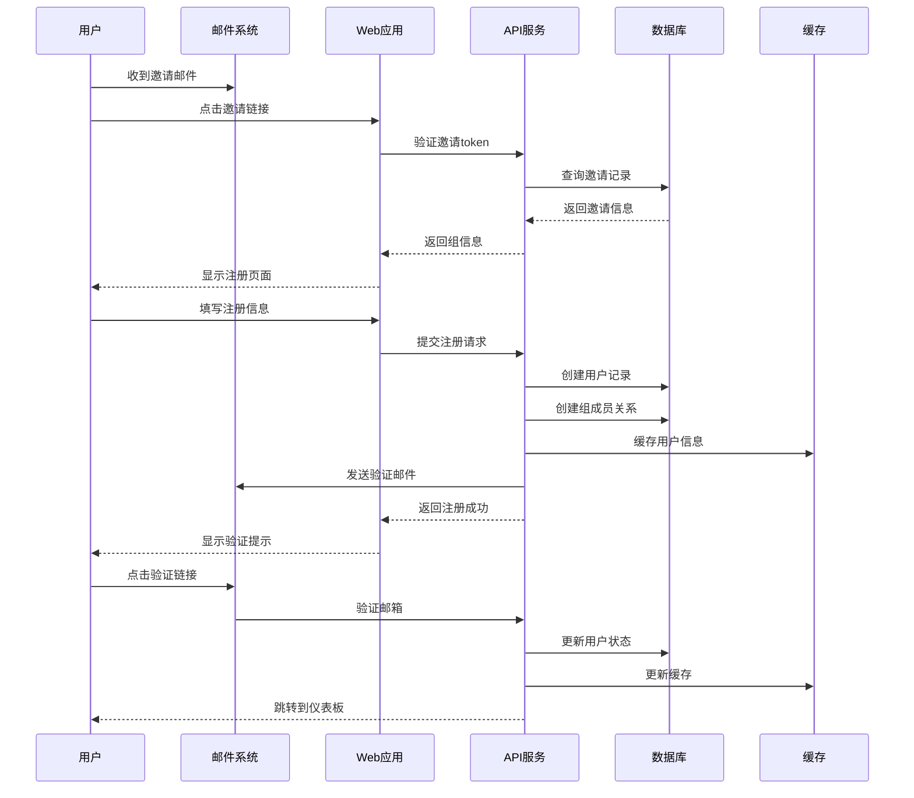

### 7.2 API Key 创建流程

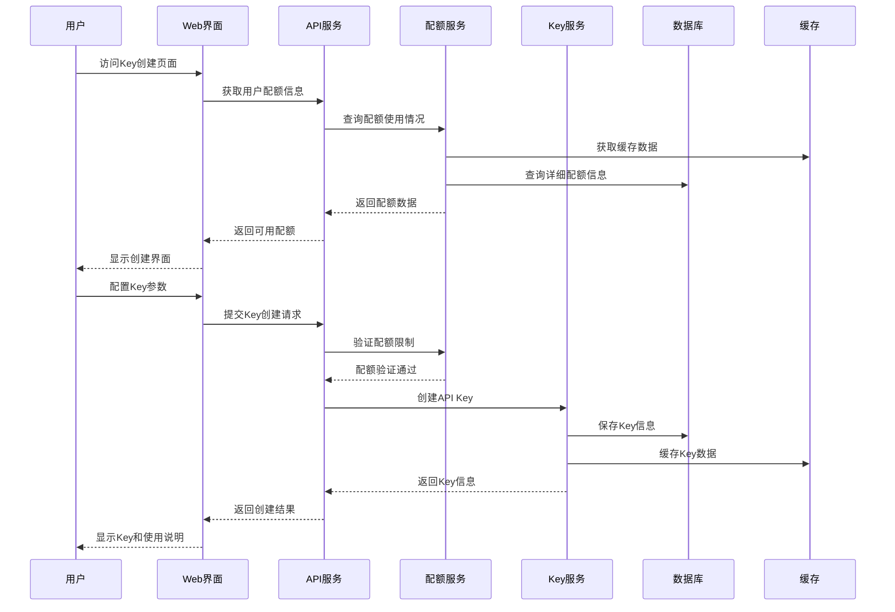

### 7.3 API 请求处理流程

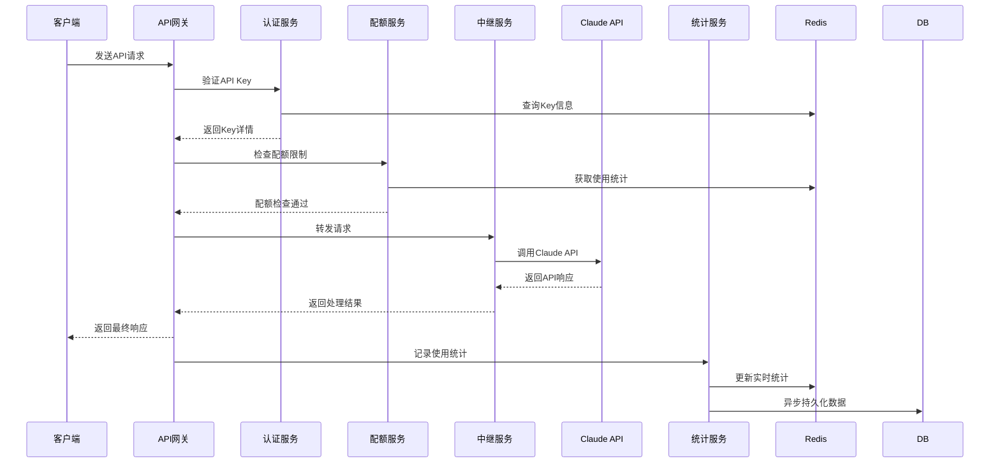

---

## 8. 安全考虑

### 8.1 身份认证与授权

#### 8.1.1 用户认证机制
- **JWT Token 认证**: 使用 JWT 作为用户身份标识，设置合理的过期时间
- **密码安全**: 使用 bcrypt 进行密码哈希，设置强密码策略
- **邮箱验证**: 强制邮箱验证，防止虚假账户注册
- **会话管理**: 实现安全的会话管理，支持会话失效和强制下线

#### 8.1.2 权限控制系统
- **角色基础访问控制 (RBAC)**: 明确定义用户角色和权限边界
- **资源级权限**: 用户只能访问所属组的资源
- **API 权限验证**: 每个 API 请求都进行权限检查
- **最小权限原则**: 用户仅获得完成任务所需的最小权限

### 8.2 数据安全

#### 8.2.1 敏感数据保护
- **数据加密**: 
  - API Key 使用哈希存储，不可逆
  - Claude OAuth Token 使用 AES 加密存储
  - 数据库连接使用 SSL/TLS 加密
- **数据脱敏**: 日志和错误信息中不包含敏感数据
- **访问审计**: 记录所有敏感操作的审计日志

#### 8.2.2 API Key 安全
- **Key 生成**: 使用密码学安全的随机数生成器
- **Key 格式**: 使用统一的前缀格式便于识别和管理
- **Key 生命周期**: 支持 Key 的启用、禁用、删除和过期管理
- **使用监控**: 监控异常使用模式，及时发现潜在安全问题

### 8.3 网络安全

#### 8.3.1 传输安全
- **HTTPS 强制**: 所有 API 和 Web 界面强制使用 HTTPS
- **证书管理**: 定期更新 SSL 证书，使用强加密算法
- **HSTS 头**: 设置 HTTP 严格传输安全头，防止协议降级攻击

#### 8.3.2 防护措施
- **速率限制**: 
  - API 调用频率限制
  - 登录尝试频率限制
  - 注册请求频率限制
- **输入验证**: 所有用户输入进行严格验证和清理
- **CSRF 保护**: 使用 CSRF Token 防止跨站请求伪造攻击
- **XSS 防护**: 对所有输出进行适当的编码和转义

### 8.4 运营安全

#### 8.4.1 访问控制
- **管理员账户**: 使用强认证和多因子认证（如果需要）
- **操作审计**: 记录所有管理操作的详细日志
- **权限分离**: 超级管理员和组管理员权限明确分离
- **定期审查**: 定期审查用户权限和访问日志

#### 8.4.2 监控告警
- **异常检测**: 
  - 异常登录地点和时间
  - 异常 API 使用模式
  - 配额超限告警
  - 系统错误率监控
- **自动响应**: 检测到异常时自动触发防护措施
- **告警通知**: 重要安全事件及时通知相关人员

### 8.5 数据隐私

#### 8.4.1 隐私保护原则
- **数据最小化**: 只收集必要的用户数据
- **用途限制**: 收集的数据仅用于声明的目的
- **访问控制**: 严格控制谁可以访问用户数据
- **数据保留**: 设置合理的数据保留期限

#### 8.5.2 合规要求
- **透明度**: 向用户清楚说明数据使用情况
- **用户权利**: 支持用户查看、修改、删除个人数据
- **数据出境**: 如涉及数据出境，遵守相关法规要求
- **安全事件响应**: 建立数据泄露应急响应机制

---

## 9. 总结

本 PRD 文档详细定义了 Claude 拼车服务产品化的完整方案，主要特点包括：

### 核心优势
- **自动化运营**: 大幅减少手动操作，提升运营效率
- **用户自助**: 用户可自主管理 API Key，提升使用体验
- **精细权限**: 基于角色和资源的多层权限控制
- **透明配额**: 清晰的配额管理和使用统计

### 技术特点
- **渐进式开发**: 基于现有项目扩展，降低开发风险
- **可扩展架构**: 支持多组并行，易于横向扩展
- **完整 API**: RESTful API 设计，支持未来集成
- **安全优先**: 多层安全防护，保护用户数据

### 产品价值
- **降本增效**: 自动化操作减少人工成本
- **用户体验**: 自助服务提升用户满意度  
- **规模化**: 支持更多用户和拼车组
- **数据驱动**: 完整统计数据支持运营决策

这个方案将传统的手动拼车服务升级为现代化的自助服务平台，既保持了定价灵活性，又大幅提升了运营效率和用户体验。