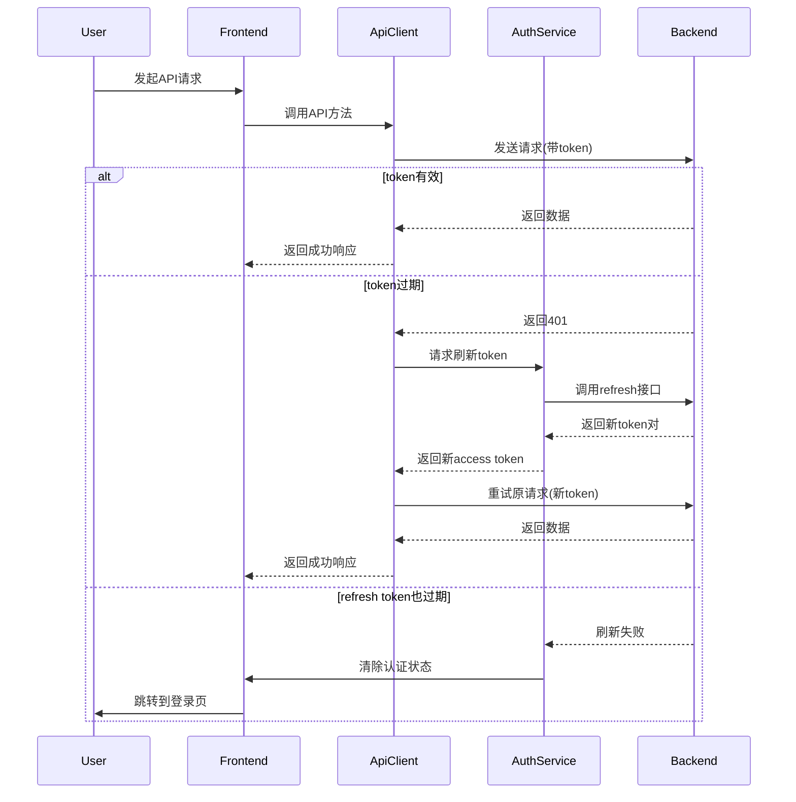

# JWT Token自动刷新系统

## 概述

AiCarpool v0.25.0 实现了完整的JWT token自动刷新机制，确保用户在使用应用期间不会因为token过期而突然被登出。

## 系统架构

### 核心组件

1. **AuthService** (`/src/lib/api/auth-service.ts`)
   - 管理token的存储和获取
   - 处理token刷新逻辑
   - 防止并发刷新请求
   - 自动定时刷新即将过期的token

2. **ApiClient** (`/src/lib/api/api-client.ts`)
   - 统一的API请求客户端
   - 自动添加Authorization header
   - 拦截401响应并自动刷新token
   - 重试失败的请求

3. **UserContext** (`/src/contexts/UserContext.tsx`)
   - 集成新的认证服务
   - 应用启动时检查token状态
   - 监听认证事件

## Token生命周期

- **Access Token**: 15分钟有效期
- **Refresh Token**: 7天有效期
- **自动刷新**: 在token过期前1分钟自动刷新

## 工作流程



## 使用方法

### 1. 使用新的API客户端

```typescript
import { api } from '@/lib/api/api-client';

// GET请求
const response = await api.get('/api/user/profile');

// POST请求
const response = await api.post('/api/user/update', {
  name: 'New Name'
});

// 处理响应
if (response.success) {
  console.log('数据:', response.data);
} else {
  console.error('错误:', response.error);
}
```

### 2. 登录时保存token

```typescript
import { authService } from '@/lib/api/auth-service';

// 登录成功后
authService.handleLoginResponse(
  {
    accessToken: data.tokens.accessToken,
    refreshToken: data.tokens.refreshToken,
    expiresIn: data.tokens.expiresIn
  },
  userData
);
```

### 3. 检查认证状态

```typescript
import { authService } from '@/lib/api/auth-service';

if (authService.isAuthenticated()) {
  // 用户已登录
}

if (authService.isTokenExpiringSoon(300)) {
  // Token将在5分钟内过期
}
```

## 特性

### 1. 自动刷新
- 系统会在token过期前1分钟自动刷新
- 用户无感知，不会中断操作

### 2. 并发控制
- 多个401响应只会触发一次刷新
- 其他请求会等待刷新完成后重试

### 3. 错误处理
- 刷新失败时自动清除认证状态
- 跳转到登录页面
- 触发全局事件通知

### 4. 事件系统
```typescript
// 监听认证事件
window.addEventListener('auth:logout', () => {
  // 用户已登出
});

window.addEventListener('auth:token-refresh-failed', () => {
  // Token刷新失败
});
```

## 迁移指南

### 旧代码（每个页面独立处理）
```typescript
const response = await fetch('/api/data', {
  headers: {
    'Authorization': `Bearer ${token}`
  }
});

if (response.status === 401) {
  router.push('/auth/login');
}
```

### 新代码（使用API客户端）
```typescript
const response = await api.get('/api/data');

if (response.success) {
  // 处理数据
}
// 不需要手动处理401，API客户端会自动处理
```

## 测试

访问 `/test-auth` 页面可以测试token刷新功能：
- 测试token刷新
- 模拟token过期
- 清除token

## 注意事项

1. **不要直接使用fetch**: 始终使用api客户端确保token自动刷新
2. **公开接口**: 登录、注册等接口使用 `skipAuth: true` 选项
3. **错误处理**: API客户端已处理认证错误，无需重复处理

## 后续优化

- [ ] 添加token预刷新策略
- [ ] 实现token黑名单机制  
- [ ] 添加设备管理功能
- [ ] 支持多设备同时登录